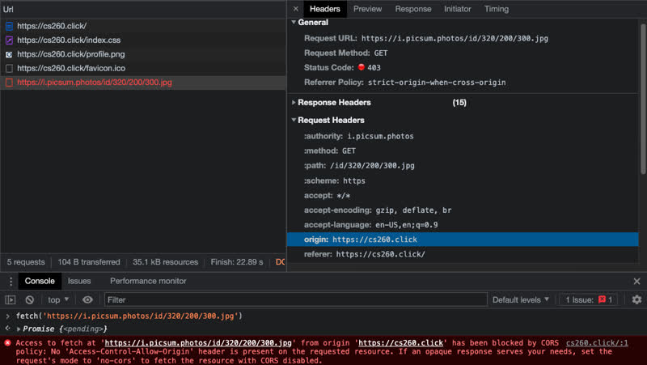
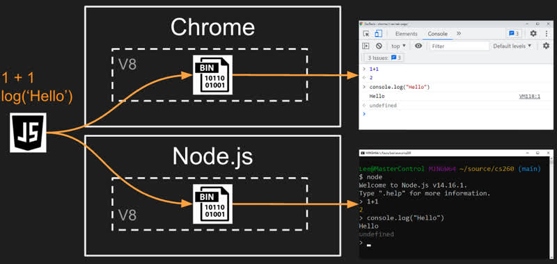
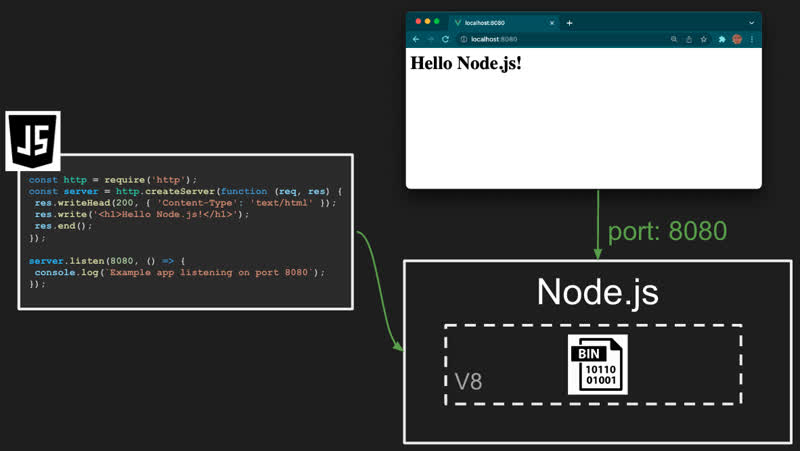
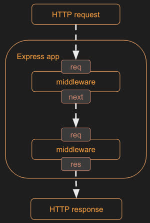
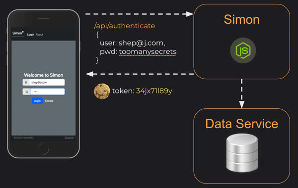
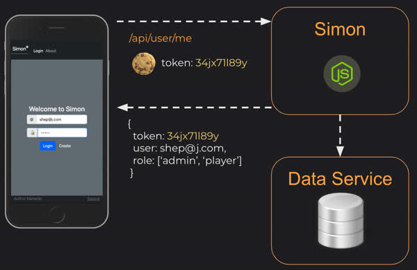
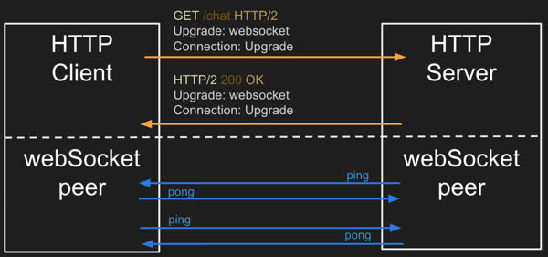
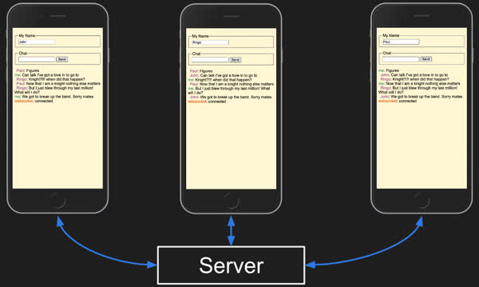
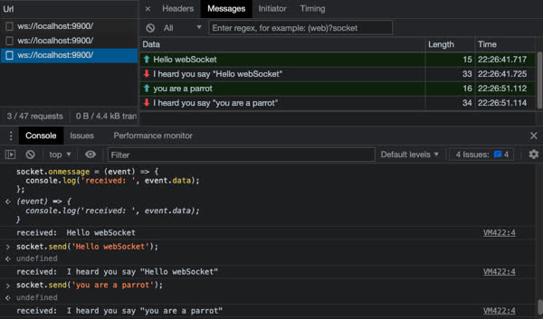

# CS 260 Notes Part II
General Notes for CS260 for use on the final

# Jusification for actions:
Professor Jensen (Discord CS 260 Help; General; 02/17/2023) [View message here:](https://discord.com/channels/748656649287368704/748656649287368708/1076153677422788628)

"Your start up README.md should be a big repository of everything you are discovering and want to record. Put whatever you would like in there. The midterm is 60 multiple choice questions covering the Console, Internet, HTML, CSS, and JavaScript. No time limit. Make sure you come to the in-person review on March 6th, 3 PM (JKB 3108). That should set you up for success."

Since there weren't any follow up messages placing restrictions on what could be contained in our NOTES.md file, although accessing links placed on the README file were forbidden, I have taken the liberty to take full advantage of the opportunity at hand by placing what I found to be the most useful information in this extremely long document. Enjoy :)

# URL

📖 **Suggested reading**: [MDN What is a URL](https://developer.mozilla.org/en-US/docs/Learn/Common_questions/What_is_a_URL)

The Uniform Resource Locator (URL) represents the location of a web resource. A web resource can be anything, such as a web page, font, image, video stream, database record, or JSON object. It can also be completely ephemeral, such as a visitation counter, or gaming session.

Looking at the different parts of a URL is a good way to understand what it represents. Here is an example URL that represents the summary of accepted CS 260 BYU students that is accessible using secure HTTP.

```js
https://byu.edu:443/cs/260/student?filter=accepted#summary
```

The URL syntax uses the following convention. Notice the delimiting punctuation between the parts of the URL. Most parts of the URL are optional. The only ones that are required are the scheme, and the domain name.

```yaml
<scheme>://<domain name>:<port>/<path>?<parameters>#<anchor>
```
Example: 
https://cs260.click:443/api/city?q=pro#3

| Part        | Example                              | Meaning                                                                                                                                                                                                                                                                             |
| ----------- | ------------------------------------ | ----------------------------------------------------------------------------------------------------------------------------------------------------------------------------------------------------------------------------------------------------------------------------------- |
| Scheme      | https                                | The protocol required to ask for the resource. For web applications, this is usually HTTPS. But it could be any internet protocol such as FTP or MAILTO.                                                                                                                            |
| Domain name | byu.edu                              | The domain name that owns the resource represented by the URL.                                                                                                                                                                                                                      |
| Port        | 3000                                 | The port specifies the numbered network port used to connect to the domain server. Lower number ports are reserved for common internet protocols, higher number ports can be used for any purpose. The default port is 80 if the scheme is HTTP, or 443 if the scheme is HTTPS.     |
| Path        | /school/byu/user/8014                | The path to the resource on the domain. The resource does not have to physically be located on the file system with this path. It can be a logical path representing endpoint parameters, a database table, or an object schema.                                                    |
| Parameters  | filter=names&highlight=intro,summary | The parameters represent a list of key value pairs. Usually it provides additional qualifiers on the resource represented by the path. This might be a filter on the returned resource or how to highlight the resource. The parameters are also sometimes called the query string. |
| Anchor      | summary                              | The anchor usually represents an sub-location in the resource. For HTML pages this represents a request for the browser to automatically scroll to the element with an ID that matches the anchor. The anchor is also sometimes called the hash, or fragment ID.                    |

Technically you can also provide a user name and password before the domain name. This was used historically to authenticate access, but for security reasons this is deprecated. However, you will still see this convention for URLs that represent database connection strings.

## URL, URN, and URI

You will sometimes hear the use of URN or URI when talking about web resources. A Uniform Resource Name (URN) is a unique resource name that does not specify location information. For example, a book URN might be `urn:isbn:10,0765350386`. A Uniform Resource Identifier (URI) is a general resource identifier that could refer to either a URL and URN. With web programming you are almost always talking about URLs and therefore you should not use the more general URI.


# Ports

When you connect to a device on the internet you need both an IP address and a numbered port. Port numbers allow a single device to support multiple protocols (e.g. HTTP, HTTPS, FTP, or SSH) as well as different types of services (e.g. search, document, or authentication). The ports may be exposed externally, or they may only be used internally on the device. For example, the HTTPS port (443) might allow the world to connect, the SSH port (22) might only allow computers at your school, and a service defined port (say 3000) may only allow access to processes running on the device.

The internet governing body, IANA, defines the standard usage for port numbers. Ports from 0 to 1023 represent standard protocols. Generally a web service should avoid these ports unless it is providing the protocol represented by the standard. Ports from 1024 to 49151 represent ports that have been assigned to requesting entities. However, it is very common for these ports to be used by services running internally on a device. Ports from 49152 to 65535 are considered dynamic and are used to create dynamic connections to a device. [Here](https://www.iana.org/assignments/service-names-port-numbers/service-names-port-numbers.xhtml) is the link to IANA's registry.

Here is a list of common port numbers that you will might come across.

| Port | Protocol                                                                                           |
| ---- | -------------------------------------------------------------------------------------------------- |
| 20   | File Transfer Protocol (FTP) for data transfer                                                     |
| 22   | Secure Shell (SSH) for connecting to remote devices                                                |
| 25   | Simple Mail Transfer Protocol (SMTP) for sending email                                             |
| 53   | Domain Name System (DNS) for looking up IP addresses                                               |
| 80   | Hypertext Transfer Protocol (HTTP) for web requests                                                |
| 110  | Post Office Protocol (POP3) for retrieving email                                                   |
| 123  | Network Time Protocol (NTP) for managing time                                                      |
| 161  | Simple Network Management Protocol (SNMP) for managing network devices such as routers or printers |
| 194  | Internet Relay Chat (IRC) for chatting                                                             |
| 443  | HTTP Secure (HTTPS) for secure web requests                                                        |

## Your ports

As an example of how ports are used we can look at your web server. When you built your web server you externally exposed port 22 so that you could use SSH to open a remote console on the server, port 443 for secure HTTP communication, and port 80 for unsecure HTTP communication.


Your web service, Caddy, is listening on ports 80 and 443. When Caddy gets a request on port 80, it automatically redirects the request to port 443 so that a secure connection is used. When Caddy gets a request on port 443 it examines the path provided in the HTTP request (as defined by the URL) and if the path matches a static file, it reads the file off disk and returns it. If the HTTP path matches one of the definitions it has for a gateway service, Caddy makes a connection on that service's port (e.g. 3000 or 4000) and passes the request to the service.

Internally on your web server, you can have as many web services running as you would like. However, you must make sure that each one uses a different port to communicate on. You run your Simon service on port 3000 and therefore **cannot** use port 3000 for your start up service. Instead you use port 4000 for your start up service. It does not matter what high range port you use. It only matters that you are consistent and that they are only used by one service.

# HTTP: Hyper text transfer protocal

📖 **Suggested reading**: [MDN An overview of HTTP](https://developer.mozilla.org/en-US/docs/Web/HTTP/Overview)

HTTP is how the web talks. When a web browser makes a request to a web server it does it using the HTTP protocol. In previous instruction we discussed how to use HTTP. Now, we will talk about the internals of HTTP. Just like becoming fluent in a foreign language make a visit to another country more enjoyable, understanding how to speak HTTP helps you communicate effectively when talking on the web.

When a web client (e.g. a web browser) and a web server talk they exchange HTTP requests and responses. The browser will make an HTTP request and the server will generate an HTTP response. You can see the HTTP exchange by using the browser's debugger or by using a console tool like Curl. For example, in your console you can use curl to make the following request.

```sh
curl -v -s http://info.cern.ch/hypertext/WWW/Helping.html
```

### Request

The HTTP request for the above command would look like the following.

```http
GET /hypertext/WWW/Helping.html HTTP/1.1
Host: info.cern.ch
Accept: text/html
```

An HTTP request has this general syntax.

```yaml
<verb> <url path, parameters, anchor> <version>
[<header key: value>]*
[

  <body>
]
```

The first line of the HTTP request contains the `verb` of the request, followed by the path, parameters, and anchor of the URL, and finally the version of HTTP being used. The following lines are optional headers that are defined by key value pairs. After the headers you have an optional body. The body start is delimited from the headers with two new lines.

In the above example, we are asking to `GET` a resource found at the path `/hypertext/WWW/Helping.html`. The version used by the request is `HTTP/1.1`. This is followed by two headers. The first specifies the requested host (i.e. domain name). The second specifies what type of resources the client will accept. The resource type is always a [MIME type](https://developer.mozilla.org/en-US/docs/Web/HTTP/Basics_of_HTTP/MIME_types) as defined by internet governing body IANA. In this case we are asking for HTML.

### Response

The response to the above request looks like this.

```yaml
HTTP/1.1 200 OK
Date: Tue, 06 Dec 2022 21:54:42 GMT
Server: Apache
Last-Modified: Thu, 29 Oct 1992 11:15:20 GMT
ETag: "5f0-28f29422b8200"
Accept-Ranges: bytes
Content-Length: 1520
Connection: close
Content-Type: text/html

<TITLE>Helping -- /WWW</TITLE>
<NEXTID 7>
<H1>How can I help?</H1>There are lots of ways you can help if you are interested in seeing
the <A NAME=4 HREF=TheProject.html>web</A> grow and be even more useful...
```

An HTTP response has the following syntax.

```yaml
<version> <status code> <status string>
[<header key: value>]*
[

  <body>
]
```

You can see that the response syntax is similar to the request syntax. The major difference is that the first line represents the version and the status of the response.

Understanding the meaning of the common HTTP verbs, status codes, and headers is important for you to understand, as you will use them in developing a web application. Take some time to internalize the following common values.

## Verbs

There are several verbs that describe what the HTTP request is asking for. The list below only describes the most common ones.

| Verb    | Meaning                                                                                                                                                                                                                                                  |
| ------- | -------------------------------------------------------------------------------------------------------------------------------------------------------------------------------------------------------------------------------------------------------- |
| GET     | Get the requested resource. This can represent a request to get a single resource or a resource representing a list of resources.                                                                                                                        |
| POST    | Create a new resource. The body of the request contains the resource. The response should include a unique ID of the newly created resource.                                                                                                             |
| PUT     | Update a resource. Either the URL path, HTTP header, or body must contain the unique ID of the resource being updated. The body of the request should contain the updated resource. The body of the response may contain the resulting updated resource. |
| DELETE  | Delete a resource. Either the URL path or HTTP header must contain the unique ID of the resource to delete.                                                                                                                                              |
| OPTIONS | Get metadata about a resource. Usually only HTTP headers are returned. The resource itself is not returned.                                                                                                                                              |

## Status codes

It is important that you use the standard HTTP status codes in your HTTP responses so that the client of a request can know how to interpret the response. The codes are partitioned into five blocks.

- 1xx - Informational.
- 2xx - Success.
- 3xx - Redirect to some other location, or that the previously cached resource is still valid.
- 4xx - Client errors. The request is invalid.
- 5xx - Server errors. The request cannot be satisfied due to an error on the server.

Within those ranges here are some of the more common codes. See the [MDN documentation](https://developer.mozilla.org/en-US/docs/Web/HTTP/Status) for a full description of status codes.

| Code | Text                                                                                 | Meaning                                                                                                                           |
| ---- | ------------------------------------------------------------------------------------ | --------------------------------------------------------------------------------------------------------------------------------- |
| 100  | Continue                                                                             | The service is working on the request                                                                                             |
| 200  | Success                                                                              | The requested resource was found and returned as appropriate.                                                                     |
| 201  | Created                                                                              | The request was successful and a new resource was created.                                                                        |
| 204  | No Content                                                                           | The request was successful but no resource is returned.                                                                           |
| 304  | Not Modified                                                                         | The cached version of the resource is still valid.                                                                                |
| 307  | Permanent redirect                                                                   | The resource is no longer at the requested location. The new location is specified in the response location header.               |
| 308  | Temporary redirect                                                                   | The resource is temporarily located at a different location. The temporary location is specified in the response location header. |
| 400  | Bad request                                                                          | The request was malformed or invalid.                                                                                             |
| 401  | Unauthorized                                                                         | The request did not provide a valid authentication token.                                                                         |
| 403  | Forbidden                                                                            | The provided authentication token is not authorized for the resource.                                                             |
| 404  | Not found                                                                            | An unknown resource was requested.                                                                                                |
| 408  | Request timeout                                                                      | The request takes too long.                                                                                                       |
| 409  | Conflict                                                                             | The provided resource represents an out of date version of the resource.                                                          |
| 418  | [I'm a teapot](https://en.wikipedia.org/wiki/Hyper_Text_Coffee_Pot_Control_Protocol) | The service refuses to brew coffee in a teapot.                                                                                   |
| 429  | Too many requests                                                                    | The client is making too many requests in too short of a time period.                                                             |
| 500  | Internal server error                                                                | The server failed to properly process the request.                                                                                |
| 503  | Service unavailable                                                                  | The server is temporarily down. The client should try again with an exponential back off.                                         |

## Headers

📖 **Suggested reading**: [MDN HTTP headers](https://developer.mozilla.org/en-US/docs/Web/HTTP/Headers)

HTTP headers specify metadata about a request or response. This includes things like how to handle security, caching, data formats, and cookies. Some common headers that you will use include the following.

| Header                      | Example                              | Meaning                                                                                                                                                                        |
| --------------------------- | ------------------------------------ | ------------------------------------------------------------------------------------------------------------------------------------------------------------------------------ |
| Authorization               | Bearer bGciOiJIUzI1NiIsI             | A token that authorized the user making the request.                                                                                                                           |
| Accept                      | image/\*                             | What content format the client accepts. This may include wildcards.                                                                                                            |
| Content-Type                | text/html; charset=utf-8             | The format of the response content. These are described using standard [MIME](https://developer.mozilla.org/en-US/docs/Web/HTTP/Basics_of_HTTP/MIME_types/Common_types) types. |
| Cookie                      | SessionID=39s8cgj34; csrftoken=9dck2 | Key value pairs that are generated by the server and stored on the client.                                                                                                     |
| Host                        | info.cern.ch                         | The domain name of the server. This is required in all requests.                                                                                                               |
| Origin                      | cs260.click                          | Identifies the origin that caused the request. A host may only allow requests from specific origins.                                                                           |
| Access-Control-Allow-Origin | https://cs260.click                  | Server response of what origins can make a request. This may include a wildcard.                                                                                               |
| Content-Length              | 368                                  | The number of bytes contained in the response.                                                                                                                                 |
| Cache-Control               | public, max-age=604800               | Tells the client how it can cache the response.                                                                                                                                |
| User-Agent                  | Mozilla/5.0 (Macintosh)              | The client application making the request.                                                                                                                                     |

## Body

The format of the body of an HTTP request or response is defined by the `Content-Type` header. For example, it may be HTML text (text/html), a binary image format (image/png), JSON (application/json), or JavaScript (text/javascript). A client may specify what formats it accepts using the `accept` header.

## Cookies


📖 **Suggested reading**: [MDN Using HTTP cookies](https://developer.mozilla.org/en-US/docs/Web/HTTP/Cookies)

HTTP itself is stateless. This means that one HTTP request does not know anything about a previous or future request. However, that does not mean that a server or client cannot track state across requests. One common method for tracking state is the `cookie`. Cookies are generated by a server and passed to the client as an HTTP header.

```http
HTTP/2 200
Set-Cookie: myAppCookie=tasty; SameSite=Strict; Secure; HttpOnly; SameSite=Strict
```

The client then caches the cookie and returns it as an HTTP header back to the server on subsequent requests.

```http
HTTP/2 200
Cookie: myAppCookie=tasty
```

This allows the server to remember things like the language preference of the user, or the user's authentication credentials. A server can also use cookies to track, and share, everything that a user does. However, there is nothing inherently evil about cookies, the problem comes from web applications that use them as a means to violate a user's privacy or inappropriately monetize their data.

## HTTP Versions

HTTP continually evolves in order to increase performance and support new types of applications. You can read about the evolution of HTTP on [MDN](https://developer.mozilla.org/en-US/docs/Web/HTTP/Basics_of_HTTP/Evolution_of_HTTP).

| Year | Version | Features                                        |
| ---- | ------- | ----------------------------------------------- |
| 1990 | HTTP0.9 | one line, no versions, only get                 |
| 1996 | HTTP1   | get/post, header, status codes, content-type    |
| 1997 | HTTP1.1 | put/patch/delete/options, persistent connection |
| 2015 | HTTP2   | multiplex, server push, binary representation   |
| 2022 | HTTP3   | QUIC for transport protocol, always encrypted   |

# SOP and CORS

📖 **Suggested reading**:

- [MDN Same origin policy](https://developer.mozilla.org/en-US/docs/Web/Security/Same-origin_policy)
- [MDN Cross origin resource sharing](https://developer.mozilla.org/en-US/docs/Web/HTTP/CORS)

Security should always be on your mind when you are working with the web. The ability to provide services to a global audience makes the information on the web very valuable, and therefore an attractive target for nefarious parties. When website architecture and browser clients were still in their infancy they allowed JavaScript to make requests from one domain while displaying a website from a different domain. These are called cross-origin requests.

Consider the following example. An attacker sends out an email with a link to a hacker website (`byu.iinstructure.com`) that is similar to the real course website. Notice the additional `i`. If the hacker website could request anything from the real website then it could make itself appear and act just like the real education website. All it would have to do is request images, html, and login endpoints from the course's website and display the results on the hacker website. This would give the hacker access to everything the user did.

To combat this problem the `Same Origin Policy` (SOP) was created. Simply stated SOP only allows JavaScript to make requests to a domain if it is the same domain that the user is currently viewing. A request from `byu.iinstructure.com` for service endpoints that are made to `byu.instructure.com` would fail because the domains do not match. This provides significant security, but it also introduces complications when building web applications. For example, if you want build a service that any web application can use it would also violate the SOP and fail. In order to address this, the concept of Cross Origin Resource Sharing (CORS) was invented.

CORS allows the client (e.g. browser) to specify the origin of a request and then let the server respond with what origins are allowed. The server may say that all origins are allowed, for example if they are a general purpose image provider, or only a specific origin is allowed, for example if they are a bank's authentication service. If the server doesn't specify what origin is allowed then the browser assumes that it must be the same origin.

Going back to our hacker example, the HTTP request from the hacker site (`byu.iinstructure.com`) to the course's authentication service (`byu.instructure.com`) would look like the following.

```http
GET /api/auth/login HTTP/2
Host: byu.instructure.com
Origin: https://byu.iinstructure.com
```

In response the banking website would return:

```http
HTTP/2 200 OK
Access-Control-Allow-Origin: https://byu.instructure.com
```

The browser would then see that the actual origin of the request does not match the allowed origin and so the browser blocks the response and generates an error.

Notice that with CORS, it is the browser that is protecting the user from accessing the banking website's authentication endpoint from the wrong origin. CORS is only meant to alert the user that something nefarious is being attempted. A hacker can still proxy requests through their own server to the banking website and completely ignore the `Access-Control-Allow-Origin` header. Therefore the banking website needs to implement its own precautions to stop a hacker for using its services inappropriately.

## Using third party services

When you make requests to your own web services you are always on the same origin and so you will not violate the SOP. However, if you want to make requests to a different domain than the one your web application is hosted on, then you need to make sure that domain allows requests as defined by the `Access-Control-Allow-Origin` header it returns. For example, if I have JavaScript in my web application loaded from `cs260.click` that makes a fetch request for an image from the website `i.picsum.photos` the browser will fail the request with an HTTP status code of 403 and an error message that CORS has blocked the request.



That happens because `i.picsum.photos` does not return an `Access-Control-Allow-Origin` header. Without a header the browser assumes that all requests must be made from the same origin.

If your web application instead makes a service request to `icanhazdadjoke.com` to get a joke, that request will succeed because `icanhazdadjoke.com` returns an `Access-Control-Allow-Origin` header with a value of `*` meaning that any origin can make requests to this service.

```http
HTTP/2 200
access-control-allow-origin: *

Did you hear about the bread factory burning down? They say the business is toast.
```

This would have also succeeded if the HTTP header had explicitly listed your web application domain. For example, if you make your request from the origin `cs260.click` the following response would also satisfy CORS.

```http
HTTP/2 200
access-control-allow-origin: https://cs260.click

I’ll tell you something about German sausages, they’re the wurst
```

This all means that you need to test the services you want to use before you include them in your application. Make sure they are responding with `*` or your calling origin. If they do not then you will not be able to use them.

# Fetch

🔑 **Recommended reading**: [MDN Using the Fetch API](https://developer.mozilla.org/en-US/docs/Web/API/Fetch_API/Using_Fetch)

The ability to make HTTP requests from JavaScript is one of the main technologies that changed the web from static content pages (Web 1.0) to one of web applications (Web 2.0) that fully interact with the user. Microsoft introduced the first API for making HTTP requests from JavaScript with the [XMLHttpRequest API](https://developer.mozilla.org/en-US/docs/Web/API/XMLHttpRequest).

Today, the [fetch API](https://developer.mozilla.org/en-US/docs/Web/API/Fetch_API) is the preferred way to make HTTP requests. The `fetch` function is built into the browser's JavaScript runtime. This means you can call it from JavaScript code running in a browser.

The basic usage of fetch takes a URL and **returns a promise**. The promise `then` function takes a callback function that is asynchronously called when the requested URL content is obtained. If the returned content is of type `application/json` you can use the `json` function on the response object to convert it to a JavaScript object.

The following example makes a fetch request to get and display an inspirational quote.

```js
fetch('https://api.quotable.io/random')
  .then((response) => response.json()) //Converts it to an JS object
  .then((jsonResponse) => {
    console.log(jsonResponse)
    console.log(jsonResponse.author)
  })

fetch('https://api.chucknorris.io/jokes/random')
  .then(r => r.json())
  .then(j => console.log(j.value))
```

**Response**

```js
{
  content: 'Never put off till tomorrow what you can do today.',
  author: 'Thomas Jefferson',
};
```

To do a POST request you populate the options parameter with the HTTP method and headers.

```js
fetch('https://jsonplaceholder.typicode.com/posts', {
  method: 'POST',
  body: JSON.stringify({
    title: 'test title',
    body: 'test body',
    userId: 1,
  }),
  headers: {
    'Content-type': 'application/json; charset=UTF-8',
  },
})
  .then((response) => response.json())
  .then((jsonResponse) => {
    console.log(jsonResponse);
  });
```

# Service design

Web services provide the interactive functionality of your web application. They commonly authenticate users, track their session state, provide, store, and analyze data, connect peers, and aggregate user information. Making your web service easy to use, performant, and extensible are factors that determine the success of your application. A good design will result in increased productivity, satisfied users, and lower processing costs.

## Model and sequence diagrams

When first considering your service design it is helpful to model the application's primary objects and the interactions of the objects. You should attempt to stay as close to the model that is in your user's mind as possible. Avoid introducing a model that focusing on programming constructs and infrastructure. For example, a chat program should model participants, conversations, and messages. It should not model user devices, network connections, and data blobs.

Once you have defined your primary objects you can create sequence diagrams that show how the objects interact with each other. This will help clarify your model and define the necessary endpoints. You can use a simple tool like [SequenceDiagram.org](https://sequencediagram.org/index.html#initialData=C4S2BsFMAIGEAsCGxqIA5oFCcQY2APYBO0AguCLpDvsdAEIEBG25lkAtAHwDKkRAN34AuPikQDEIcIiZRMjJtz6CRY1JOmz5igDy6OHFUKLC2VDVJlzq5yPsPGRDZpa03Md5fxOjgiIhRcAgA7EwBnZBBQ6AB3MHgXFj0DIx8RWFCIqJiiSABHAFdIcJQQglAAM0ockIVmb1VTUlwqNBQ7aGCw-kjQUPqlXnTTHkQAT2gAIgAJSHBwAinoQjIKKkwnIm47YVn5xeXKogIAWySgA) to create and share diagrams.


## Leveraging HTTP

Web services are usually provided over HTTP, and so HTTP greatly influences the design of the service. The HTTP verbs such as GET, POST, PUT, and DELETE often mirror the designed actions of a web service. For example, a web service for managing comments might list the comments (GET), create a comment (POST), update a comment (PUT), and delete a comment (DELETE). Likewise, the MIME content types defined by IANA are a natural fit for defining the types of content that you want to provide (e.g. HTML, PNG, MP3, and MP4). The goal is to leverage those technologies as much as possible so that you don't have to recreate the functionality they provide and instead take advantage of the significant networking infrastructure built up around HTTP. This includes caching servers that increase your performance, edge servers that bring your content closer, and replication servers that provide redundant copies of your content and make your application more resilient to network failures.


## Endpoints

A web service is usually divided up into multiple service endpoints. Each endpoint provides a single functional purpose. All of the criteria that you would apply to creating well designed code functions also applies when exposing service endpoints.


⚠ Note that service endpoints are often called an Application Programming Interface (API). This is a throwback to old desktop applications and the programming interfaces that they exposed. Sometimes the term API refers to the entire collection of endpoints, and sometimes it is used to refer to a single endpoint.

Here are some things you should consider when designing your service's endpoints.

- **Grammatical** - With HTTP everything is a resource (think noun or object). You act on the resource with an HTTP verb. For example, you might have an order resource that is contained in a store resource. You then create, get, update, and delete order resources on the store resource.
- **Readable** - The resource you are referencing with an HTTP request should be clearly readable in the URL path. For example, an order resource might contain the path to both the order and store where the order resource resides: `/store/provo/order/28502`. This makes it easier to remember how to use the endpoint because it is human readable.
- **Discoverable** - As you expose resources that contain other resources you can provide the endpoints for the aggregated resources. This makes it so someone using your endpoints only needs to remember the top level endpoint and then they can discover everything else. For example, if you have a store endpoint that returns information about a store you can include an endpoint for working with a store in the response.

  ```http
  GET /store/provo  HTTP/2
  ```

  ```json
  {
    "id": "provo",
    "address": "Cougar blvd",
    "orders": "https://cs260.click/store/provo/orders",
    "employees": "https://cs260.click/store/provo/employees"
  }
  ```

- **Compatible** - When you build your endpoints you want to make it so that you can add new functionality without breaking existing clients. Usually this means that the clients of your service endpoints should ignore anything that they don't understand. Consider the two following JSON response versions.

  **Version 1**

  ```js
  {
    "name": "John Taylor"
  }
  ```

  **Version 2**

  ```js
  {
    "name": "John Taylor",
    "givenName": "John",
    "familyName": "Taylor"
  }
  ```

  By adding a new representation of the `name` field, you provide new functionality for clients that know how to use the new fields without harming older clients that ignore the new fields and simply use the old representation. This is all done without officially versioning the endpoint.

  If you are fortunate enough to be able to control all of your client code you can mark the `name` field as depreciated and in a future version remove it once all of the clients have upgraded. Usually you want to keep compatibility with at least one previous version of the endpoint so that there is enough time for all of the clients to migrate before compatibility is removed.

- **Simple** - Keeping your endpoints focused on the primary resources of your application helps to avoid the temptation to add endpoints that duplicate or create parallel access to primary resources. It is very helpful to write some simple class and sequence diagrams that outline your primary resources before you begin coding. These resources should focus on the actual resources of the system you are modeling. They should not focus on the data structure or devices used to host the resources. There should only be one way to act on a resource. Endpoints should only do one thing.

- **Documented** - The [Open API Specification](https://spec.openapis.org/oas/latest.html) is a good example of tooling that helps create, use, and maintain documentation of your service endpoints. It is highly suggested that you make use of such tools in order to provide client libraries for your endpoints and a sandbox for experimentation. Creating an initial draft of your endpoint documentation before you begin coding will help you mentally clarify your design and produce a better final result. Providing access to your endpoint documentation along with your production system helps with client implementations and facilitates easier maintenance of the service. The [Swagger Petstore](https://petstore.swagger.io/) example documentation is a reasonable example to follow.

There are many models for exposing endpoints. We will consider three common ones, RPC, REST, and GraphQL.

### Third-party Endpoints Example
  The about.js file contains code for making calls to third party endpoints using fetch. We make one call to `picsum.photos` to get a random picture and another to `quotable.io` to get a random quote. Once the endpoint asynchronously returns, the DOM is updated with the requested data. Here is an example of the quote endpoint call.

```js
function displayQuote(data) {
  fetch('https://api.quotable.io/random')
    .then((response) => response.json())
    .then((data) => {
      const containerEl = document.querySelector('#quote');

      const quoteEl = document.createElement('p');
      quoteEl.classList.add('quote');
      const authorEl = document.createElement('p');
      authorEl.classList.add('author');

      quoteEl.textContent = data.content;
      authorEl.textContent = data.author;

      containerEl.appendChild(quoteEl);
      containerEl.appendChild(authorEl);
    });
}
```
## RPC

Remote Procedure Calls (RPC) expose service endpoints as simple function calls. When RPC is used over HTTP it usually just leverages the POST HTTP verb. The actual verb and subject of the function call is represented by the function name. For example, `deleteOrder` or `updateOrder`. The name of the function is either the entire path of the URL or a parameter in the POST body.

```http
POST /updateOrder HTTP/2

{"id": 2197, "date": "20220505"}
```

or

```http
POST /rpc HTTP/2

{"cmd":"updateOrder", "params":{"id": 2197, "date": "20220505"}}
```

One advantage of RPC is that it maps directly to function calls that might exist within the server. This could also be considered a disadvantage as it directly exposes the inner workings of the service, and thus creates a coupling between the endpoints and the implementation.

## REST

Representational State Transfer (REST) attempts to take advantage of the foundational principles of HTTP. This is not surprising considering the principle author of REST, Roy Fielding, was also a contributor to the HTTP specification. REST HTTP verbs always act upon a resource. Operations on a resource impact the state of the resource as it is transferred by a REST endpoint call. This allows for the caching functionality of HTTP to work optimally. For example, GET will always return the same resource until a PUT is executed on the resource. When PUT is used, the cached resource is replaced with the updated resource.

With REST the updateOrder endpoint would look like the following.

```http
PUT /order/2197 HTTP/2

{"date": "20220505"}
```

Where the proper HTTP verb is used and the URL path uniquely identifies the resource. These seem like small differences, but maximizing HTTP pays dividends by making it easy for HTTP infrastructure, such as caching, to work properly.

There are several other pieces of [Fielding's dissertation](https://www.ics.uci.edu/~fielding/pubs/dissertation/top.htm) on REST, such as hypermedia, that are often quoted as being required for a truly "restful" implementation, and these are just as often ignored.

## GraphQL

GraphQL focuses on the manipulation of data instead of a function call (RPC) or a resource (REST). The heart of GraphQL is a query that specifies the desired data and how it should be joined and filtered. GraphQL was developed to address frustration concerning the massive number of REST, or RPC calls, that a web application client needed to make in order to support even a simple UI widget.

Instead of making a call for getting a store, and then a bunch of calls for getting the store's orders and employees, GraphQL would send a single query that would request all of that information in one big JSON response. The server would examine the query, join the desired data, and then filter out anything that was not wanted.

Here is an example GraphQL query.

```graphql
query {
  getOrder(id: "2197") {
    orders(filter: { date: { allofterms: "20220505" } }) {
      store
      description
      orderedBy
    }
  }
}
```

GraphQL helps to remove a lot of the logic for parsing endpoints and mapping requests to specific resources. Basically in GraphQL there is only one endpoint. The query endpoint.

The downside of that flexibility is that the client now has significant power to consume resources on the server. There is no clear boundary on what, how much, or how complicated the aggregation of data is. It also is difficult for the server to implement authorization rights to data as they have to be baked into the data schema. However, there are standards for how to define a complex schema. Common GraphQL packages provide support for schema implementations along with database adaptors for query support.

# Node.js


In 2009 Ryan Dahl created `Node.js`. It was the first successful application for deploying JavaScript outside of a browser. This changed the JavaScript mindset from a browser technology to one that could run on the server as well. This means that JavaScript can power your entire technology stack. One language to rule them all. Node.js is often just referred to as Node, and is currently maintained by the [Open.js Foundation](https://openjsf.org/).


> “You can never understand everything. But, you should push yourself to understand the system”
>
> — Ryan Dahl

Browser run JavaScript using a JavaScript interpreter and execution engine. For example, Chromium based browsers all use the [V8](https://v8.dev/) engine created by Google. Node.js simply took the V8 engine and ran it inside of a console application. When you run a JavaScript program in Chrome or Node.js, it is V8 that reads your code and executes it. With either program wrapping V8, the result is the same.




Three major things of node:

1. NVM - Node version manager
1. Node - JavaScript runtime
1. NPM - Node package manager

## Installing NVM and Node.js

Your production environment web server comes with Node.js already install. However, you will need to install Node.js in your development environment if you have not already. The easiest way to install Node.js is to first install the `Node Version Manager` (NVM) and use it to install, and manage, Node.js.

### Installing on Windows

If you are using Windows, then follow the installation instructions from the [windows-nvm](https://github.com/coreybutler/nvm-windows#installation--upgrades) repository. Click on `latest installer` and then scroll down to the `Assets` and download and execute nvm-setup.exe. Once the installation is complete, you will need to open a new console window so that it gets the updated path that includes NVM.

In the console application install the long term support (LTS) version of Node.

```sh
➜ nvm install lts
➜ nvm use lts
```

### Installing on Linux or MacOS

If you are using Linux or MacOS then you can install NVM with the following console commands.

```sh
➜ curl -o- https://raw.githubusercontent.com/nvm-sh/nvm/v0.39.3/install.sh | bash

➜ . ~/.nvm/nvm.sh
```

In the console application install the long term support (LTS) version of Node.

```sh
➜ nvm install --lts
```

## Checking that Node is installed

The node.js console application is simply called `node`. You can verify that Node is working correctly by running node with the `-v` parameter. Note that your version might be different than what is shown here. As long as it is a LTS version you should be fine.

```sh
➜ node -v
v18.13.0
```

## Running programs

You can execute a line of JavaScript with Node.js from your console with the `-e` parameter.

```sh
➜  node -e "console.log(1+1)"
2
```

However, to do real work you need to execute an entire project composed of dozens or even hundreds of JavaScript files. You do this by creating a single starting JavaScript file, named something like `main.js`, that references the code found in the rest your project. You then execute your code by running `node` with main.js as a parameter. For example, with the following JavaScript saved to a file named `main.js`

```js
function countdown() {
  let i = 0;
  while (i++ < 5) {
    console.log(`Counting ... ${i}`);
  }
}

countdown();
```

We can execute the JavaScript by passed the file to node, and receive the following result.

```sh
➜  node main.js
Counting ... 1
Counting ... 2
Counting ... 3
Counting ... 4
Counting ... 5
```

You can also run node in interpretive mode by executing it without any parameters and then typing your JavaScript code directly into the interpreter.

```sh
➜ node
Welcome to Node.js v16.15.1.
> 1+1
2
> console.log('hello')
hello
```

## Node package manager

While you could write all of the JavaScript for everything you need, it is always helpful to use preexisting packages of JavaScript for implementing common tasks. To load a package using Node.js you must take two steps. First install the package locally on your machine using the Node Package Manager (NPM), and then include a `require` statement in your code that references the package name. NPM is automatically installed when you installed Node.js.

NPM knows how to access a massive repository of preexisting packages. You can search for packages on the [NPM website](https://www.npmjs.com/). However, before you start using NPM to install packages you need to initialize you code to use NPM. This is done by creating a directory that will contain your JavaScript and then running `npm init`. NPM will step you through a series of questions about the project you are creating. You can press the return key for each of questions if you want to accept the defaults. If you are always going to accept all of the defaults you can use `npm init -y` and skip the Q&A.

```sh
➜  mkdir npmtest
➜  cd npmtest
➜  npm init -y
```

## Package.json

If you list the files in directory you will notice that it has created a file named `package.json`. This file contains three main things: 

  1. Metadata about your project such as its name and the default entry JavaScript file, 
  1. commands that you can execute to do things like run, test, or distribute your code, and 
  1. packages that this project depends upon. With NPM initialized to work with your project, you can now use it to install a node package. 
  
As a simple example, we will install a package that knows how to tell jokes. This package is called `give-me-a-joke`. You can search for it on the [NPM website](https://www.npmjs.com/), see how often it is installed, examine the source code, and learn about who created it. You install the package using `npm install` followed by the name of the package.

```sh
➜  npm install give-me-a-joke
```

If you again examine the contents of the `package.json` file you will see a reference to the newly installed package dependency. If you decide you no longer want a package dependency you can always remove it with the `npm uninstall <package name here>` console command.

⚠ Note that when you start installing package dependencies NPM will create an additional file named `package-lock.json` and a directory named `node-modules` in your project directory. The `node-modules` directory contains the actual JavaScript for the package and all of its dependent packages. As you install several packages this directory will start to get very large. You do **not** want to check this directory into your source control system since it is so large and can be rebuilt using the information contained in the `package.json` and `package-lock.json` files. So make sure you include `node-modules` in your `.gitignore` file.

When you clone your source code from GitHub to a new location, just run `npm install` in the project directory. This will cause NPM to download all of the previously installed packages and recreate the `node-modules` directory. The `package-lock.json` file tracks the version of the package that you installed. That way if rebuild your `node-modules` directory you will have the version of the package you initially installed and not the latest available version, which might not be compatible with your code.

With NPM and the joke package installed, you can now use the package in a JavaScript file by referencing the package name as a parameter to the `require` function. This is then followed by a call the joke object's `getRandomDadJoke` function to actually generate a joke.

```js
const giveMeAJoke = require('give-me-a-joke');
giveMeAJoke.getRandomDadJoke((joke) => {
  console.log(joke);
});
```

If we run this code using node we get the following result.

```sh
➜  node main.js
What do you call a fish with no eyes? A fsh.
```

This may seem like a lot of work but after you do it a few times it will begin to feel natural. Just remember the main steps.

1. Create your project directory
1. Initialize it for use with NPM by running `npm init -y`
1. Make sure `.gitignore` file contains `node-modules`
1. Install any desired packages with `npm install <package name here>`
1. Add `require('<package name here>')` to your JavaScript code
1. Run your code with `node main.js`

## Creating a web service

With JavaScript we can write code that listens on a server port (e.g. 8080), receives HTTP requests, processes them, and then responds. We can use this to create a simple web service that we then execute using Node.js.

The following example first initializes the use of NPM and installs the package `http`. The http package contains the functionality for listening on server ports and manipulating HTTP requests.

```sh
➜ mkdir webservicetest
➜ cd webservicetest
➜ npm init -y
➜ npm install http
```

### REQ &amp; RES

Now we can create our HTTP server using the `http.createServer` function and provide it with a callback function that takes a request (`req`) and response (`res`) object. That function is called whenever the server receives an HTTP request. In our example, the callback always returns the same HTML snippet, with a status code of 200, and a Content-Type header, no matter what request is made. Basically this is just a simple dynamically generated HTML page. A real web service would examine the HTTP path and return meaningful content based upon the purpose of the endpoint.

The `server.listen` call starts listening on port 8080 and blocks until the program is terminated.

```js
const http = require('http');
const server = http.createServer(function (req, res) {
  res.writeHead(200, { 'Content-Type': 'text/html' });
  res.write('<h1>Hello Node.js!</h1>');
  res.end();
});

server.listen(8080, () => {
  console.log(`Web service listening on port 8080`);
});
```

We execute the program by passing our JavaScript to Node. If the service starts up correctly then it should look like the following.

```sh
➜ node main.js
Web service listening on port 8080
```

You can now open you browser and point it to `localhost:8080` and view the result. The interaction between the JavaScript, node, and the browser looks like this.



You can kill the process by pressing `CTRL-C` in the console.

## Deno and Bun

You should be aware that Ryan has created a successor to Node.js called [`Deno`](https://deno.land/). This version is more compliant with advances in ECMAScript and has significant performance enhancements. There are also competitor server JavaScript applications. One of the more interesting rising stars is called [`Bun`](https://bun.sh/). If you have the time you should learn about them.

# Express


📖 **Deeper dive reading**: [MDN Express/Node introduction](https://developer.mozilla.org/en-US/docs/Learn/Server-side/Express_Nodejs/Introduction)

In the previous instruction you saw how to use Node.js to create a simple web server. This works great for little projects where you are trying to quickly serve up some web content, but to build a production ready application you need a framework with a bit more functionality for easily implementing a full web service. This is where the Node package `Express` come in. Express provides support for:

1. Routing requests for service endpoints
1. Manipulating HTTP requests with JSON body content
1. Generating HTTP responses
1. Using `middleware` to add functionality

Express was created by TJ Holowaychuk and is currently maintained by the [Open.js Foundation](https://openjsf.org/).


> “People tell you to not reinvent things, but I think you should … it will teach you things”
>
> — TJ Holowaychuk

Everything in Express revolves around creating and using HTTP routing and middleware functions.
You create an Express application by using NPM to install the Express package and then calling the `express` constructor to create the express application and listen for HTTP requests on a desired port.

```sh
➜ npm install express
```

```js
const express = require('express');
const app = express();

app.listen(8080);
```

With the app object you can now add HTTP routing and middleware functions to the application.

## Defining routes

HTTP endpoints are implemented in Express by defining routes that call a function based upon an HTTP path. The Express app object supports all of the HTTP verbs as functions on the object. For example, if you want to have a route function that handles an HTTP GET request for the URL path `/store/provo` you would call the `get` method on the app.

```js
app.get('/store/provo', (req, res, next) => {
  res.send({ name: 'provo' });
});
```

The `get` function takes two parameters, a URL path matching pattern, and a callback function that is invoked when the pattern matches. The path matching parameter is used to match against the URL path of an incoming HTTP request.

The callback function has three parameters that represent the HTTP request object (`req`), the HTTP response object (`res`), and the `next` routing function that Express expects to be called if this routing function wants another function to generate a response.

The express app compares the routing function patterns in the order that they are added to the Express app object. So if you have two routing functions with patterns that both match, the first one that was added will be called and given the next matching function in the `next` parameter.

In our example above we hard coded the store name to be `provo`. A real store endpoint would allow any store name to be provided as a parameter in the path. Express supports path parameters by prefixing the parameter name with a colon (`:`). Express creates a map of path parameters and populates it with the matching values found in the URL path. You then reference the parameters using the `req.params` object. Using this pattern you can rewrite our getStore endpoint as follows.

```js
app.get('/store/:storeName', (req, res, next) => {
  res.send({ name: req.params.storeName });
});
```

If we run our JavaScript using node we can see the result when make an HTTP request using curl.

```sh
➜ curl localhost:8080/store/orem
{"name":"orem"}
```

If you wanted an endpoint that used the POST or DELETE HTTP verb then you just use the `post` or `delete` function on the Express app object.

The route path can also include a limited wildcard syntax or even full regular expressions in path pattern. Here are a couple route functions using different pattern syntax.

```js
// Wildcard - matches /store/x and /star/y
app.put('/st*/:storeName', (req, res) => res.send({ update: req.params.storeName }));

// Pure regular expression
app.delete(/\/store\/(.+)/, (req, res) => res.send({ delete: req.params[0] }));
```

Notice that in these examples the `next` parameter was omitted. Since we are not calling `next` we do not need to include it as a parameter. However, if you do not call next then no following middleware functions will be invoked for the request.

## Using middleware

📖 **Deeper dive reading**: [Express Middleware](https://expressjs.com/en/resources/middleware.html)

The standard [Mediator/Middleware](https://www.patterns.dev/posts/mediator-pattern/) design pattern has two pieces: A mediator and middleware. Middleware represents componentized pieces of functionality. The mediator loads the middleware components and determines their order of execution. When a request comes to the mediator it then passes the request around to the middleware components. Following this pattern, Express is the mediator, and middleware functions are the middleware components.

Express comes with a standard set of middleware functions. These provide functionality like routing, authentication, CORS, sessions, serving static web files, cookies, and logging. Some middleware functions are provided by default, and other ones must be installed using NPM before you can use it. You can also write your own middleware functions and use them with Express.

A middleware function looks very similar to a routing function. That is because routing functions are also middleware functions. The only difference is that routing functions are only called if the associated pattern matches. Middleware functions are always called for every HTTP request unless a preceding middleware function does not call `next`. A middleware function has the following pattern:

```js
function middlewareName(req, res, next)
```

The middleware function parameters represent the HTTP request object (`req`), the HTTP response object (`res`), and the `next` middleware function to pass processing to. You should usually call the `next` function after completing processing so that the next middleware function can execute.



### Creating your own middleware

As an example of writing your own middleware, you can create a function that logs out the URL of the request and then passes on processing to the next middleware function.

```js
app.use((req, res, next) => {
  console.log(req.originalUrl);
  next();
});
```

Remember that the order that you add your middleware to the Express app object controls the order that the middleware functions are called. Any middleware that does not call the next function after doing its processing, stops the middleware chain from continuing.

### Builtin middleware

In addition to creating your own middleware functions, you can use a built-in middleware function. Here is an example of using the `static` middleware function. This middleware responds with static files, found in a given directory, that match the request URL.

```js
app.use(express.static('public'));
```

Now if you create a subdirectory in your project directory and name it `public` you can serve up any static content that you would like. For example, you could create an `index.html` file that is the default content for your web service. Then when you call your web service without any path the index.html file will be returned.

### Third party middleware

You can also use third party middleware functions by using NPM to install the package and including the package in your JavaScript with the `require` function. The following uses the `cookie-parser` package to simplify the generation and access of cookies.

```sh
➜ npm install cookie-parser
```

```js
const cookieParser = require('cookie-parser');

app.use(cookieParser());

app.post('/cookie/:name/:value', (req, res, next) => {
  res.cookie(req.params.name, req.params.value);
  res.send({ cookie: `${req.params.name}:${req.params.value}` });
});

app.get('/cookie', (req, res, next) => {
  res.send({ cookie: req.cookies });
});
```

It is common for middleware functions to add functionality to the `req` object so that other middleware can access their functionality. You see this happening with the cookie-parser as it adds the `cookies` object for reading and setting cookies to the `req` object.

## Error handling middleware

You can also add middleware for handling errors that occur. Error middleware looks similar to other middleware functions, but it takes an additional `err` parameter that contains the error.

```js
function errorMiddlewareName(err, req, res, next)
```

If you wanted to add a simple error handler for anything that might go wrong while process HTTP requests you could add the following.

```js
app.use(function (err, req, res, next) {
  res.status(500).send({ type: err.name, message: err.message });
});
```

We can test that our error middleware is getting used by adding a new endpoint that generates an error.

```js
app.get('/error', (req, res, next) => {
  throw new Error('Trouble in river city');
});
```

Now if we use curl to call our error endpoint we can see that the response comes from the error middleware.

```sh
➜ curl localhost:8080/error
{"type":"Error","message":"Trouble in river city"}
```

## Putting it all together

Here is a full example of our web service built using Express.

```js
const express = require('express');
const cookieParser = require('cookie-parser');
const app = express();

// Third party middleware - Cookies
app.use(cookieParser());

app.post('/cookie/:name/:value', (req, res, next) => {
  res.cookie(req.params.name, req.params.value);
  res.send({ cookie: `${req.params.name}:${req.params.value}` });
});

app.get('/cookie', (req, res, next) => {
  res.send({ cookie: req.cookies });
});

// Creating your own middleware - logging
app.use((req, res, next) => {
  console.log(req.originalUrl);
  next();
});

// Built in middleware - Static file hosting
app.use(express.static('public'));

// Routing middleware
app.get('/store/:storeName', (req, res) => {
  res.send({ name: req.params.storeName });
});

app.put('/st*/:storeName', (req, res) => res.send({ update: req.params.storeName }));

app.delete(/\/store\/(.+)/, (req, res) => res.send({ delete: req.params[0] }));

// Error middleware
app.get('/error', (req, res, next) => {
  throw new Error('Trouble in river city');
});

app.use(function (err, req, res, next) {
  res.status(500).send({ type: err.name, message: err.message });
});

// Listening to a network port
const port = 8080;
app.listen(port, function () {
  console.log(`Listening on port ${port}`);
});
```

# PM2

When you run a program from the console the program will automatically terminate when you close the console or if the computer restarts. In order to keep programs running after a shutdown you need to register it as a `daemon`. The term daemon comes from the idea of something that is always there working in the background. Hopefully you only have good daemons running in your background.

We want our web services to continue running as a daemon. We would also like a easy way to start and stop our services. That is what [Process Manager 2](https://pm2.keymetrics.io/docs/usage/quick-start/) (PM2) does.

PM2 is already installed on your production server as part of the AWS AMI that you selected when you launched your server. Additionally, the deployment scripts found with the Simon projects automatically modify PM2 to register and restart your web services. That means you should not need to do anything with PM2. However, if you run into problems such as your services are not running, then here are some commands that you might find useful.

Feel free to SSH into your server and try them out. Just make sure that the `simon` and `startup` services are still registered and running correctly when you are done.

| Command                                                    | Purpose                                                                          |
| ---------------------------------------------------------- | -------------------------------------------------------------------------------- |
| **pm2 ls**                                                 | List all of the hosted node processes                                            |
| **pm2 monit**                                              | Visual monitor                                                                   |
| **pm2 start index.js -n simon**                            | Add a new process with an explicit name                                          |
| **pm2 start index.js -n startup -- 4000**                  | Add a new process with an explicit name and port parameter                       |
| **pm2 stop simon**                                         | Stop a process                                                                   |
| **pm2 restart simon**                                      | Restart a process                                                                |
| **pm2 delete simon**                                       | Delete a process from being hosted                                               |
| **pm2 delete all**                                         | Delete all processes                                                             |
| **pm2 save**                                               | Save the current processes across reboot                                         |
| **pm2 restart all**                                        | Reload all of the processes                                                      |
| **pm2 restart simon-react --update-env**                   | Reload process and update the node version to the current environment definition |
| **pm2 update**                                             | Reload pm2                                                                       |
| **pm2 start env.js --watch --ignore-watch="node_modules"** | Automatically reload service when index.js changes                               |
| **pm2 describe simon**                                     | Describe detailed process information                                            |
| **pm2 startup**                                            | Displays the command to run to keep PM2 running after a reboot.                  |
| **pm2 logs simon**                                         | Display process logs                                                             |

### Modify Caddyfile

SSH into your server.

Copy the section for the start up subdomain and alter it so that it represents the desired subdomain and give it a different port number that is not currently used on your server. For example:

```sh
tacos.cs260.click {
  reverse_proxy _ localhost:5000
  header Cache-Control none
  header -server
  header Access-Control-Allow-Origin *
}
```

This tells Caddy that when it gets a request for tacos.cs260.click it will act as a proxy for those requests and pass them on to the web service that is listening on the same machine (localhost), on port 5000. The other settings tell Caddy to return headers that disable caching, hide the fact that Caddy is the server (no reason to tell hackers anything about your server), and to allow any other origin server to make endpoint requests to this subdomain (basically disabling CORS). Depending on what your web service does you may want different settings.

Restart Caddy to cause it to load the new settings.

```sh
sudo service caddy restart
```

Now Caddy will attempt to proxy the requests, but there is no web service listening on port 5000 and so you will get an error from Caddy if you make a request to tacos.cs260.click.

### Create the web service

Copy the ~/services/startup directory to a directory that represents the purpose of your service. For example:

cp -r ~/services/startup ~/services/tacos

If you list the directory you should see an `index.js` file that is the main JavaScript file for your web service. It has the code to listen on the designated network port and respond to requests. The following is the JavaScript that causes the web service to listen on a port that is provided as an argument to the command line.

```js
const port = process.argv.length > 2 ? process.argv[2] : 3000;
app.listen(port, () => {
  console.log(`Listening on port ${port}`);
});
```

There is also a directory named `public` that has static HTML/CSS/JavaScript files that your web service will respond with when requested. The index.js file enables this with the following code:

```js
app.use(express.static('public'));
```

You can start up the web service, listening on port 5000, using Node as follows.

```sh
node index.js 5000
```

You can now access your web service through the browser, or curl.

```sh
curl https://tacos.cs260.click
```

Caddy will receive the request and map the subdomain name, tacos.cs260.click, to a request for https://localhost:5000. Your web service is listening on port 5000 and so it receives the request and responds.

Stop your web service by pressing CTRL-C in the SSH console that you used to start the service. Now your browser request for your subdomain should return an error again.

### Configure PM2 to host the web service

The problem with running your web service from the console with `node index.js 5000`, is that as soon as you close your SSH session it will terminate all processes you started in that session, including your web service. Instead you need something that is always running in the background to run your web service. This is where daemons come into play. The daemon we use to do this is called PM2.

From your SSH console session run:

```sh
pm2 ls
```

This will list the web services that you already have registered with PM2. To run your newly created web service under PM2, make sure you are in your service directory, and run the command similar to the following, with the service name and port substituted to your desired values:

```sh
cd ~/services/tacos
pm2 start index.js -n tacos -- 5000
pm2 save
```

If you run `pm2 ls` again you should see your web service listed. You can now access your subdomain in the browser and see the proper response. PM2 will keep running your service even after you exit your SSH session.

# Data services

Web applications commonly need to store application and user data persistently. The data can be many things, but it is usually a representation of complex interrelated objects. This includes this like a user profile, organizational structure, game play information, usage history, billing information, peer relationship, library catalog, and so forth.


Historically SQL databases have served as the general purpose data service solution, but starting around 2010 specialty data services that better support document, graph, JSON, time, sequence, and key-value pair data began to take significant roles in applications from major companies. These data services are often called NoSQL solutions because they do not use the general purpose relational database paradigms popularized by SQL databases. However, they all have very different underlying data structures, strengths, and weaknesses. That means that you should not simply split all of the possible data services into two narrowly defined boxes, SQL and NoSQL, when you are considering the right data service for your application.

Here is a list of some of the popular data services that are available.

| Service       | Specialty             |
| ------------- | --------------------- |
| MySQL         | Relational queries    |
| Redis         | Memory cached objects |
| ElasticSearch | Ranked free text      |
| MongoDB       | JSON objects          |
| DynamoDB      | Key value pairs       |
| Neo4J         | Graph based data      |
| InfluxDB      | Time series data      |

## MongoDB


For the projects in this course that require data services, we will use `MongoDB`. Mongo increases developer productivity by using JSON objects as its core data model. This makes it easy to have an application that uses JSON from the top to the bottom of the technology stack. A mongo database is made up of one or more collections that each contain JSON documents. You can think of a collection as a large array of JavaScript objects, each with a unique ID. The following is a sample of a collection of houses that are for rent.

```js
[
  {
    _id: '62300f5316f7f58839c811de',
    name: 'Lovely Loft',
    summary: 'A charming loft in Paris',
    beds: 1,
    last_review: {
      $date: '2022-03-15T04:06:17.766Z',
    },
    price: 3000,
  },
  {
    _id: '623010b97f1fed0a2df311f8',
    name: 'Infinite Views',
    summary: 'Modern home with infinite views from the infinity pool',
    property_type: 'House',
    beds: 5,
    price: 250,
  },
];
```

Unlike relational databases that require a rigid table definition where each column must be strictly typed and defined beforehand, Mongo has no strict schema requirements. Each document in the collection usually follows a similar schema, but each document may have specialized fields that are present, and common fields that are missing. This allows the schema of a collection to morph organically as the data model of the application evolves. To add a new field to a Mongo collection you just start insert the field into the documents as desired. If the field is not present, or has a different type in some documents, then the document simply doesn't match the query criteria when the field is referenced.

The query syntax for Mongo also follow a JavaScript inspired flavor. Consider the following queries on the houses for rent collection that was shown above.

```js
// find all houses
db.house.find();

// find houses with two or more bedrooms
db.house.find({ beds: { $gte: 2 } });

// find houses that are available with less than three beds
db.house.find({ status: 'available', beds: { $lt: 3 } });

// find houses with either less than three beds or less than $1000 a night
db.house.find({ $or: [(beds: { $lt: 3 }), (price: { $lt: 1000 })] });

// find houses with the text 'modern' or 'beach' in the summary
db.house.find({ summary: /(modern|beach)/i });
```

### Using MongoDB in your application

📖 **Deeper dive reading**: [MongoDB tutorial](https://www.mongodb.com/developer/languages/javascript/node-crud-tutorial/)

The first step to using Mongo in your application is to install the `mongodb` package using NPM.

```sh
➜ npm install mongodb
```

With that done you then use the `MongoClient` object to make a client connection to the database server. This requires a username, password, and the hostname of the database server.

```js
const { MongoClient } = require('mongodb');

const userName = 'holowaychuk';
const password = 'express';
const hostname = 'mongodb.com';

const uri = `mongodb+srv://${userName}:${password}@${hostname}`;

const client = new MongoClient(uri);
```

With the client connection you can then get a database object and from that a collection object. The collection object allows you to insert, and query for, documents. You do not have to do anything special to insert a JavaScript object as a Mongo document. You just call the `insertOne` function on the collection object and pass it the JavaScript object. When you insert a document, if the database or collection does not exists, Mongo will automatically create them for you. When the document is inserted into the collection it will automatically be assigned a unique ID.

```js
const collection = client.db('rental').collection('house');

const house = {
  name: 'Beachfront views',
  summary: 'From your bedroom to the beach, no shoes required',
  property_type: 'Condo',
  beds: 1,
};
await collection.insertOne(house);
```

To query for documents you use the `find` function on the collection object. Note that the find function is asynchronous and so we use the `await` keyword to wait for the promise to resolve before we write them out to the console.

```js
const cursor = collection.find();
const rentals = await cursor.toArray();
rentals.forEach((i) => console.log(i));
```

If you do not supply any parameters to the `find` function then it will return all documents in the collection. In this case we only get back the single document that we previously inserted. Notice that the automatically generated ID is returned with the document.

**Output**

```js
[
  {
    _id: new ObjectId('639a96398f8de594e198fc13'),
    name: 'Beachfront views',
    summary: 'From your bedroom to the beach, no shoes required',
    property_type: 'Condo',
    beds: 1,
  },
];
```

You can provide a query and options to the `find` function. In the example below we query for a `property_type` of Condo that has less than two bedrooms. We also specify the options to sort by descending price, and limit our results to the first 10 documents.

```js
const query = { property_type: 'Condo', beds: { $lt: 2 } };

const options = {
  sort: { price: -1 },
  limit: 10,
};

const cursor = collection.find(query, options);
const rentals = await cursor.toArray();
rentals.forEach((i) => console.log(i));
```

The query matches the document that we previously inserted and so we get the same result as before.

There is a lot more functionality that MongoDB provides, but this is enough to get you started. If you are interested you can explore the tutorials on their [website](https://www.mongodb.com/docs/).

### Keeping your keys out of your code

You need to protect your credentials for connecting to your Mongo database. One common mistake is to check them into your code and then post it to a public GitHub repository. Instead you can load your credentials when the application executes. One common way to do that, is to read them from environment variables. The JavaScript `process.env` object provides access to the environment.

```Javascript
const userName = process.env.MONGOUSER;
const password = process.env.MONGOPASSWORD;
const hostname = process.env.MONGOHOSTNAME;

if (!userName) {
  throw Error("Database not configured. Set environment variables");
}
```

Following this pattern requires you to set these variables in your development and production environments before you can successfully execute.

#### Setting environment variables for your **production** environment

For your production environment, you will add your MongoDB Atlas credentials by using SSH to access your production server and modifying the `/etc/environment` file.

```
sudo vi /etc/environment
```

In the environment file will find that the credentials are already set to access the class demo MongoDB server. You want to replace those values with your own values so that your data will be stored in your server.

```sh
export MONGOUSER=<yourmongodbusername>
export MONGOPASSWORD=<yourmongodbpassword>
export MONGOHOSTNAME=<yourmongodbhostname>
```

When you are done modifying the `/etc/environment` with your MongoDB username, password, and hostname, save the file. It will look something like the following.

```sh
export MONGOUSER=cs260mongo
export MONGOPASSWORD=toomanysecrets
export MONGOHOSTNAME=cs260.nan123cs.mongodb.net
```

You then need to tell your Simon and Start Up services to use the new values found in the environment file. To do this you need to tell our service service daemon, PM2, to reload its stored environment for all services that it manages. Run this command from a SSH session on your production server.

```sh
pm2 restart all --update-env
```

#### Setting environment variables for your **development** environment

For your development environment add the same environment variables. Depending on what operating system and console you are using, how you add the variables will be different.

**`Linux`**

1. Modify /etc/environment

**`Mac` (Zsh)**

1. If there isn' a ~/.zprofile, create one following the tutorial found [here](https://www.insightsjava.com/2022/01/how-to-create-bash-profile-on-mac.html)
1. Modify ~/.zprofile
  1. Make sure the keyword `export` is placed before each variable name 

**`Windows`**

1. From the Start Menu search for "system environment variables" in the search bar
1. Go to the Advanced Tab
1. Click on Environment Variables
1. Under SYSTEM variables click on NEW
1. Add the variables information and click APPLY and OK
1. Restart program needing the variables

If necessary consult the documentation for the operating system, or console shell, you are using for the details on how to set environment variables.

## Managed services

Historically each application development team would have developers that managed the data service. Those developers would acquisition hardware, install the database software, monitor the memory, cpu, and disk space, control the data schema, and handle migrations and upgrades. Much of this work has now moved to services that are hosted and managed by a 3rd party. This relieves the development team from much of the day to day maintenance. The team can instead focus more on the application and less on the infrastructure. With a managed data service you simply supply the data and the service grows, or shrinks, to support the desired capacity and performance criteria.

### MongoDB Atlas

All of the major cloud providers offer multiple data services. For this class we will use the data service provided by MongoDB called [Atlas](https://www.mongodb.com/atlas/database). No credit card or payment is required to setup and use Atlas, as long as you stick to the shared cluster environment.

[](https://www.mongodb.com/atlas/database)

This [video tutorial](https://www.youtube.com/watch?v=daIH4o75KE8) will step you through the process of creating your account and setting up your database. Note that some of the Atlas website interface may be slightly different, but the basic concepts should all be there is some shape or form. The main steps you need to take are:

1. Create your account.
1. Create a database cluster.
1. Create your root database user credentials. Remember these for later use.
1. Set network access to your database to be available from anywhere.
1. Copy the connection string and use the information in your code.
1. Save the connection and credential information in your production and development environments as instructed above.

You can always find the connection string to your Atlas cluster by pressing the `Connect` button from your Database > DataServices view.


With that all done, you should be good to use Atlas from both your development and production environments. You can test that things are working correctly with the following example.

```js
const { MongoClient } = require('mongodb');

// Read the credentials from environment variables so that you do not accidentally check in your credentials
const userName = process.env.MONGOUSER;
const password = process.env.MONGOPASSWORD;
const hostname = process.env.MONGOHOSTNAME;

async function main() {
  // Connect to the database cluster
  const url = `mongodb+srv://${userName}:${password}@${hostname}`;
  const client = new MongoClient(url);
  const collection = client.db('rental').collection('house');

  // Insert a document
  const house = {
    name: 'Beachfront views',
    summary: 'From your bedroom to the beach, no shoes required',
    property_type: 'Condo',
    beds: 1,
  };
  await collection.insertOne(house);

  // Query the documents
  const query = { property_type: 'Condo', beds: { $lt: 2 } };
  const options = {
    sort: { score: -1 },
    limit: 10,
  };

  const cursor = collection.find(query, options);
  const rentals = await cursor.toArray();
  rentals.forEach((i) => console.log(i));
}

main().catch(console.error);
```

To execute the above example, do the following:

1. Create a directory called `mongoTest`
1. Save the above content to a file named `main.js`
1. Run `npm init -y`
1. Run `npm install mongodb`
1. Run `node main.js`.

This should output something like the following if everything is working correctly.

```js
{
_id: new ObjectId("639b51b74ef1e953b884ca5b"),
name: 'Beachfront views',
summary: 'From your bedroom to the beach, no shoes required',
property_type: 'Condo',
beds: 1
}
```

# Authorization services

If your application is going to remember a user's data then it will need a way to uniquely associate the data with a particular credential. That usually means that you `authenticate` a user by asking for information, such as an email address and password. You then remember, for some period of time, that the user has authenticated by storing an `authentication token` on the user's device. Often that token is stored in a [cookie](https://developer.mozilla.org/en-US/docs/Web/HTTP/Headers/Cookie) that is passed back to your web service on each request. The service can now associate data that the user supplies with a unique identifier that corresponds to their authorization token.



Determining what a user is `authorized` to do in your application is also important. For example, you might have different roles in your application such as Administrators, Editors, and Customers. Once you have the ability to authenticate a user and store information about that user, you can also store the authorization for the user. A simple application might have a single field that represents the role of the user. The service code would then use that role to allow, limit, or prevent what a service endpoint does. A complex web application will usually have very powerful authorization representation that controls the user's access to every part of the application. For example, an Editor role might have authorization only to work on content that they created or were invited to.



As you might imagine, authentication and authorization can become very complex, very quickly. It is also a primary target for a hacker. If they can bypass the authentication or escalate what they are authorized to do then they can gain control of your application. Additionally, constantly forcing users to authenticate in a secure way causes users to not want to use an application. This creates opposing priorities. Keep the system secure or make it easy to use.

In an attempt to remove the complexity of authentication and authorization from your application many service providers and package developers have created solutions that you can use. Assuming that you are using a trusted, well tested, service this is an attractive option because it removes the cost of building, testing, and managing that critical infrastructure yourself.

Authorization services often use standard protocols for authenticating and authorizing. These include standards such as [OAuth](https://en.wikipedia.org/wiki/OAuth), [SAML](https://en.wikipedia.org/wiki/Security_Assertion_Markup_Language), and [OIDC](https://en.wikipedia.org/wiki/OpenID). Additionally, they usually support concepts like `Single Sign On` (SSO) and Federated Login. Single sign on allows a user to use the same credentials for multiple web applications. For example, you can login into GitHub using your Google credentials. Federated login allows a user to login once and then the authentication token reused to automatically log the user into multiple websites. For example, logging into Gmail allows you to also use Google Docs and YouTube without logging in again.

For this course we will implement our own authentication using a simple a simple email/password design. Knowing how to implement a simple authentication design will help you appreciate what authentication services provide. If you want to experiment with different authorization services you might consider [AWS Cognito](https://aws.amazon.com/cognito/), or [Google Firebase](https://firebase.google.com/docs/auth).

## Account creation and login

The first step towards supporting authentication in your web application is providing a way for users to uniquely identify themselves. This usually requires two service endpoints. One to initially `create` an authentication credential, and a second to authenticate, or `login`, on future visits. Once a user is authenticated we can control access to other endpoints. For example, web services often have a `getMe` endpoint that gives information about the currently authenticated user. We will implement this endpoint to demonstrate that authentication is actually working correctly.

### Endpoint design

Using HTTP we can map out the design of each of our endpoints.

#### Create authentication endpoint

This takes an email and password and returns a cookie containing the authentication token and user ID. If the email already exists it returns a 409 (conflict) status code.

```http
POST /auth/create HTTP/2
Content-Type: application/json

{
  "email":"marta@id.com",
  "password":"toomanysecrets"
}
```

```http
HTTP/2 200 OK
Content-Type: application/json
Set-Cookie: auth=tokenHere

{
  "id":"337"
}
```

#### Login authentication endpoint

This takes an email and password and returns a cookie containing the authentication token and user ID. If the email does not exist or the password is bad it returns a 401 (unauthorized) status code.

```http
POST /auth/login HTTP/2
Content-Type: application/json

{
  "email":"marta@id.com",
  "password":"toomanysecrets"
}
```

```http
HTTP/2 200 OK
Content-Type: application/json
Set-Cookie: auth=tokenHere

{
  "id":"337"
}

```

#### GetMe endpoint

This uses the authentication token stored in the cookie to look up and return information about the authenticated user. If the token or user do not exist it returns a 401 (unauthorized) status code.

```http
GET /user/me HTTP/2
Cookie: auth=tokenHere
```

```http
HTTP/2 200 OK
Content-Type: application/json

{
  "email":"marta@id.com"
}

```

### Web service

With our service endpoints designed, we can now build our web service using Express.

```js
const express = require('express');
const app = express();

app.post('/auth/create', async (req, res) => {
  res.send({ id: 'user@id.com' });
});

app.post('/auth/login', async (req, res) => {
  res.send({ id: 'user@id.com' });
});

const port = 8080;
app.listen(port, function () {
  console.log(`Listening on port ${port}`);
});
```

Follow these steps, and then add in the code from the sections that follow. There is a copy of the final version of the example at the end of this instruction. If you get lost, or things are not working as expected, refer to the final version.

1. Create a directory called `authTest` that we will work in.
1. Save the above content to a file named `main.js`. This is our starting web service.
1. Run `npm init -y` to initial the project to work with node.js.
1. Run `npm install express cookie-parser mongodb uuid bcrypt` to install all of the packages we are going to use.
1. Run `node main.js` or press `F5` in VS Code to start up the web service.
1. You can now open a console window and use curl to try out one of the endpoints.

   ```sh
   ➜  curl -X POST localhost:8080/auth/create

   {"id":"user@id.com"}
   ```

#### Handling requests

With our basic service created, we can now implement the create authentication endpoint. The first step is to read the credentials from the body of the HTTP request. Since the body is designed to contain JSON we need to tell Express that it should parse HTTP requests, with a content type of `application/json`, automatically into a JavaScript object. We do this by using the `express.json` middleware. We can then read the email and password directly out of the `req.body` object. We can test that this is working by temporarily including them in the response.

```js
app.use(express.json());

app.post('/auth/create', (req, res) => {
  res.send({
    id: 'user@id.com',
    email: req.body.email,
    password: req.body.password,
  });
});
```

```sh
➜  curl -X POST localhost:8080/auth/create -H 'Content-Type:application/json' -d '{"email":"marta@id.com", "password":"toomanysecrets"}'

{"id":"user@id.com","email":"marta@id.com","password":"toomanysecrets"}
```

Now that we have proven that we can parse the request bodies correctly, we can change the code to add a check to see if we already have a user with that email address. If we do, then we immediately return a 409 (conflict) status code. Otherwise we create a new user and return the user ID.

```js
app.post('/auth/create', async (req, res) => {
  if (await getUser(req.body.email)) {
    res.status(409).send({ msg: 'Existing user' });
  } else {
    const user = await createUser(req.body.email, req.body.password);
    res.send({
      id: user._id,
    });
  }
});
```

### Using the database

We want to persistently store our users in Mongo and so we need to set up our code to connect to and use the database. This code is explained in the instruction on data services if you want to review what it is doing.

```js
const { MongoClient } = require('mongodb');

const userName = process.env.MONGOUSER;
const password = process.env.MONGOPASSWORD;
const hostname = process.env.MONGOHOSTNAME;

const url = `mongodb+srv://${userName}:${password}@${hostname}`;
const client = new MongoClient(url);
const collection = client.db('authTest').collection('user');
```

With a Mongo collection object we can implement the `getUser` and `createUser` functions.

```js
function getUser(email) {
  return collection.findOne({ email: email });
}

async function createUser(email, password) {
  const user = {
    email: email,
    password: password,
    token: 'xxx',
  };
  return collection.insertOne(user);
}
```

But, we are missing a couple of things. We need to a real authentication token, and we cannot simply store a clear text password in our database.

### Generating authentication tokens

To generate a reasonable authentication token we use the `uuid` package. [UUID](https://en.wikipedia.org/wiki/Universally_unique_identifier) stands for Universally Unique Identifier, and it does a really good job creating a hard to guess, random, unique ID.

```js
const uuid = require('uuid');

token: uuid.v4();
```

#### Securing passwords

Next we need to securely store our passwords. Failing to do so is a major security concern. If, and it has happened to many major companies, a hacker is able to access the database, they will have the passwords for all of your users. This may not seem like a big deal if your application is not very valuable, but users often reuse passwords. That means you will also provide the hacker with the means to attack the user on many other websites.

So instead of storing the password directly, we want to cryptographically hash the password so that we never store the actual password. When we want to validate a password during login, we can hash the login password and compare it to our stored hash of the password.

To hash our passwords we will use the `bcrypt` package. This creates a very secure one way hash of the password. If you are interested in understanding how [bcrypt](https://en.wikipedia.org/wiki/Bcrypt) works, it is definitely worth the time.

```js
const bcrypt = require('bcrypt');

async function createUser(email, password) {
  // Hash the password before we insert it into the database
  const passwordHash = await bcrypt.hash(password, 10);

  const user = {
    email: email,
    password: passwordHash,
    token: uuid.v4(),
  };
  await collection.insertOne(user);

  return user;
}
```

#### Passing authentication tokens

We now need to pass our generated authentication token to the browser when the login endpoint is called, and get it back on subsequent requests. To do this we use HTTP cookies. The `cookie-parser` package provides middleware for cookies and so we will leverage that.

We import the `cookieParser` object and then tell our app to use it. When a user is successfully created, or logs in, we set the cookie header. Since we are storing an authentication token in the cookie we want to make it as secure as possible, and so we use the `httpOnly`, `secure`, and `sameSite` options.

- `httpOnly` tells the browser to not allow JavaScript running on the browser to read the cookie.
- `secure` requires HTTPS to be used when sending the cookie back to the server.
- `sameSite` will only return the cookie to the domain that generated it.

```js
const cookieParser = require('cookie-parser');

// Use the cookie parser middleware
app.use(cookieParser());

app.post('/auth/create', async (req, res) => {
  if (await getUser(req.body.email)) {
    res.status(409).send({ msg: 'Existing user' });
  } else {
    const user = await createUser(req.body.email, req.body.password);

    // Set the cookie
    setAuthCookie(res, user.token);

    res.send({
      id: user._id,
    });
  }
});

function setAuthCookie(res, authToken) {
  res.cookie('token', authToken, {
    secure: true,
    httpOnly: true,
    sameSite: 'strict',
  });
}
```

#### Login endpoint

The login authorization endpoint needs to get the hashed password from the database, compare it to the provided password using `bcrypt.compare`, and if successful set the authentication token in the cookie. If the password does not match, or there is no user with the given email, the endpoint returns status 401 (unauthorized).

```js
app.post('/auth/login', async (req, res) => {
  const user = await getUser(req.body.email);
  if (user) {
    if (await bcrypt.compare(req.body.password, user.password)) {
      setAuthCookie(res, user.token);
      res.send({ id: user._id });
      return;
    }
  }
  res.status(401).send({ msg: 'Unauthorized' });
});
```

#### GetMe endpoint

With everything in place to create credentials and login using the credentials, we can now implement the `getMe` endpoint to demonstrate that it all actually works. To implement this we get the user object from the database by querying on the authentication token. If there is not an authentication token, or there is no user with that token, we return status 401 (unauthorized).

```js
app.get('/user/me', async (req, res) => {
  authToken = req.cookies['token'];
  const user = await collection.findOne({ token: authToken });
  if (user) {
    res.send({ email: user.email });
    return;
  }
  res.status(401).send({ msg: 'Unauthorized' });
});
```

### Final code

Here is the full example code.

```js
const { MongoClient } = require('mongodb');
const uuid = require('uuid');
const bcrypt = require('bcrypt');
const cookieParser = require('cookie-parser');
const express = require('express');
const app = express();

const userName = process.env.MONGOUSER;
const password = process.env.MONGOPASSWORD;
const hostname = process.env.MONGOHOSTNAME;

const url = `mongodb+srv://${userName}:${password}@${hostname}`;
const client = new MongoClient(url);
const collection = client.db('authTest').collection('user');

app.use(cookieParser());
app.use(express.json());

// createAuthorization from the given credentials
app.post('/auth/create', async (req, res) => {
  if (await getUser(req.body.email)) {
    res.status(409).send({ msg: 'Existing user' });
  } else {
    const user = await createUser(req.body.email, req.body.password);
    setAuthCookie(res, user.token);
    res.send({
      id: user._id,
    });
  }
});

// loginAuthorization from the given credentials
app.post('/auth/login', async (req, res) => {
  const user = await getUser(req.body.email);
  if (user) {
    if (await bcrypt.compare(req.body.password, user.password)) {
      setAuthCookie(res, user.token);
      res.send({ id: user._id });
      return;
    }
  }
  res.status(401).send({ msg: 'Unauthorized' });
});

// getMe for the currently authenticated user
app.get('/user/me', async (req, res) => {
  authToken = req.cookies['token'];
  const user = await collection.findOne({ token: authToken });
  if (user) {
    res.send({ email: user.email });
    return;
  }
  res.status(401).send({ msg: 'Unauthorized' });
});

function getUser(email) {
  return collection.findOne({ email: email });
}

async function createUser(email, password) {
  const passwordHash = await bcrypt.hash(password, 10);
  const user = {
    email: email,
    password: passwordHash,
    token: uuid.v4(),
  };
  await collection.insertOne(user);

  return user;
}

function setAuthCookie(res, authToken) {
  res.cookie('token', authToken, {
    secure: true,
    httpOnly: true,
    sameSite: 'strict',
  });
}

const port = 8080;
app.listen(port, function () {
  console.log(`Listening on port ${port}`);
});
```

### Testing it out

With everything implemented we can use curl to try it out. First start up the web service from VS Code by pressing `F5` and selecting `node.js` as the debugger if you have not already done that. You can set breakpoints on all of the different endpoints to see what they do and inspect the different variables. Then open a console window and run the following curl commands. You should see similar results as what is shown below. Note that the `-c` and `-b` parameters tell curl to store and use cookies with the given file.

```sh
➜  curl -X POST localhost:8080/auth/create -H 'Content-Type:application/json' -d '{"email":"지안@id.com", "password":"toomanysecrets"}'

{"id":"639bb9d644416bf7278dde44"}


➜  curl -c cookie.txt -X POST localhost:8080/auth/login -H 'Content-Type:application/json' -d '{"email":"지안@id.com", "password":"toomanysecrets"}'

{"id":"639bb9d644416bf7278dde44"}


➜  curl -b cookie.txt localhost:8080/user/me

{"email":"지안@id.com"}
```
# WebSocket


HTTP is based on a client server architecture. A client always initiates the request and the server responds. This is great if you are building a global document library connected by hyperlinks, but for many other use cases it just doesn't work. Applications for notifications, distributed task processing, peer to peer communication, or asynchronous events need communication that is initiated by two or more connected devices.

For years, web developers created hacks to worked around the limitation of the client/server model. This included solutions like having the client frequently pinging the server to see if the server had anything to say, or keeping client initiated connections open for a very long time as the client waited for some event to happen on the server. Needless to say, none of these solutions were elegant or efficient.

Finally, in 2011 the communication protocol WebSocket was created to solve this problem. The core feature of WebSocket is that it is fully duplexed. Meaning that after the initial connection is made from a client, using vanilla HTTP, and then upgraded by the server to a WebSocket connection, the relationship changes to a peer to peer connection where either party can efficiently send data at any time.



WebSocket connections are still only between two parties. So if you want to facilitate a conversation between a group of users the server must act as the intermediary. Each peer first connects to the server, and then the server forwards messages amongst the peers.



## Creating a WebSocket conversation

JavaScript running on a browser can initiate a websocket connection with the browser's WebSocket API. First you create a WebSocket object by specifying the port you want to communicate on.

You can then send messages with the `send` function, and register a callback using the `onmessage` function to receive messages.

```js
const socket = new WebSocket('ws://localhost:9900');

socket.onmessage = (event) => {
  console.log('received: ', event.data);
};

socket.send('I am listening');
```

The server uses the `ws` package to create a WebSocketServer that is listening on the same port the browser is using. By specifying a port when you create the WebSocketServer you are telling the server to listen for HTTP connections on that port and to automatically upgrade them to a WebSocket connection if the request has a `connection: Upgrade` header.

When a connection is detected it calls the server's `on connection` callback. The server can then send messages with the `send` function, and register a callback using the `on message` function to receive messages.

```js
const { WebSocketServer } = require('ws');

const wss = new WebSocketServer({ port: 9900 });

wss.on('connection', (ws) => {
  ws.on('message', (data) => {
    const msg = String.fromCharCode(...data);
    console.log('received: %s', msg);

    ws.send(`I heard you say "${msg}"`);
  });

  ws.send('Hello webSocket');
});
```

In later instruction we will show you how to run and debug this example.
## Debugging WebSocket

You can debug both sides of the WebSocket communication with VS Code to debug the server, and Chrome to debug the client. When you do this you will notice that Chrome's debugger has support specifically for working with WebSocket communication.



### Debugging the server

1. Create a directory named `testWebSocket` and change to that directory.
1. Run `npm init -y`.
1. Run `npm install ws`.
1. Open VS Code and create a file named `main.js`. Paste the following code.

   ```js
   const { WebSocketServer } = require('ws');

   const wss = new WebSocketServer({ port: 9900 });

   wss.on('connection', (ws) => {
     ws.on('message', (data) => {
       const msg = String.fromCharCode(...data);
       console.log('received: %s', msg);

       ws.send(`I heard you say "${msg}"`);
     });

     ws.send('Hello webSocket');
   });
   ```

1. Set breakpoints on the `ws.send` lines so you can inspect the code executing.
1. Start debugging by pressing `F5`. The first time you may need to choose Node.js as the debugger.


### Debugging the client

1. Open the Chrome debugger by pressing `F12`.
1. Paste this code into the debugger console window and press enter to execute it. Executing this code will immediately hit the server breakpoint. Take a look at what is going on and then remove the breakpoint from the server.

   ```js
   const socket = new WebSocket('ws://localhost:9900');

   socket.onmessage = (event) => {
     console.log('received: ', event.data);
   };
   ```

1. Select the `Network` tab and then select the HTTP message that was generated by the execution of the above client code.
1. With the HTTP message selected, you then click the `Messages` tab to view the WebSocket messages
1. Send a message to the server by executing the following in the debugger console window. This will cause the second server breakpoint to hit. Explore and then remove the breakpoint from the server.
   ```js
   socket.send('I am listening');
   ```
1. You should see the messages in the `Messages` debugger window.
1. Send some more messages and observe the communication back and forth without stopping on the breakpoints.

## WebSocket chat

With the understanding of what WebSockets are, the basics of using them from Node and the browser, and the ability to debug the communication, it is time to use WebSocket to build a simple chat application.


In this example we will create an HTML page that uses WebSockets and displays the resulting chat. The server will forward the WebSocket communication from the different clients.

### Chat client

The HTML for the client provides an input for the user's name, an input for creating messages, and an element to display the messages that are sent and received.

```html
<!DOCTYPE html>
<html lang="en">
  <head>
    <meta charset="UTF-8" />
    <meta name="viewport" content="width=device-width, initial-scale=1.0" />
    <title>WebSocket Chat</title>
    <link rel="stylesheet" href="main.css" />
  </head>
  <body>
    <div class="name">
      <fieldset id="name-controls">
        <legend>My Name</legend>
        <input id="my-name" type="text" />
      </fieldset>
    </div>

    <fieldset id="chat-controls" disabled>
      <legend>Chat</legend>
      <input id="new-msg" type="text" />
      <button onclick="sendMessage()">Send</button>
    </fieldset>
    <div id="chat-text"></div>
  </body>
  <script src="chatClient.js"></script>
</html>
```

The JavaScript for the application provides the interaction with the DOM for creating and displaying messages, and manages the WebSockets in order to connect, send, and receive messages.

### DOM interaction

We do not want to be able to send messages if the user has not specified a name. So we add an event listener on the name input and disable the chat controls if the name ever is empty.

```js
const chatControls = document.querySelector('#chat-controls');
const myName = document.querySelector('#my-name');
myName.addEventListener('keyup', (e) => {
  chatControls.disabled = myName.value === '';
});
```

We then create a function that will update the displayed messages by selecting the element with the `chat-text` ID and appending the new message to its HTML. Security minded developers will realize that manipulating the DOM in this way will allow any chat user execute code in the context of the application. After you get everything working, if you are interested, see if you can exploit this weakness.

```js
function appendMsg(cls, from, msg) {
  const chatText = document.querySelector('#chat-text');
  chatText.innerHTML = `<div><span class="${cls}">${from}</span>: ${msg}</div>` + chatText.innerHTML;
}
```

When a user presses the enter key in the message input we want to send the message over the socket. We do this by selecting the DOM element with the `new-msg` ID and adding a listener that watches for the `Enter` keystroke.

```js
const input = document.querySelector('#new-msg');
input.addEventListener('keydown', (e) => {
  if (e.key === 'Enter') {
    sendMessage();
  }
});
```

When Enter is pressed the sendMessage function is called. This selects the text out of the `new-msg` element and the name out of the `my-name` element and sends that over the WebSocket. The value of the message element is then cleared so that it is ready for the next message.

```js
function sendMessage() {
  const msgEl = document.querySelector('#new-msg');
  const msg = msgEl.value;
  if (!!msg) {
    appendMsg('me', 'me', msg);
    const name = document.querySelector('#my-name').value;
    socket.send(`{"name":"${name}", "msg":"${msg}"}`);
    msgEl.value = '';
  }
}
```

### WebSocket connection

Now we can set up our WebSocket. We want to be able to support both secure and non-secure WebSocket connections. To do this we look at the protocol that is currently being used as represented by the `window.location.protocol` variable. If it is non-secure HTTP then we set our WebSocket protocol to be non-secure WebSocket (`ws`). Otherwise we use secure WebSocket (`wss`). We use that to then connect the WebSocket to the same location that we loaded the HTML from by referencing the `window.location.host` variable.

We can notify the user that chat is ready to go by listening to the `onopen` event and appending some text to the display using the `appendMsg` function we created earlier.

```js
// Adjust the webSocket protocol to what is being used for HTTP
const protocol = window.location.protocol === 'http:' ? 'ws' : 'wss';
const socket = new WebSocket(`${protocol}://${window.location.host}/ws`);

// Display that we have opened the webSocket
socket.onopen = (event) => {
  appendMsg('system', 'websocket', 'connected');
};
```

When the WebSocket receives a message from a peer it displays it using the `appendMsg` function.

```js
socket.onmessage = async (event) => {
  const text = await event.data.text();
  const chat = JSON.parse(text);
  appendMsg('friend', chat.name, chat.msg);
};
```

And if the WebSocket closes for any reason we also display that to the user and disable the controls.

```js
socket.onclose = (event) => {
  appendMsg('system', 'websocket', 'disconnected');
  document.querySelector('#name-controls').disabled = true;
  document.querySelector('#chat-controls').disabled = true;
};
```

## Chat server

The chat server runs the web service, serves up the client code, manages the WebSocket connections, and forwards messages from the peers.

### Web service

The web service is established using a simple Express application. Note that we serve up our client HTML, CSS, and JavaScript files using the `static` middleware.

```js
const { WebSocketServer } = require('ws');
const express = require('express');
const app = express();

// Serve up our webSocket client HTML
app.use(express.static('./public'));

const port = process.argv.length > 2 ? process.argv[2] : 3000;
server = app.listen(port, () => {
  console.log(`Listening on ${port}`);
});
```

### WebSocket server

When we create our WebSocket we do things a little differently than we did with the simple connection example. Instead of letting the WebSocketServer control both the HTTP connection and the upgrading to WebSocket, we want to use the HTTP connection that Express is providing and handle the upgrade to WebSocket ourselves. This is done by specifying the `noServer` option when creating the WebSocketServer and then handling the `upgrade` notification that occurs when a client requests the upgrade of the protocol from HTTP to WebSocket.

```js
// Create a websocket object
const wss = new WebSocketServer({ noServer: true });

// Handle the protocol upgrade from HTTP to WebSocket
server.on('upgrade', (request, socket, head) => {
  wss.handleUpgrade(request, socket, head, function done(ws) {
    wss.emit('connection', ws, request);
  });
});
```

### Forwarding messages

With the WebSocket server we can use the `connection`, `message`, and `close` events to forward messages between peers. On connection we insert an object representing the connection into a list of all connections from the chat peers. Then when a message is received we loop through the peer connections and forward it on to everyone except the peer who initiated the request. Finally we remove a connection from the peer connection list when it is closed.

```js
// Keep track of all the connections so we can forward messages
let connections = [];

wss.on('connection', (ws) => {
  const connection = { id: connections.length + 1, alive: true, ws: ws };
  connections.push(connection);

  // Forward messages to everyone except the sender
  ws.on('message', function message(data) {
    connections.forEach((c) => {
      if (c.id !== connection.id) {
        c.ws.send(data);
      }
    });
  });

  // Remove the closed connection so we don't try to forward anymore
  ws.on('close', () => {
    connections.findIndex((o, i) => {
      if (o.id === connection.id) {
        connections.splice(i, 1);
        return true;
      }
    });
  });
});
```

### Keeping connections alive

A WebSocket connection will eventually close automatically if no data is sent across it. In order to prevent that from happening the WebSocket protocol supports the ability to send a `ping` message to see if the peer is still there and receive `pong` responses to indicate the affirmative.

It make this work we use `setInterval` to send out a ping every 10 seconds to each of our peer connections and clean up any connections that did not response to our previous ping.

```js
setInterval(() => {
  connections.forEach((c) => {
    // Kill any connection that didn't respond to the ping last time
    if (!c.alive) {
      c.ws.terminate();
    } else {
      c.alive = false;
      c.ws.ping();
    }
  });
}, 10000);
```

In our `connection` handler we listen for the `pong` response and mark the connection as alive.

```js
// Respond to pong messages by marking the connection alive
ws.on('pong', () => {
  connection.alive = true;
});
```

Any connection that did not response will remain in the not alive state and get cleaned up on the next pass.

### Experiment

You can find the complete example described above in this [GitHub repository](https://github.com/webprogramming260/websocket-chat).

1. Clone the repository.
1. Run `npm install` from a console window in the example directory.
1. Open up the code in VS Code and review what it is doing.
1. Run and debug the example by pressing `F5`. You may need to select node.js as the debugger the first time you run.
1. Open multiple browser windows and point them to http://localhost:3000 and start chatting.
1. Use the browser's debugger to view the WebSocket communication.

 ### Putting it all togeter:

 #### Front end:

 ```js
// Adjust the webSocket protocol to what is being used for HTTP
const protocol = window.location.protocol === 'http:' ? 'ws' : 'wss';
const socket = new WebSocket(`${protocol}://${window.location.host}/ws`);

// Display that we have opened the webSocket
socket.onopen = (event) => {
  appendMsg('system', 'websocket', 'connected');
};

// Display messages we receive from our friends
socket.onmessage = async (event) => {
  const text = await event.data.text();
  const chat = JSON.parse(text);
  appendMsg('friend', chat.name, chat.msg);
};

// If the webSocket is closed then disable the interface
socket.onclose = (event) => {
  appendMsg('system', 'websocket', 'disconnected');
  document.querySelector('#name-controls').disabled = true;
  document.querySelector('#chat-controls').disabled = true;
};

// Send a message over the webSocket
function sendMessage() {
  const msgEl = document.querySelector('#new-msg');
  const msg = msgEl.value;
  if (!!msg) {
    appendMsg('me', 'me', msg);
    const name = document.querySelector('#my-name').value;
    socket.send(`{"name":"${name}", "msg":"${msg}"}`);
    msgEl.value = '';
  }
}

// Create one long list of messages
function appendMsg(cls, from, msg) {
  const chatText = document.querySelector('#chat-text');
  chatText.innerHTML =
    `<div><span class="${cls}">${from}</span>: ${msg}</div>` +
    chatText.innerHTML;
}

// Send message on enter keystroke
const input = document.querySelector('#new-msg');
input.addEventListener('keydown', (e) => {
  if (e.key === 'Enter') {
    sendMessage();
  }
});

// Disable chat if no name provided
const chatControls = document.querySelector('#chat-controls');
const myName = document.querySelector('#my-name');
myName.addEventListener('keyup', (e) => {
  chatControls.disabled = myName.value === '';
});

 ```

 #### Back end:

```js
const { WebSocketServer } = require('ws');
const express = require('express');
const app = express();

// Serve up our webSocket client HTML
app.use(express.static('./public'));

server = app.listen(8080, () => {
  console.log(`Listening on 8080`);
});

// Create a websocket object
const wss = new WebSocketServer({ noServer: true });

// Handle the protocol upgrade from HTTP to WebSocket
server.on('upgrade', (request, socket, head) => {
  wss.handleUpgrade(request, socket, head, function done(ws) {
    wss.emit('connection', ws, request);
  });
});

// Keep track of all the connections so we can forward messages
let connections = [];

wss.on('connection', (ws) => {
  const connection = { id: connections.length + 1, alive: true, ws: ws };
  connections.push(connection);

  // Forward messages to everyone except the sender
  ws.on('message', function message(data) {
    connections.forEach((c) => {
      if (c.id !== connection.id) {
        c.ws.send(data);
      }
    });
  });

  // Remove the closed connection so we don't try to forward anymore
  ws.on('close', () => {
    connections.findIndex((o, i) => {
      if (o.id === connection.id) {
        connections.splice(i, 1);
        return true;
      }
    });
  });

  // Respond to pong messages by marking the connection alive
  ws.on('pong', () => {
    connection.alive = true;
  });
});

// Keep active connections alive
setInterval(() => {
  connections.forEach((c) => {
    // Kill any connection that didn't respond to the ping last time
    if (!c.alive) {
      c.ws.terminate();
    } else {
      c.alive = false;
      c.ws.ping();
    }
  });
}, 10000);

```

# Web frameworks

📖 **Deeper dive reading**: [MDN Introduction to client-side frameworks](https://developer.mozilla.org/en-US/docs/Learn/Tools_and_testing/Client-side_JavaScript_frameworks/Introduction)

Web frameworks seek to make the job of writing web applications easier by providing tools for completing common application tasks. This includes things like modularizing code, creating single page applications, simplifying reactivity, and supporting diverse hardware devices.

Some frameworks take things beyond the standard web technologies (HTML, CSS, JavaScript) and create new hybrid file formats that combine things like HTML and JavaScript into a single file. Examples of this include React JSX, Vue SFC, and Svelte files. Abstracting away the core web file formats puts the focus on functional components rather than files.

There are lots of web frameworks to choose from and they evolve all the time. You can view the latest popularity poll at [StateOfJS](https://stateofjs.com).


\- **Source**: _StateOfJS web framework poll_

Each framework has advantages and disadvantages. Some are very perscriptive (opinionated) about how to do things, some have major institutional backing, others have a strong open source community. Other factors you want to consider include how easy it is to learn, how it impacts productivity, how performant it is, how long it takes to build, and how actively the framework is evolving.

Why frameworks are used:

1. Simplify common patterns
1. Provide common componetns
1. Improve performance
1. Increase device coverage

## Hello world examples

For our classwork we will use the web framework React. However, before we dig into React let's look at how the major frameworks would render a simple hello world application.

### Vue

[Vue](https://vuejs.org/) combines HTML, CSS, and JavaScript into a single file. HTML is represented by a `template` element that can be aggregated into other templates.

**SFC**

```html
<script>
  export default {
    data() {
      return {
        name: 'world',
      };
    },
  };
</script>

<style>
  p {
    color: green;
  }
</style>

<template>
  <p>Hello {{ name }}!</p>
</template>
```

### Svelte

Like Vue, [Svelte](https://svelte.dev/) combines HTML, CSS, and JavaScript into a single file. The difference here is that Svelte requires a transpiler to generate browser ready code, instead of a runtime virtual DOM.

**Svelte file**

```html
<script>
  let name = 'world';
</script>

<style>
  p {
    color: green;
  }
</style>

<p>Hello {name}!</p>
```

### React

React combines JavaScript and HTML into its component format. CSS must be declared outside of the JSX file. The component itself highly leverages the functionality of JavaScript and can be represented as a function or class.

**JSX**

```jsx
import 'hello.css';

const Hello = () => {
  let name = 'world';

  return <p>Hello {name}</p>;
};
```

**CSS**

```css
p {
  color: green;
}
```

### Angular component

An Angular component defines what JavaScript, HTML, and CSS are combined together. This keeps a fairly strong separation of files what are usually grouped together in a directory rather than using the single file representation.

**JS**

```js
@Component({
  selector: 'app-hello-world',
  templateUrl: './hello-world.component.html',
  styleUrls: ['./hello-world.component.css'],
})
export class HelloWorldComponent {
  name: string;
  constructor() {
    this.name = 'world';
  }
}
```

**HTML**

```html
<p>hello {{name}}</p>
```

**CSS**

```css
p {
  color: green;
}
```

# React

📖 **Recommended reading**: - [MDN React Introduction Tutorial](https://developer.mozilla.org/en-US/docs/Learn/Tools_and_testing/Client-side_JavaScript_frameworks/React_getting_started)


React, and its associated projects, provide a powerful web programming framework. The name React comes from its focus on making reactive web page components that automatically update based on user interactions or changes in the underlying data.


> “The best drug is getting little things done that have been weighing on you. Instant high.”
>
> — Jordan Walke (_Source_: [Twitter](https://twitter.com/jordwalke/status/1554625863089418243?cxt=HHwWhsCjgYv_kZMrAAAA))

React was created by Jordan Walke for use at FaceBook in 2011. It was first used with FaceBook's news feed and then as the main framework for Instagram. Shortly thereafter, FaceBook open sourced the framework and it was quickly adopted by many popular web applications.

React abstracts HTML into a JavaScript variate called [JSX](https://reactjs.org/docs/introducing-jsx.html). JSX is converted into valid HTML and JavaScript using a preprocessor called [Babel](https://babeljs.io/). For example, the following is a JSX file. Notice that it mixes both HTML and JavaScript into a single representation.

```jsx
const i = 3;
const list = (
  <ol class='big'>
    <li>Item {i}</li>
    <li>Item {3 + i}</li>
  </ol>
);
```

Babel will convert that into valid JavaScript:

```js
const i = 3;
const list = React.createElement(
  'ol',
  { class: 'big' },
  React.createElement('li', null, 'Item ', i),
  React.createElement('li', null, 'Item ', 3 + i)
);
```

The `React.createElement` function will then generate DOM elements and monitor the data they represent for changes. When a change is discovered React will trigger dependent changes.

## Components

📖 **Recommended reading**: [React.dev - Your First Component](https://react.dev/learn/your-first-component)

React components allow you to modularize the functionality of your application. This allows the underlying code to directly represent the components that a user interacts with. It also enables code reuse as common application component often show up repeatedly.

### The render function

One of the primary purposes of a component is to generate user interface. This is done with the components `render` function. Whatever is returned from the render function is inserted into the component HTML element.

As a simple example, a JSX file containing a React component element named `Demo` would cause React to load the `Demo` component, call the render function, and insert the result into the place of the `Demo` element.

**JSX**

```jsx
<div>
  Component: <Demo />
</div>
```

Notice that `Demo` is not a valid HTML element. The transpiler will replace this tag with the resulting rendered HTML.

**React component**

```js
function Demo() {
  const who = 'world';
  return <b>Hello {who}</b>;
}
```

**Resulting HTML**

```html
<div>Component: <b>Hello world</b></p>
```

### Properties

React components also allow you to pass information to them in the form of element properties. The component receives the properties in its constructor and then can display them when it renders.

**JSX**

```jsx
<div>Component: <Demo who="Walke" /><div>
```

**React component**

```jsx
function Demo(props) {
  return <b>Hello {props.who}</b>;
}
```

**Resulting HTML**

```html
<div>Component: <b>Hello Walke</b></div>
```

### State

In addition to properties, a component can have internal state. Component state is created by calling the `React.useState` hook function. The useState function returns a variable that contains the current state and a function to update the state. The following example creates a state variable called `clicked` toggles the click state in the `updateClicked` function that gets called when the paragraph text is clicked.

```jsx
const Clicker = (props) => {
  const [clicked, updateClicked] = React.useState(false);

  const onClicked = (e) => {
    updateClicked(!clicked);
  };

  return <p onClick={(e) => onClicked(e)}>clicked: {`${clicked}`}</p>;
};

const root = ReactDOM.createRoot(document.getElementById('root'));
root.render(<Clicker />);
```

You should note that you can use JSX even without a function. A simple variable representing JSX will work anyplace you would otherwise provide a component.

```jsx
const hello = <div>Hello</div>;

ReactDOM.render(hello, document.getElementById('root'));
```

### Class style components

In addition to the preferred `function style` components demonstrated above, React also supports `class style` components. However, you should note that the React team is moving away from the class style representation, and for that reason you should probably not use it. With that said, you are likely to see class style components and so you should be aware of the syntax. Below is the equivalent class style component for the Clicker component that we created above.

The major difference is that properties are loaded on the constructor and state is set using a `setState` function on the component object.

```jsx
class Clicker extends React.Component {
  constructor(props) {
    super(props);
    this.state = {
      clicked: false,
    };
  }
  onClicked() {
    this.setState({
      clicked: !this.state.clicked,
    });
  }
  render() {
    return <p onClick={(e) => this.onClicked(e)}>clicked: {`${this.state.clicked}`}</p>;
  }
}

const root = ReactDOM.createRoot(document.getElementById('root'));
root.render(<Clicker />);
```

### Reactivity

A component's properties and state are used by the React framework to determine the reactivity of the interface. Reactivity controls how a component reacts to actions taken by the user or events that happen within the application. Whenever a component's state or properties change, the render function for the component and all of its dependent component render functions are called.

### ☑ Assignment

Create a fork of this [CodePen](https://codepen.io/leesjensen/pen/Yzvaver) and experiment.

Try the following:

1. Add a new property to the Demo component that provides the background color for the component.
2. Add another state variable that changes the color on a mouse over event.

When you are done submit your CodePen URL, along with a comment about something you found interesting, to the Canvas assignment.

#### 🧧 Possible solution (spoilers!)

If you get stuck here is a possible solution.

```jsx
function App() {
  return (
    <div>
      Function Style Component: <Demo who='function' color='yellow' />
    </div>
  );
}

const Demo = ({ who, initialColor }) => {
  const [color, setColor] = React.useState(initialColor);
  const [outlook, setOutlook] = React.useState('beautiful');

  function changeOutlook() {
    setOutlook(outlook === 'exciting' ? 'beautiful' : 'exciting');
  }

  function changeColor() {
    var randomColor = Math.floor(Math.random() * 16777215).toString(16);
    setColor('#' + randomColor);
  }

  return (
    <div className='component' onMouseOver={changeColor} style={{ background: color }}>
      <p>
        Hello {outlook} {who}
      </p>
      <button onClick={changeOutlook}>change</button>
    </div>
  );
};
```
### React hooks

📖 **Recommended reading**: [Reactjs.org - Hooks Overview](https://reactjs.org/docs/hooks-overview.html)

React hooks allow React function style components to be able to do everything that a class style component can do and more. Additionally, as new features are added to React they are including them as hooks. This makes function style components the preferred way of doing things in React. You have already see one use of hooks to declare and update state in a function component with the `useState` hook.

```jsx
function Clicker({ initialCount }) {
  const [count, updateCount] = React.useState(initialCount);
  return <div onClick={() => updateCount(count + 1)}>Click count: {count}</div>;
}

ReactDOM.render(<Clicker initialCount={3} />, document.getElementById('root'));
```

#### useEffect hook

The `useEffect` hook allows you to represent lifecycle events. For example, if you want run a function every time the component completes rendering, you could do the following.

```jsx
function UseEffectHookDemo() {
  React.useEffect(() => {
    console.log('rendered');
  });

  return <div>useEffectExample</div>;
}

ReactDOM.render(<UseEffectHookDemo />, document.getElementById('root'));
```

You can also take action when the component cleans up by returning a cleanup function from the function registered with `useEffect`. In the following example, every time the component is clicked the state changes and so the component is rerendered. This causes both the cleanup function to be called in addition to the hook function. If the function was not rerendered then only the cleanup function would be called.

```jsx
function UseEffectHookDemo() {
  const [count, updateCount] = React.useState(0);
  React.useEffect(() => {
    console.log('rendered');

    return function cleanup() {
      console.log('cleanup');
    };
  });

  return <div onClick={() => updateCount(count + 1)}>useEffectExample {count}</div>;
}

ReactDOM.render(<UseEffectHookDemo />, document.getElementById('root'));
```

This is useful when you want to create side effects for things such as tracking when a component is displayed or hidden, or creating and disposing of resources.

#### Hook dependencies

You can control what triggers a `useEffect` hook by specifying its dependencies. In the following example we have two state variables, but we only want the `useEffect` hook to be called when the component is initially called and when the first variable is clicked. To accomplish this you pass an array of dependencies as a second parameter to the `useEffect` call.

```jsx
function UseEffectHookDemo() {
  const [count1, updateCount1] = React.useState(0);
  const [count2, updateCount2] = React.useState(0);

  React.useEffect(() => {
    console.log(`count1 effect triggered ${count1}`);
  }, [count1]);

  return (
    <ol>
      <li onClick={() => updateCount1(count1 + 1)}>Item 1 - {count1}</li>
      <li onClick={() => updateCount2(count2 + 1)}>Item 2 - {count2}</li>
    </ol>
  );
}

ReactDOM.render(<UseEffectHookDemo />, document.getElementById('root'));
```

If you specify and empty array `[]` as the hook dependency then it is only called when the component is first rendered.

Note that hooks can only be used in function style components and must be called at the top scope of the function. That means a hook cannot be called inside of a loop or conditional. This restriction ensures that hooks are always called in the same order when a component is rendered.

# Toolchains

As web programming becomes more and more complex it became necessary to abstract away some of that complexity with a series of tools. Some common functional pieces in a web application chain include:

- **Code repository** - Stores code in a shared, versioned, location.
- **Linter** - Removes, or warns, of non-idiomatic code usage.
- **Prettier** - Formats code according to a shared standard.
- **Transpiler** - Compiles code into a different format. For example, from JSX to JavaScript.
- **Polyfill** - Generates backward compatible code for supporting old browser versions that do not support the latest standards.
- **Bundler** - Packages code into bundles for delivery to the browser. This enables compatibility (for example with ES6 module support), or performance (with lazy loading).
- **Minifier** - Removes whitespace and renames variables in order to make code smaller and more efficient to deploy.
- **Testing** - Automated tests at multiple levels to ensure correctness.
- **Deployment** - Automated packaging and delivery of code from the development environment to the production environment.

The toolchain that we use for our React project consists of [GitHub](https://github.com/) as the code repository, [Babel](https://babeljs.io/docs/en/) for transpiling, [WebPack](https://webpack.js.org/) for polyfill, bundling, and minifying, and finally a simple bash script (deployReact.sh) for deployment.

You don't have to fully understand what each of these pieces in the chain are accomplishing, but the more you know about them the more you can optimize your development efforts.


# React CLI

🔑 **Required reading**: [Create React App Getting Started](https://create-react-app.dev/docs/getting-started)

Now that we have covered the basics of React, we want to extend our usage to include a full web framework toolchain that allows us to use JSX, minification, polyfills, and bundling for our Simon and start up applications. One common way for configuring your project to take advantage of these technologies is to use a Command Line Interface (CLI) to initially set up a React based project.

A CLI is a program that runs from the console and usually provides an assortment of commands related to some specific purpose. For example, the [AWS CLI](https://aws.amazon.com/cli/) allows you to interact with all of its services. This saves you the time of having to bring up the AWS website interface when you want to use an AWS service. Instead of opening a browser, logging in, navigating to a service, and walking through a bunch of UI dialogs, you simply open your console window and use the AWS CLI to execute a single command.

To set up our React toolchain we will use the `create-react-app` CLI. This CLI will create and configure a template React application that you can use as a starting place for your application. `create-react-app` is an NPM package that works as a console program. Previously you used npm packages to add code libraries to your applications, but you can also run NPM packages as if they were a console program, if they are [configured](https://blog.npmjs.org/post/118810260230/building-a-simple-command-line-tool-with-npm.html) to do so.

The common way to run CLI NPM programs is to use the `NPX` program that was included when you installed NPM. NPX will temporarily download the desired package from NPM and then execute it using Node. Basically, NPX is just a short cut for `NPM install` and `NPM start`. It also has the advantage of not actually persistently installing the package and so it doesn't leave any clutter behind in your development environment.

When you run `create-react-app` with NPX, it creates a brand new React application project based on a standard template. You can see how this works by running the following from your console window. Make sure you are in a directory where you keep your coding projects. For example, `cd ~/src/byu/cs260`.

```sh
npx create-react-app test-react
```

When this runs it will create a project directory named `test-react`, create a bunch of project template files, and install the NPM packages necessary to use React and the associated toolchain. You can examine the project it created by changing into the `test-react` directory and opening VS Code.

```sh
cd test-react
code .
```

Before we look at what the generated project contains, let's run the application and see what it does. From the `test-react` directory run `npm start`.

```sh
➜  npm start

Compiled successfully!

You can now view test-react in the browser.

  Local:            http://localhost:3000
```

This should automatically launch the application and open your browser to display the application running on port 3000.


To stop the application, use the `CTRL-C` (kill) keystroke in the console window where you started it.

Congratulations you have just used a CLI to create a React based web application. Time for cookies.

## Generated project

Let's examine the file and directory structure that `create-react-app` created.

| Directory | File               | Purpose                                                      |
| --------- | ------------------ | ------------------------------------------------------------ |
| ./        | .gitignore         | Specifies files to not include in your Git commits           |
|           | package-json       | NPM definition for included packages and script commands     |
|           | package-lock.json  | Version constraints for included packages (do not edit this) |
|           | README.md          | GitHub readme for the project                                |
| ./public  | index.html         | Primary page for the application                             |
|           | favicon.ico        | Primary application icon                                     |
|           | logo\*.png         | Icons used for mobile devices                                |
|           | manifest.json      | Configuration for use on mobile devices (PWA support)        |
|           | robots.txt         | Directives for search engine crawlers like Google            |
| ./src     | index.js           | Entry point for code execution                               |
|           | index.css          | CSS for top level component                                  |
|           | App.css            | CSS for the main application component                       |
|           | App.js             | JavaScript for the main application component                |
|           | App.test.js        | Automated tests for the main application component           |
|           | logo.svg           | Image displayed in the main application component            |
|           | reportWebVitals.js | Configuration for reporting application performance          |
|           | setupTests.js      | Set up for automated tests                                   |

At a high level `create-react-app` did the following:

1. Updated `./package-json` to include the necessary NPM packages for running and testing a React application.
1. Created `./public/index.html` as the entry point for the browser to load your application
1. Created `./src/index.js` to initialize the React application
1. Created `./src/app.js` to provide the top level React component

All the other files provide styling, use on mobile devices, testing, and performance monitoring.

## Digging into the generated code

When the browser requests to load your application it gets `index.html` by default. `index.html` contains the basic metadata for the application, but the actual content is injected into the HTML, at runtime, based upon the code contained in `index.js`. This happens because React by default will look for a file named `index.js` and execute it. The `index.js` file contains code that looks for a `div` element named `root` and renders the App component into that div. This causes the `App` component to be loaded from `App.js` which finally provides the content that you see visualized in the browser.


From this basic template code, you can build your application by replacing the App component, adding new React child components to the App component, and introducing a React router.

## What the toolchain is doing

When you run `npm start` it executes the `start` script found in `package.json`.

```json
  "scripts": {
    "start": "react-scripts start",
    "build": "react-scripts build",
  }
```

This runs another NPM CLI package called `react-scripts` and tells it to build the application from the code and launch it with a development HTTP server similar to the Live Server extension you have been using in VS Code. `react-scripts` then launches your browser and points it to `localhost:3000` where you can see the application rendering. Note that the development HTTP server will monitor changes to the application source and automatically rebuild it. Try this out by starting the application, editing the `App.js` file to contain something different, saving it, and looking at the browser window displaying the application.


When `react-scripts` builds the application it converts the React JSX files to valid JavaScript and populates the `index.html` file with references to the generated files. If you look at `index.html` in your project, you will see that it contains a fairly bare bones HTML page.

**Template version of index.html**

```html
<html lang="en">
  <head>
    <meta charset="utf-8" />
    <link rel="icon" href="%PUBLIC_URL%/favicon.ico" />
    <meta name="viewport" content="width=device-width, initial-scale=1" />
    <meta name="theme-color" content="#000000" />
    <meta name="description" content="Web site created using create-react-app" />
    <link rel="apple-touch-icon" href="%PUBLIC_URL%/logo192.png" />
    <link rel="manifest" href="%PUBLIC_URL%/manifest.json" />
    <title>React App</title>
  </head>
  <body>
    <div id="root"></div>
  </body>
</html>
```

If you start the application, and use the browser's debugger to look at the actual HTML loaded into the DOM you will see the result of the toolchain manipulation and bundling. (Note that this code has been abbreviated for clarity of the example.) Our `index.html` file now has injected file paths, JavaScript for running the React web framework in the browser, CSS elements for the currently rendered components, and the transpiled component HTML from the React components.

**DOM version of index.html**

```html
<html lang="en">
  <head>
    <meta charset="utf-8" />
    <!-- path for public files in injected -->
    <link rel="icon" href="/favicon.ico" />
    <meta name="viewport" content="width=device-width, initial-scale=1" />
    <meta name="theme-color" content="#000000" />
    <meta name="description" content="Web site created using create-react-app" />
    <link rel="apple-touch-icon" href="/logo192.png" />
    <link rel="manifest" href="/manifest.json" />
    <title>React App</title>
    <!-- The minified JavaScript for using React as the web framework -->
    <script defer="" src="/static/js/bundle.js"></script>
    <!-- CSS styles are inserted from the component CSS. -->
    <style>
      body {
        margin: 0;
        font-family: 'Roboto', 'Oxygen', 'Ubuntu', sans-serif;
      }
      .App {
        text-align: center;
      }
    </style>
  </head>
  <body>
    <!-- Root application JSX transpiled and inserted -->
    <div id="root">
      <!-- Application component JSX transpiled and inserted -->
      <div class="App">
        <header class="App-header">
          
          <p>Edit <code>src/App.js</code> and save to reload.</p>
          <a class="App-link" href="https://reactjs.org" target="_blank" rel="noopener noreferrer">Learn React</a>
        </header>
      </div>
    </div>
  </body>
</html>
```

## Modifying the generated project

There is nothing that `create-react-app` does that you should consider off limits for change or improvement. If you take the time to understand what it is doing and why, then you should feel free to customize the application to how you would like it to work. At a basic level you should always do the following:

1. Replace the icon files with your own icons
1. Modify the manifest.json and package.json to contain your application name
1. Modify the README.md to describe your application
1. Modify index.html to contain a proper title and description metadata.

### Removing testing and performance monitoring

As an example of more extension modifications, we can remove the testing and performance packages that `create-react-app` included in the template. You might do this because you are trying to simplify the project for demonstration purposes, or because you want to replace it with a different testing framework such as Playwright.

To make this change, we first use NPM to **uninstall** the `@testing-library` packages. This removes the packages from `package.json` so that they are no longer installed in `node_modules` when your run `npm install`.

```sh
npm uninstall @testing-library/jest-dom @testing-library/react @testing-library/user-event
```

Next delete the test JavaScript files `setupTest.js` and `App.test.js`. With the testing packages gone, nothing will call this code and so we can simply delete it.

```sh
rm src/setupTests.js src/App.test.js
```

We can also remove the performance reporting package and code in order to simplify our application even further.

```sh
npm uninstall web-vitals
rm src/reportWebVitals.js
```

Finally, we remove the references to `reportWebVitals` from `index.js` since that package is no longer available.

**index.js**

```js
import React from 'react';
import ReactDOM from 'react-dom/client';
import './index.css';
import App from './App';
// -> Delete
// import reportWebVitals from './reportWebVitals';

const root = ReactDOM.createRoot(document.getElementById('root'));
root.render(
  <React.StrictMode>
    <App />
  </React.StrictMode>
);

// -> Delete
// reportWebVitals();
```

If we run `npm start` again the application will run the same as before, but without testing or performance monitoring support. You can now insert a different package for these vital functions if you so desire.

If you want to strip the project down even more, you can also delete the robots.txt, manifest.json, and the logo\*.png files.

Temporarily deleting code is sometimes a good strategy to use when trying to learn how the code works. If everything is committed to Git then you can easily do experiments like this.

### JSX vs JS

The `create-react-app` CLI uses the `.js` (JavaScript) extension for JSX files instead of `.jsx`. The Babel transpiler will work with either one, but some editor tools will work differently based upon the extension. For this reason, you might consider renaming the `.js` files that actually contain JSX to use `.jsx` instead. The developers at AirBNB had an interesting [conversation](https://github.com/airbnb/javascript/pull/985) on this topic that you might browse if you would like to consider the differing opinions on this subject.

## Building a production release

Now that you have your React application the way that you like you need to build a production ready release. You do this by running `npm run build`. The executes the `build` script found in your `package.json`. The `build` script transpiles, minifies, and injects the proper JavaScript, and then outputs everything to a deployment ready version contained in a subdirectory named `build`.

```sh
➜  npm run build

Creating an optimized production build...
Compiled successfully.
```

The deployment scripts for Simon React creates a distribution package by calling `npm run build` and then copying the `build` directory out to your production server.

## Other React project generators

The `create-react-app` CLI is not the only tool that you can use to generate a templated React project. For example, there is also `nano-react-app`, that uses [Vite](https://vitejs.dev/) instead of [webpack](https://webpack.js.org/), and results in a very minimal collection of template files. If you are comfortable with what `create-react-app` is doing, then you might experiment with some of the other CLI alternatives. Otherwise, just stick with `create-react-app` for now.

# Router

🔑 **Required reading**: [React Router DOM Tutorial](https://blog.webdevsimplified.com/2022-07/react-router/)

A web framework router provides essential functionality for single page applications. With a multiple web page application the headers, footers, navigation, and common components must be either duplicated in each HTML page, or injected before the server sends the page to the browser. With a single page application the browser only loads one HTML page and then JavaScript is used to manipulate the DOM and give it the appearance of multiple pages. The router defines the routes a user can take through the application, and automatically manipulates the DOM to display the appropriate framework components.

React does not have a standard router package, and there are many that you can choose from. We will use [react-router-dom](https://www.npmjs.com/package/react-router-dom) Version 6. The simplified routing functionality of React-router-dom derives from the project [react-router](https://www.npmjs.com/package/react-router) for its core functionality. Do not confuse the two, or versions of react-router-dom before version 6, when reading tutorials and documentation.


A basic implementation of the router consists of a `BrowserRouter` component that encapsulates the entire application and controls the routing action. The `Link` component captures user navigation events and modifies what is rendered by the `Routes` component by matching up the `to` and `path` attributes.

```jsx
// Inject the router into the application root DOM element
const root = ReactDOM.createRoot(document.getElementById('root'));
root.render(
  // BrowserRouter component that controls what is rendered
  // NavLink component captures user navigation requests
  // Routes component defines what component is routed to
  <BrowserRouter>
    <div className='app'>
      <nav>
        <NavLink to='/'>Home</Link>
        <NavLink to='/about'>About</Link>
        <NavLink to='/users'>Users</Link>
      </nav>

      <main>
        <Routes>
          <Route path='/' element={<Home />} exact />
          <Route path='/about' element={<About />} />
          <Route path='/users' element={<Users />} />
          <Route path='*' element={<Navigate to='/' replace />} />
        </Routes>
      </main>
    </div>
  </BrowserRouter>
);
```
# Security overview

📖 **Deeper dive reading**:

- [Database of publicized software vulnerabilities](https://cve.mitre.org/)
- [SQL Injection](https://portswigger.net/web-security/sql-injection)

The internet allows us to socially connect, conduct financial transactions, and provide access to sensitive individual, corporate, and government data. It is also accessible from every corner of the planet. This positions the internet as a tool that can make the world a much better place, but it also makes a very attractive target for those who would seek to do harm. Preventing that potential for harm needs to be in the forefront of you mind whenever you create or use a web application.

You can see bad actors at work on your very own server by using `ssh` to open a console to your server and reviewing the authorization log. The authorization log captures all of the attempts to create a session on your server.

```sh
sudo less +G /var/log/auth.log
```

The last entry in the log will be from your connection to the server.

```sh
Feb 23 16:26:54 sshd[319071]: pam_unix(sshd:session): session opened for user ubuntu(uid=1000) by (uid=0)
Feb 23 16:26:54 systemd-logind[480]: New session 1350 of user ubuntu.
Feb 23 16:26:54 systemd: pam_unix(systemd-user:session): session opened for user ubuntu(uid=1000) by (uid=0)
```

However, you will see lots of other attempts with specific user names associated with common exploits. These all should be failing to connect, but if your server is not configured properly then an unauthorized access is possible. The sample of attempts below show the IP addresses of the attacker, as well as the user name that they used. Using the `whois` utility we can see that these attacks are originating from servers at DLive.kr in Korea, and DigitalOcean.com in the USA.

```sh
Feb 19 02:34:28 sshd[298185]: Invalid user developer from 27.1.253.142
Feb 19 02:37:12 sshd[298193]: Invalid user minecraft1 from 27.1.253.142
Feb 23 14:26:19 sshd[318868]: Invalid user siteadmin 174.138.72.191
Feb 23 14:22:18 sshd[318845]: Invalid user tester 174.138.72.191
```

As an experiment, one of our TAs created a test server with a user named `admin` with password `password`. Within 15 minutes, an attacker had logged in, bypassed all the restrictions that were in place, and started using the server to attack other servers on the internet.

Even if you don't think your application is valuable enough to require security, you need to consider that you might be creating a security problem for your users on other systems. For example, think about a simple game application where a user is required to provides a username and password in order to play the game. If the application's data is then compromised, then an attacker could use the password, used for the game application, to gain access to other websites where the user might have used the same password. For example, their social networking sites, work account, or financial institution.

## Security terminology

Web application security, sometimes called AppSec, is a subset of cybersecurity that specifically focuses on preventing security vulnerabilities within end-user applications. Web application security involves securing the frontend code running on the user's device and also the backend code running on the web server.

Here is a list of common phrases used by the security community that you should be familiar with.

- **Hacking** - The process of making a system do something it's not supposed to do.
- **Exploit** - Code or input that takes advantage of a programming or configuration flaw.
- **Attack Vector** - The method that a hacker employs to penetrate and exploit a system.
- **Attack Surface** - The exposed parts of a system that an attacker can access. For example, open ports (22, 443, 80), service endpoints, or user accounts.
- **Attack Payload** - The actual code, or data, that a hacker delivers to a system in order to exploit it.
- **Input sanitization** - "Cleaning" any input of potentially malicious data.
- **Black box testing** - Testing an application without knowledge of the internals of the application.
- **White box testing** - Testing an application by **with** knowledge of the source code and internal infrastructure.
- **Penetration Testing** - Attempting to gain access to, or exploit, a system in ways that are not anticipated by the developers.
- **Mitigation** - The action taken to remove, or reduce, a threat.

## Motivation for attackers

The following lists some common motivations at drives a system attack.

- **Disruption** - By overloading a system, encrypting essential data, or deleting critical infrastructure, an attacker can destroy normal business operations. This may be an attempt at extortion, or simply be an attempt to punish a business that that attacker does not agree with.
- **Data exfiltration** - By privately extracting, or publicly exposing, a system's data, an attacker can embarrass the company, exploit insider information, sell the information to competitors, or leverage the information for additional attacks.
- **Resource consumption** - By taking control of a company's computing resources an attacker can use it for other purposes such as mining cryptocurrency, gathering customer information, or attacking other systems.

## Examples of security failures

Security should always be a primary objective of any application. Building a web application that looks good and performs well, is a lot less important than building an application that is secure.

Here are a few examples where companies failed to properly prevent attacks to their systems.

- [$100 million dollars stolen through insider trading using SQL injection vulnerability](https://www.theverge.com/2018/8/22/17716622/sec-business-wire-hack-stolen-press-release-fraud-ukraine)
- [Log4Shell remote code execution vulnerability, 93% of cloud vulnerable at time of discovery, dubbed "the most severe vulnerability ever"](https://en.wikipedia.org/wiki/Log4Shell)
- [Russian hackers install backdoor on 18,000 government and Fortune 500 computers](https://www.npr.org/2021/04/16/985439655/a-worst-nightmare-cyberattack-the-untold-story-of-the-solarwinds-hack)
- [State-sponsored hackers infect 20+ Texas towns' computers with ransomware](https://www.usnews.com/news/national-news/articles/2019-08-20/hackers-hold-computers-of-23-texas-towns-for-ransom)

## Common hacking techniques

There are a few common exploitation techniques that you should be aware of. These include the following.

- **Injection**: When an application interacts with a database on the backend, a programmer will often take user input and concatenate it directly into a search query. This allows a hacker can use a specially crafted query to make the database reveal hidden information or even delete the database.

- **Cross-Site Scripting (XSS)**: A category of attacks where an attacker can make malicious code execute on a different user's browser. If successful, an attacker can turn a website that a user trusts, into one that can steal passwords and hijack a user's account.

- **Denial of Service**: This includes any attack where the main goal is to render any service inaccessible. This can be done by deleting a database using an SQL injection, by sending unexpected data to a service endpoint that causes the program to crash, or by simply making more requests than a server can handle.

- **Credential Stuffing**: People have a tendency to reuse passwords or variations of passwords on different websites. If a hacker has a user's credentials from a previous website attack, then there is a good chance that they can successfully use those credentials on a different website. A hacker can also try to brute force attack a system by trying every possible combination of password.

- **Social engineering** - Appealing to a human's desire to help, in order to gain unauthorized access or information.

## What can I do about it?

Taking the time to learn the techniques a hacker uses to attack a system is the first step in preventing them from exploiting your systems. From there, develop a security mindset, where you always assume any attack surface will be used against you. Make security a consistent part of your application design and feature discussions. Here is a list of common security practices you should include in your applications.

- **Sanitize input data** - Always assume that any data you receive from outside your system will be used to exploit your system. Consider if the input data can be turned into an executable expression, or can overload computing, bandwidth, or storage resources.
- **Logging** - It is not possible to think of every way that your system can be exploited, but you can create an immutable log of requests that will expose when a system is being exploited. You can then trigger alerts, and periodically review the logs for unexpected activity.
- **Traps** - Create what appears to be valuable information and then trigger alarms when the data is accessed.
- **Educate** - Teach yourself, your users, and everyone you work with, to be security minded. Anyone who has access to your system should understand how to prevent physical, social, and software attacks.
- **Reduce attack surfaces** - Do not open access anymore than is necessary to properly provide your application. This includes what network ports are open, what account privileges are allowed, where you can access the system from, and what endpoints are available.
- **Layered security** - Do not assume that one safeguard is enough. Create multiple layers of security that each take different approaches. For example, secure your physical environment, secure your network, secure your server, secure your public network traffic, secure your private network traffic, encrypt your storage, separate your production systems from your development systems, put your payment information in a separate environment from your application environment. Do not allow data from one layer to move to other layers. For example, do not allow an employee to take data out of the production system.
- **Least required access policy** - Do not give any one user all the credentials necessary to control the entire system. Only give a user what access they need to do the work they are required to do.
- **Safeguard credentials** - Do not store credentials in accessible locations such as a public GitHub repository or a sticky note taped to a monitor. Automatically rotate credentials in order to limit the impact of an exposure. Only award credentials that are necessary to do a specific task.
- **Public review** - Do not rely on obscurity to keep your system safe. Assume instead that an attacker knows everything about your system and then make it difficult for anyone to exploit the system. If you can attack your system, then a hacker will be able to also. By soliciting public review and the work of external penetration testers, you will be able to discover and remove potential exploits.

# OWASP


📖 **Deeper dive reading**: [OWASP 2021](https://owasp.org/www-project-top-ten/)

The Open Web Application Security Project (OWASP) is a non-profit research entity that manages the _Top Ten_ list of the most important web application security risks. Understanding, and periodically reviewing, this list will help to keep your web applications secure.

The following is a discussion of each of the entries in the top ten list, along with examples, and suggested mitigations.

## A01 Broken Access Control

📖 **Deeper dive reading**: [snyk Learn broken access control](https://learn.snyk.io/lessons/broken-access-control/javascript/)

Broken access control occurs when the application doesn't properly enforce permissions on users. This could mean that a non-admin user can do things that only an admin should be able to do, or admin accounts are improperly secured. While browser application code can restrict access by disabling UI for navigating to sensitive functionality, the ultimate responsibility for enforcing access control rests upon the application service.

As an example of broken access control, consider an application where the UI only provides a navigation to the administrator application settings if the user is an administrator. However, the attacker can simply change the URL to point to the application settings URL and gain access. Additionally, unless the service endpoints reject requests to obtain, and update, the application settings, any restrictions that the UI provides are meaningless.

Mitigations include:

- Strict access enforcement at the service level
- Clearly defined roles and elevation paths

## A02 Cryptographic Failures

Cryptographic failures occur when sensitive data is accessible either without encryption, with weak encryption protocols, or when cryptographic protections are ignored.

Sending any unencrypted data over a public network connection allows an attacker to capture the data. Even private, internal, network connections, or data that is store without encryption, is susceptibly to exploitation once an attacker gains access to the internal system.

Examples of ineffective cryptographic methods include hashing algorithms like MD5 and SHA-1 that are trivial to crack with modern hardware and tools.

Another cryptographic failure happens when applications do not validate the provided web certificate when establishing a network connection. This is a case of falsely assuming that if the protocol is secure then the entity represented by the protocol is acceptable.

Mitigations include:

- Use strong encryption for all data. This includes external, internal, in transit, and at rest data.
- Updating encryption algorithms as older algorithms become compromised.
- Properly using cryptographic safeguards.

## A03 Injection

📖 **Deeper dive reading**: [Snyk Learn SQL injection](https://learn.snyk.io/lessons/sql-injection/javascript/)

Injection exploits occur when an attacker is allowed to supply data that is then injected into a context where it violates the expected use of the user input. For example, consider an input field that is only expected to contain a user's password. Instead the attacker supplies a SQL database command in the password input.

**Supplied password**

```js
`p@ssword!'; DROP TABLE db; --`;
```

The application then uses a template SQL query to validate the user's password.

**Template query**

```js
`SELECT user FROM db WHERE password='${password}' LIMIT 1`;
```

When the supplied input is injected into the template an unintended query results. Notice that this query will delete the entire database table.

**Resulting query**

```sql
SELECT user FROM db WHERE password='p@ssword!'; DROP TABLE db; -- ` LIMIT 1
```

Mitigations include:

- Sanitizing input
- Use database prepared statements
- Restricting execution rights
- Limit output

## A04 Insecure Design

📖 **Deeper dive reading**: [Snyk Learn insecure design](https://learn.snyk.io/lessons/insecure-design/javascript/)

Insecure design broadly refers to architectural flaws that are unique for individual systems, rather than implementation errors. This happens when the application team doesn't focus on security when designing a system, or doesn't continuously reevaluate the application's security.

Insecure design exploits are based upon unexpected uses of the business logic that controls the functionality of the application. For example, if the application allows for trial accounts to be easily created, then an attacker could create a denial of service attack by creating millions of accounts and utilizing the maximum allowable usage.

Mitigations include:

- Integration testing
- Strict access control
- Security education
- Security design pattern usages
- Scenario reviews

## A05 Security Misconfiguration

Security misconfiguration attacks exploit the configuration of an application. Some examples include using default passwords, not updating software, exposing configuration settings, or enabling unsecured remote configuration.

For example, some third party utilities, such as a logging system, will expose a public administration interface that has a default user name and password. Unless that configuration is changed, an attacker will be able to access all of the critical logging information for your application.

Mitigations include:

- Configuration reviews
- Setting defaults to disable all access
- Automated configuration audits
- Requiring multiple layers of access for remote configuration

## A06 Vulnerable and Outdated Components

📖 **Deeper dive reading**: [Snyk Learn vulnerable and outdate components](https://learn.snyk.io/lessons/vulnerable-and-outdated-components/javascript/)

The longer an application has been deployed, the more likely it is that the attack surface, and corresponding exploits, of the application will increase. This is primarily due to the cost of maintaining an application and keeping it up to date in order to mitigate newly discovered exploits.

Outdated components often accumulate as third party packages are used by the application. Over time the packages are updated in order to address security concerns, or somethings the packages stop being supported. When this happens your application becomes vulnerable. Consider what happens when a request to install NPM packages displays the following warning:

```sh
➜  npm install

up to date, audited 1421 packages in 3s

7 high severity vulnerabilities

To address all issues (including breaking changes), run:
  npm audit fix --force

Run `npm audit` for details.
```

The application developer is warned that the components are vulnerable, but when faced choice of taking the time to update packages, and potentially break the application, or meeting deliverable deadlines, the developer is tempted to ignore the warning and continue without addressing the possible problem.

Mitigations include:

- Keeping a manifest of your software stack including versions
- Reviewing security bulletins
- Regularly updating software
- Required components to be up to date
- Replacing unsupported software

## A07 Identification and Authentication Failures

Identification and authentication failures include any situation where a user's identity can be impersonated or assumed by an attacker. For example, if an attacker can repeatedly attempt to guess a user's password, then eventually they will be successful. Additionally, if passwords are exposed outside of the application, or are stored inside the application, with weak cryptographic protection, then they are susceptible to attack.

Another example of an identification failure would be a weak password recovery process that doesn't properly verify the user. Common practices such as asking for well known security questions (e.g. mother's maiden name) from a user fall into this category.

Mitigations include:

- Rate limiting requests
- Properly managing credentials
- Multifactor authentication
- Authentication recovery

## A08 Software and Data Integrity Failure

Software and data integrity failures represent attacks that allow external software, processes, or data to compromise your application. Modern web applications extensively use open source and commercially produced packages to provide key functionality. Using these packages without conducting a security audit, gives them an unknown amount of control over your application. Likewise, using a third party processing workflow, or blindly accessing external data, opens you up to attacks.

Consider the use of a third party continuous delivery (CD) pipeline for deploying your application to a cloud provider. If the CD provider is penetrated by an attacker then they also gain access to your production cloud environment.

Another example is the use of an NPM package that is controlled by an attacker. Once the package has gained general acceptance, the attacker can subtly change the package to capture and deliver sensitive information.

Mitigations include:

- Only using trusted package repositories
- Using your own private vetted repository
- Audit all updates to third party packages and data sources

## A09 Security Logging and Monitoring Failures

📖 **Deeper dive reading**: [Snyk Learn logging vulnerabilities](https://learn.snyk.io/lessons/logging-vulnerabilities/javascript/)

Proper system monitoring, logging, and alerting is critical to increasing security. One of the first things an attacker will do after penetrating your application is delete or alter any logs that might reveal the attacker's presence. A secure system will store logs that are accessible, immutable, and contain adequate information to detect an intrusion, and conduct post-mortem analysis.

An attacker might also try to create a smoke screen in the monitoring system in order to hide a true attack. This might consist of a barrage of periodic ineffective attacks that hide the insertion of a slightly different effective one.

Mitigations include:

- Real time log processing
- Automated alerts for metric threshold violations
- Periodic log reviews
- Visual dashboards for key indicators

## A10 Server Side Request Forgery (SSRF)

📖 **Deeper dive reading**: [Snyk Learn SSRF](https://learn.snyk.io/lessons/ssrf-server-side-request-forgery/javascript/)

This category of attack causes the application service to make unintended internal requests, that utilized the service's elevated privileges, in order to expose internal data or services.

For example, if your service exposed an endpoint that let a user retrieve an external profile image based upon a supplied URL, an attacker could change the URL to point to a location that is normally only available to the service internally.

The following command would theoretically return the internal AWS service metadata that includes the administrative access token.

```sh
curl https://yourdomain.click/user/image?imgUrl=http://169.254.169.254/latest/meta-data/iam/security-credentials/Admin-Role
```

Mitigations include:

- Sanitizing returned data
- Not returning data
- Whitelisting accessible domains
- Rejecting HTTP redirects

# TypeScript

📖 **Deeper dive reading**: [Typescript in 5 minutes](https://www.typescriptlang.org/docs/handbook/typescript-in-5-minutes.html)

TypeScript adds static type checking to JavaScript. This provides type checking while you are writing the code to prevent mistakes like using a string when a number is expected. Consider the following simplistic JavaScript code example.

```js
function increment(value) {
  return value + 1;
}

let count = 'one';
console.log(increment(count));
```

When this code executes the console will log `one1` because the count variable was accidentally initialized with a string instead of a number.

With TypeScript you explicitly define the types, and as the JavaScript is transpiled (with something like Babel) an error will be generate long before the code is seen by a user. To provide type safety for our increment function, it would look like this:

```ts
function increment(value: number) {
  return value + 1;
}

let count: number = 'one';
console.log(increment(count));
```

With TypeScript enabled, VS Code will analyze the code and give you an error about the invalid type conversion.


In addition to defining types for function parameters, you can define the types of object properties. For example, when defining the state for a React class style component, you can specify the types of all the state and property values.

```ts
export class About extends React.Component {
  state: {
    imageUrl: string;
    quote: string;
    price: number;
  };

  constructor(props: { price: number }) {
    super(props);

    this.state = {
      imageUrl: '',
      quote: 'loading...',
      price: props.price,
    };
  }
}
```

You can likewise specify the type of a React function style component's properties with an inline object definition.

```ts
function Clicker(props: { initialCount: number }) {
  const [count, updateCount] = React.useState(props.initialCount);

  return <div onClick={() => updateCount(1 + count)}>Click count: {count}</div>;
}
```

## Interfaces

Because it is so common to define object property types, TypeScript introduced the use of the `interface` keyword to define a collection of parameters and types that an object must contain in order to satisfy the interface type. For example, a Book interface might look like the following.

```ts
interface Book {
  title: string;
  id: number;
}
```

You can then create an object and pass it to a function that requires the interface.

```ts
function catalog(book: Book) {
  console.log(`Cataloging ${book.title} with ID ${book.id}`);
}

const myBook = { title: 'Essentials', id: 2938 };
catalog(myBook);
```

## Beyond type checking

TypeScript also provides other benefits, such as warning you of potential uses of an uninitialized variable. Here is an example of when a function may return null, but the code fails to check for this case.


You can correct this problem with a simple `if` block.

```ts
const containerEl = document.querySelector<HTMLElement>('#picture');
if (containerEl) {
  const width = containerEl.offsetWidth;
}
```

Notice that in the above example, the return type is coerced for the `querySelector` call. This is required because the assumed return type for that function is the base class `Element`, but we know that our query will return the subclass `HTMLElement` and so we need to cast that to the subclass with the `querySelector<HTMLElement>()` syntax.

### Unions

TypeScript introduces the ability to define the possible values for a new type. This is useful for doing things like defining an enumerable.

With plain JavaScript you might create an enumerable with a class.

```js
export class AuthState {
  static Unknown = new AuthState('unknown');
  static Authenticated = new AuthState('authenticated');
  static Unauthenticated = new AuthState('unauthenticated');

  constructor(name) {
    this.name = name;
  }
}
```

With TypeScript you can define this by declaring a new type and defining what its possible values are.

```ts
type AuthState = 'unknown' | 'authenticated' | 'unauthenticated';

let auth: AuthState = 'authenticated';
```

You can also use unions to specify all of the possible types that a variable can represent.

```ts
function square(n: number | string) {
  if (typeof n === 'string') {
    console.log(`{$n}^2`);
  } else {
    console.log(n * n);
  }
}
```

## Using TypeScript

If you would like to experiment with TypeScript you can use [CodePen](https://codepen.io), or the official [TypeScript playground](https://www.typescriptlang.org/play). The TypeScript playground has the advantage of showing you inline errors and what the resulting JavaScript will be.


To use TypeScript in your web application you can create your project using the `create-react-app` CLI and specifying the `--template typescript` switch. This will configure the template application to use TypeScript.

```sh
npx create-react-app my-app --template typescript
```

If you want to convert an existing application, then install the NPM `typescript` package to your development dependencies.

```sh
npm install --save-dev typescript
```

This will only include typescript package when you are developing and will not distribute it with a production bundle.

Once you have TypeScript installed for your project, you then configure how you want TypeScript to interact with your code by creating a `tsconfig.json` file.

If your project structure is configured to have your source code in a directory named `src`, and you want to output to a directory named `build` then you would use the following TS configuration file.

```js
{
  "compilerOptions": {
    "rootDir": "src",
    "outDir": "build",
    "target": "es5",
    "lib": [
      "dom",
      "dom.iterable",
      "esnext"
    ],
    "allowJs": true,
    "skipLibCheck": true,
    "esModuleInterop": true,
    "allowSyntheticDefaultImports": true,
    "strict": true,
    "forceConsistentCasingInFileNames": true,
    "noFallthroughCasesInSwitch": true,
    "module": "esnext",
    "moduleResolution": "node",
    "resolveJsonModule": true,
    "isolatedModules": true,
    "noEmit": true,
    "jsx": "react-jsx"
  },
  "include": [
    "./src/**/*"
  ]
}
```

To learn what all of the tsconfig.json options do, refer to [What is a tsconfig.json](https://www.typescriptlang.org/docs/handbook/tsconfig-json.html).


# Search engine optimization

📖 **Deeper dive reading**: [Google Search Central](https://developers.google.com/search)

Once Google became the de facto search engine for the internet, a new industry was created to help websites get the top search result spots. Modifying your application for search results is called search engine optimization (SEO). While SEO has nothing to do with the functionality of your application, it has everything to do with its success. You can save millions of dollars in marketing if your application appears in the top search ranking for common user searches.

There are several factors that are major contributors to your search rank. These include:

1. Content
1. Authoritative links
1. Structure and organization
1. Metadata
1. Performance and usability

Let's take a closer look at each of these.

## Content

Search engines pay a lot of attention to the value an application provides. One of the ways you can provide significant value is to host interesting, current, easily accessible content. For example, if your application is about the game Simon, then you should include a history of the game, strategies for playing the game, current news about competitions, and biographies of the world's best players. The key is that there is lots of interesting content and that it is kept current.

You want to make sure that you provide both textual and video content. Also make sure that the content is available without authentication or payment.

## Authoritative links

The success of the Google Page Rank algorithm is founded on determining how authoritative an application is. The more websites that point to your application the higher its search ranking will be. If you can get an influencer to link to your content, or get links from other authoritative applications you will see a significant bump in your ranking.

You also want to be an authority to yourself. This includes links from other applications that you own, and internal application links. Making sure that you have multiple paths to key content from within your application will help the Google crawler find the content and value its authority.

## Structure and organization

You need to properly use HTML elements to correctly define and organize your application. The Google search crawler is an automated bot. That means it will not spend a lot of effort trying to guess what you meant with the `div` or `span` element, when they actually represent a `title` or `a` element. Leveraging the semantic meaning of HTML will help the crawler navigate your content.

You want to make sure that your content is not hidden behind JavaScript interactions. When the crawler hits a URL, the important content should be rendered. The crawler should not have to interact with the application before the content is injected.

Key HTML elements include the `title` and `heading` elements. The title and heading elements should contain text that clearly defines the value of your content, and include keywords that you want in the search index.

## Metadata

HTML defines several elements and attributes that search crawlers specifically target. This includes the `description`, `robots`, social media open graph (`og`), and image alt attributes.

If you were creating a description for Simon, you would include something like the following description meta element on the home page of your application.

```html
<meta name="description" content="Game play, news, rankings, tips, and instruction for Simon." />
```

The robots meta element instructs the crawler how to specifically index a given page. The image alt attribute tells the crawler the keywords for a given image.

The open graph (`og`) meta tags are used by social media websites to give a preview of your application. Crawlers consider information like this as a reflection that the application is modern and more interesting to users.

```html
<meta property="og:title" content="Play Simon online" />
<meta property="og:description" content="News, rankings, instruction, and competitive online play for Simon." />
<meta property="og:image" content="https://simon.cs260.click/simon.png" />
```

### Sitemap

A sitemap is a textual file that you distribute with your application. It describes the major content pieces of your application and aids in search crawler navigation. If you have a small application then a sitemap is probably not necessary. If you have hundreds, or thousands, of content pages then you definitely want to build a sitemap and submit it to the Google Search Console.

Here is an example of a simple sitemap file with a single entry.

```xml
<?xml version="1.0" encoding="UTF-8"?>
<urlset xmlns="http://www.sitemaps.org/schemas/sitemap/0.9">
  <url>
    <loc>https://simon.cs260.click/news/2022-world-champion.html</loc>
    <lastmod>2023-01-17</lastmod>
  </url>
</urlset>
```

### Robots.txt

The `robots.txt` file tells the crawler what parts of your application is off limits. Here is an example robots.txt file:

```yaml
# cs260.com/robots.txt
# Tell Google not to crawl the game play path,
# because it won't be useful in Google Search results.
User-agent: googlebot
Disallow: /play/
```

To include a robots.txt file for your application you simply create the file with the specific name `robots.txt` and serve it from the root of your domain.

## Performance and usability

In addition to authority, Google wants to rank results by quality. That means it will check how performant your application is and how good the user experience (UX) is. This includes measurements such as the time it takes for the first byte to load, how long it takes to render the page, and how well your application works on mobile devices.

## Tools

### Google search

You want to frequently do a Google search for your application's domain to see how much of it is being indexed. You can do this by querying Google with your domain name prefixed with `site:`. For example, here is the current result for `site:simon.cs260.click`.


This shows that Google is not indexing any pages from the domain. It looks like we have some SEO work to do. Probably some authoritative links will help.

### PageSpeed Insights

PageSpeed Insights is similar to the Chrome browser debugging tool Lighthouse, but it allows you to run it from a webpage. Using a tool like Insights is helpful because performance and usability are key factors in determining your search ranking. The better the rating you get from PageSpeed Insights, the better your search ranking will be.

Here is the result of examining `simon.cs260.click`. This shows that it is performing well, but that it is not optimal for SEO.


If we dig into the SEO section of the report we see that there is no Robots.txt file and the description meta element is missing.


### Google Search Console

The [Google Search Console](https://search.google.com/search-console/about) contains many tools to help you understand how your application is being indexed and why. This includes information about your website's performance, what pages are indexed, your mobile usability, and information about the site's overall user experience.


To get started with the Google Search Console, you need to add a DNS `TXT` record to your application's domain DNS information. This is similar to when you added an `A` or `CNAME` record when you first set up your DNS information with the AWS Route 53 service.


Once your ownership of the domain name is verified, the Google Search Console will start tracking statistics for your domain. Check back often to gain insight on how you can improve your search ranking.


# Device APIs

Every year browsers mature and increase the features that they provide. Sometimes these features are exposed as APIs (Application programming interfaces) that allow a web application to interact with the user through browser, operating system, or device features. For example, your application could take advantage of location services that tell you where your user is physically located, or read a user's contacts in order to allow them to share information with their peers. As these APIs become standard across all browsers they enable web applications to behave more and more like historical native device applications.

## Respecting privacy

Most device APIs require the user to consent to your application's use of the API, but as long as your application is providing value and not just trying to invade the user's privacy, that usually isn't a problem. For example, a good use of location services, would be a restaurant finder application that suggests nearby venues. A bad example of using locations services, would be a Sudoku game that sold your home address to advertisers. In some governmental jurisdictions such uses would be considered illegal.

## Location API

📖 **Deeper dive reading**: [MDN Location API](https://developer.mozilla.org/en-US/docs/Web/API/Geolocation_API/Using_the_Geolocation_API)

The location API provides the GPS location of the device. Like the notification API, the user will be prompted for permission to access their location. After permission is granted then the `navigator.geolocation` API will return the user's location.

The following React component will display the user's location once it loads.

```jsx
import React from 'react';

export function Location() {
  const [position, updatePosition] = React.useState({ lat: 0, long: 0 });

  React.useEffect(() => {
    console.log('updating pos');
    navigator.geolocation.getCurrentPosition((p) => {
      updatePosition({ lat: p.coords.latitude, long: p.coords.longitude });
    });
  }, []);

  return (
    <div>
      {position.lat !== 0 && (
        <div>
          <h1>Your location</h1>
          <div>Latitude: {position.lat}</div>
          <div>Longitude: {position.long}</div>
          <div>
            <iframe
              title='map'
              width='600'
              height='300'
              src={`https://www.openstreetmap.org/export/embed.html?bbox=${position.long + 0.001},${
                position.lat + 0.001
              },${position.long - 0.001},${position.lat - 0.001}&amp;layer=mapnik`}
            ></iframe>
          </div>
        </div>
      )}
      {position.lat === 0 && <div>Location unknown</div>}
    </div>
  );
}
```

You can try this out by creating a simple React app and adding a new component file named `location.js` that contains the above code. Then include Location component in the `App.js` file.

```jsx
import { Location } from './location';

function App() {
  return (
    <div className='App'>
      <header className='App-header'>
        <Location></Location>
      </header>
    </div>
  );
}
```


## Notification API

📖 **Deeper dive reading**: [MDN Notification API](https://developer.mozilla.org/en-US/docs/Web/API/Notifications_API)

As an example of integrating your web application with the device, let's look at the Notification API.

The following React code has a function to register the user's permission to display notifications, and a function to send notifications. The state representing a user's permission is initialized with the Notification API `permission` property. The state of the property can be `default` (not set), `granted`, or `denied`. If a user grants permission then the `Notification` class may be used to actually display a notification.

The rest of the code controls the UI for the display state, buttons, and message input.

```jsx
function Notifier() {
  const [acceptanceState, updateAcceptanceState] = React.useState(Notification.permission);
  const [msg, updateMsg] = React.useState('');

  function register() {
    Notification.requestPermission().then((response) => {
      updateAcceptanceState(response);
    });
  }

  function notify() {
    new Notification('You are notified', {
      body: msg,
    });
    updateMsg('');
  }

  return (
    <div className='component'>
      <p>User's acceptance of notifications: {acceptanceState}</p>
      {acceptanceState === 'default' && <button onClick={() => register()}>Register</button>}
      {acceptanceState === 'granted' && (
        <div>
          <input type='text' value={msg} onChange={(e) => updateMsg(e.target.value)} placeholder='msg here'></input>
          <button disabled={msg === ''} onClick={() => notify()}>
            Notify
          </button>
        </div>
      )}
    </div>
  );
}
```

Here is what the code looks like in action.


## Other APIs

Other interesting device APIs include the [Contact Picker](https://developer.mozilla.org/en-US/docs/Web/API/Contact_Picker_API), [Bluetooth](https://developer.mozilla.org/en-US/docs/Web/API/Bluetooth/requestDevice), and [File System](https://developer.mozilla.org/en-US/docs/Web/API/File_System_Access_API).

Before you get too excited about using any device API make sure you check the current browser support for the API so that you can make sure you properly serve your target market. If a specific device is not supported on some device or browser, you can always hide that functionality for those users while still providing it for others.


# Simon React:

This deliverable demonstrates using React as a web framework. When your application starts getting more and more complex, it becomes necessary to use a web framework that helps with tasks such as building modular components, providing reactive UI elements, supporting sessions, lazy loading, and reducing (minifying) the size of your application.

Some frameworks take the additional step of abstracting parts of HTML and CSS to make authoring components easier. When this happens the project must be pre-processed in order to turn it into HTML and CSS that the browser can execute. This process requires a toolchain that executes to produce a browser ready bundle.

The introduction of React converts our application from a **multi-page application** to a **single page application**. In a single page application, the browser only loads a single HTML file (index.html), and then we use JavaScript to interactively change the rendered content and components. This is a significant architectural shift to the application and will require you to reorganize your code to fit the single page, component driven, model.

For this deliverable, we use the [React](https://reactjs.org/) framework and the associated `create-react-app` package to convert Simon into a React based application.

## Steps to convert Simon to React

The following section discusses the general steps taken to convert the Simon application from a simple HTML/CSS/JavaScript application to a React application. You will need to take similar steps for your start up project and so it is important to understand what is happening at each step conversion process. You don't necessarily have to go through this process with the Simon demonstration application, but it is a safe place to try since you have both the starting version (simon-websocket) and the ending version (simon-react) to reference.

The first step uses `create-react-app` to create a React template application that is moved into the Simon code repository. The HTML, CSS, and JavaScript is then reworked into React components. The React components are then refactored to take advantage of functionality that React provides including function style components, modularization, and a React representation of Bootstrap.

Here is a complete list of all the steps involved to convert Simon to a React application. Steps with a ⭐ prefix are detailed below in order to help clarify some of the more complicated parts.

1. ⭐ **Reorganize Simon**
1. **Commit**: Commit this version in Git as the starting place for the conversion to React. It won't run, but by committing at this point can revert if necessary, instead of starting over. Make sure you keep testing and committing throughout this process.
1. **Create template React application**. Run `npx create-react-app template-react`. This creates a new directory named `template-react` that contains the basic configuration and template React application code.
1. **Clean up template code**
   1. Uninstall and NPM packages you won't use (e.g. stats, test)
   1. Delete the unnecessary create-react-app files (e.g. images)
   1. Rename `js` JSX files have `jsx` extension
   1. Replace the `favicon.ico` with the Simon icon
   1. Update `manifest.json` to represent Simon
1. ⭐ **Move template files to Simon**
1. ⭐ **Populate App.jsx**
1. ⭐ **Create view components**
1. ⭐ **Create the router**
1. ⭐ **Convert to React components**
1. ⭐ **Convert to React Bootstrap**
1. ⭐ **Set up to debug**
1. Refactor play.jsx into simonGame.jsx, simonButton.jsx, and players.jsx
1. Refactor components to take advantage of React specific functionality and to create sub-components
1. Move webSocket code from play.jsx to gameNotifier.js

The final Simon project structure look like the following.


### Reorganize Simon

Because we are hosting both the Simon React application and the Simon service web service in the same project we need to put them each in separate directories. We want the service code in a `service` directory and the React code in the `src` directory. To accomplish this, first delete the `node_modules` directory from the `simon` directory. Then move the service code (`package.json`, `package-lock.json`, `index.js`, `database.js`, and `peerProxy.js`) into a subdirectory named `service`. Then run `npm install` in the `service` directory in order to get the NPM packages for the service.

Once you move the service to the `service` directory, you can test that the service is still working by running `node index.js` from a console window in the `service` directory. Try it out and make sure you can hit the service endpoints using Curl.

```sh
➜  curl 'localhost:3000/api/user/joe'

{"msg":"Unknown"}
```

Next, we want to put the existing UI code in a temporary place where we can then copy from as we move it to the React componentized version contained in the React `src` directory. To do this we rename the `public` directory to `old-public`. Once we have moved all the code over, we can delete the `old-public` directory.

### Move template files to Simon

Copy over the generated files from the `template-react` directory to the `simon` repository directory. You can now delete the template `template-react` directory. All steps from this point on are done in the `simon` repository directory. Run `npm install` in the root of the `simon` directory to get all of the NPM packages that React uses.

### Populate App.jsx

One of the big advantages of React is the ability to represent your web application as a modular single page application instead of a set of interconnected redundant HTML pages. Instead of an HTML page for each functional piece, you now have a React component for each functional piece. The `app.jsx` file represents the application component that is the parent of all our other components. To make `app.jsx` the Simon application component, we first move the header and footer HTML into the render function for the app. Since, this is now JSX instead of HTML we rename the `class` attribute to be `className` so that it doesn't conflict with the JavaScript `class` keyword.

```jsx
function App() {
  return (
    <div className='body bg-dark text-light'>
      <header className='container-fluid'>
        <nav className='navbar fixed-top navbar-dark'>
          <div className='navbar-brand'>
            Simon<sup>&reg;</sup>
          </div>
          <menu className='navbar-nav'>
            <li className='nav-item'>
              <a className='nav-link active' href='index.html'>
                Home
              </a>
            </li>
            <li className='nav-item'>
              <a className='nav-link' href='play.html'>
                Play
              </a>
            </li>
            <li className='nav-item'>
              <a className='nav-link' href='scores.html'>
                Scores
              </a>
            </li>
            <li className='nav-item'>
              <a className='nav-link' href='about.html'>
                About
              </a>
            </li>
          </menu>
        </nav>
      </header>

      <footer className='bg-dark text-dark text-muted'>
        <div className='container-fluid'>
          <span className='text-reset'>Author Name(s)</span>
          <a className='text-reset' href='https://github.com/webprogramming260/simon-react'>
            Source
          </a>
        </div>
      </footer>
    </div>
  );
}
```

In order for the styling to show up, move the `main.css` content into a file named `app.css` and import the CSS file into the app.jsx file.

```jsx
import `./app.css`
```

Next, we want to disable the ability to access the play and scores if the user is not authenticated. We do this with a React `useEffect` hook that will run whenever the user name changes. The hook will call out to the simon `getUser` endpoint and set a state variable based on the result. The state is then used to show or hide the play and scores NavLinks.

### Checking the authentication state

```jsx
const [userName, setUserName] = React.useState(localStorage.getItem('userName') || '');

// Asynchronously determine if the user is authenticated by calling the service
const [authState, setAuthState] = React.useState(AuthState.Unknown);
React.useEffect(() => {
  if (userName) {
    fetch(`/api/user/${userName}`)
      .then((response) => {
        if (response.status === 200) {
          return response.json();
        }
      })
      .then((user) => {
        const state = user?.authenticated ? AuthState.Authenticated : AuthState.Unauthenticated;
        setAuthState(state);
      });
  } else {
    setAuthState(AuthState.Unauthenticated);
  }
}, [userName]);
```

### Showing or hiding the navigation elements based on the authentication state

```jsx
{
  authState === AuthState.Authenticated && (
    <li className='nav-item'>
      <a className='nav-link' href='play.html'>
        Play
      </a>
    </li>
  );
}
```

### Create view components

We now create React component files `login.jsx`, `play.jsx`, `scores.jsx`, and `about.jsx` to represent each of the application views. To begin with these are just stubs that we will populate as we move functionality from the old `js` files into the `jsx` components. We place each of the stubbed components in a separate directory (e.g. `src/login/login.jsx) so that we can keep all of the component files together.

Here is the `login.jsx` stub before any code is converted over. The other components would be similar.

```jsx
import React from 'react';

export function Login() {
  return (
    <main className='container-fluid bg-secondary text-center'>
      <div>login displayed here</div>
    </main>
  );
}
```

### Create the router

With `app.jsx` containing the header and footer and all the application view component stubs created, we can now create the router that will display each component as the navigation UI requests it.

This is done by inserting the `react-router-dom` package into the project. First, install the package with `npm install react-router-dom` and then include the router component in the `index.jsx` and `app.jsx` files.

### index.jsx

The router controls the whole application by determining what component to display based upon what navigation the user chooses. In order for the router to be able to do this the `BrowserRouter` component element must have the `App` element as a child.

```jsx
const root = ReactDOM.createRoot(document.getElementById('root'));
root.render(
  <BrowserRouter>
    <App />
  </BrowserRouter>
);
```

### app.jsx

In the App component, we replace `a` elements with the router's `NavLink` component. The `href` attribute is replaced with the router's `to` attribute. The NavLink component prevents the browser's default navigation functionality and instead handles it by replacing the currently display component.

```jsx
<a className="nav-link" href="play.html">Play</a>

// to

<NavLink className='nav-link' to='/play'>Play</NavLink>
```

The nav bar now looks like the following.

```jsx
<nav className='navbar fixed-top navbar-dark'>
  <div className='navbar-brand'>
    Simon<sup>&reg;</sup>
  </div>
  <menu className='navbar-nav'>
    <li className='nav-item'>
      <NavLink className='nav-link' to=''>
        Login
      </NavLink>
    </li>
    {authState === AuthState.Authenticated && (
      <li className='nav-item'>
        <NavLink className='nav-link' to='play'>
          Play
        </NavLink>
      </li>
    )}
    {authState === AuthState.Authenticated && (
      <li className='nav-item'>
        <NavLink className='nav-link' to='scores'>
          Scores
        </NavLink>
      </li>
    )}
    <li className='nav-item'>
      <NavLink className='nav-link' to='about'>
        About
      </NavLink>
    </li>
  </menu>
</nav>
```

The router definitions are then inserted so that the router knows what component to display for a given path.

```jsx
<Routes>
  <Route path='/' element={<Login />} exact />
  <Route path='/play' element={<Play />} />
  <Route path='/scores' element={<Scores />} />
  <Route path='/about' element={<About />} />
  <Route path='*' element={<NotFound />} />
</Routes>
```

Notice that the `*` (default matcher) was added to handle the case where an unknown path is requested. A simple `NotFound` component is added to the `app.jsx` file to handle the default.

```jsx
function NotFound() {
  return <main className='container-fluid bg-secondary text-center'>404: Return to sender. Address unknown.</main>;
}
```

At this point the React application should run. You can test this.

### Converting to React components

Each of the HTML pages in the original code needs to be converted to a component represented by a corresponding `jsx` file. Each of the components is a bit different, and so you want to inspect them to see what they look like as a React component.

The basic steps for converting the component include the following.

- Copy the HTML over and put it in the return value of the component.
- The `class` attribute is renamed to `className` so that it doesn't conflict with the JavaScript keyword `class`.

- Delete the header and footer HTML since they are now represented in `app.jsx`.
- Copy the JavaScript over and turn the functions into inner functions of the React component.
- Create a file for the CSS and use an import statement in the component `jsx` file.
- Create React state variables for each of the stateful objects in the component.
- Replaced DOM query selectors with React state variables.
- Move state up to parent components as necessary. For example, authentication state, or user name state.
- Create child components as necessary. For example, a SimonGame and SimonButton component.

### Convert to React Bootstrap

There is an NPM package called [React Bootstrap](https://react-bootstrap.github.io/) that wraps the Bootstrap CSS framework in React components. This allows you to treat the Bootstrap widgets such as Button and Modal as a React component instead of just imported CSS and JavaScript.

To use the React version of Bootstrap remove the CDN links from `index.html` and import the NPM package.

```sh
npm install bootstrap react-bootstrap
```

In components where you still want to refer to the Bootstrap styles you can import the css from the
imported NPM package just like you would other CSS files.

```jsx
import 'bootstrap/dist/css/bootstrap.min.css';
```

For Simon we converted the modal dialog and button implementations to use the React Bootstrap components.

### Setup to debug

When running in production, the Simon web service running under Node.js on port 3000 serves up the Simon React application code when the browser requests `index.html`. This is the same as we did with previous Simon deliverables. The service pulls those files from the application's static HTML, CSS, and JavaScript files located in the `public` directory that we set up when we build the production distribution package.


However, when the application is running in debug mode on your development environment we actually need two HTTP servers running. One for the Node.js web service, so that we can debug the service endpoints, and one for the React client HTTP debugger, so that we can develop and debug the React application code.

To make this work when doing development debugging, we configure the React debugger HTTP server to listen on port 3001 and leave the Node.js server to listen on port 3000.


To configure the React HTTP debugger to listen on port 3001 when running in our local development environment, we create a file named `.env.local` in the root of the project, and insert the following text.

```
PORT=3001
```

Next, we modify the `package.json` file to include the field `"proxy": "http://localhost:3000"`. This tells the React HTTP debugger that if a request is made for a service endpoint, it forwards it to port 3000, where our Node.js service is listening.

```json
{
  "name": "simon-react",
  // ...
  "proxy": "http://localhost:3000"
}
```

We also need to change the WebSocket initialization to explicitly use the service port (3000) instead of the React HTTP debugger port (3001). This is done by checking the dynamically injected node process variable that is set when webpack creates the application bundle.

```js
let port = window.location.port;
if (process.env.NODE_ENV !== 'production') {
  port = 3000;
}
```

This is a bit of annoying configuration, but without it you won't be able to debug your entire application in your development environment.

### Test as you go

That was a lot of changes and it is easy to make a mistake during the process. It is easier if you start with the working app that `create-react-app` builds and then make sure it runs (using `npm run start`) without error. Make sure you understand everything it is doing before it gets more complex. Then make a small change, and test that it works. That way you can see where things get broken before it gets out of hand.