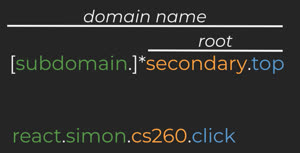

# CS 260 Notes Part I
General Notes for CS260 for use on the midterm and final

# Jusification for actions:
Professor Jensen (Discord CS 260 Help; General; 02/17/2023) [View message here:](https://discord.com/channels/748656649287368704/748656649287368708/1076153677422788628)

"Your start up README.md should be a big repository of everything you are discovering and want to record. **Put whatever you would like in there.**  The midterm is 60 multiple choice questions covering the Console, Internet, HTML, CSS, and JavaScript. No time limit. Make sure you come to the in-person review on March 6th, 3 PM (JKB 3108). That should set you up for success."

# The Console

Executing commands
The other primary purpose of the console is to execute commands. You already did this in the previous section when you executed commands for working with the file system. However, console commands can perform many different operations. Here are some basic commands that you show experiment with.


| Command | Explanation |
|---------|-------------|
| echo    | Output the parameters of the command |
| cd      | Change directory |
| mkdir   | make directory |
| rmdir   | remove directory |
| rm      | remove files |
| mv      | move files |
| cp      | copy files |
| ls      | list files |
| curl    | command line client URL browser |
| grep    | regular expression search |
| find    | find files |
| top     | view running processes with CPU and memory usage |
| df      | view disk statistics |
| cat     | output the contents of a file |
| less    | interactively output the contents of a file |
| wc      | count the words in a file |
| ps      | view the currently running processes |
| kill    | kill a currently running process |
| sudo    | execute a command as a super user or admin |
| ssh     | create a secure shell on a remote computer |
| scp     | securely copy files to a remote computer |
| history | show the history of commands |
| ping    | check if a website is up |
| tracert | trace the connections to a website |
| dig     | show the DNS information for a domain |
| man     | Look up a command in the manual |

You can also chain the input and output of commands using special characters
| Opperator | Explanation | Example |
|-----------|-------------| --------|
| ```\|```     | Take the output from the command on the left and pipe, or pass, it to the command on the right | `cat input.txt \| xxd` |
| ```>```     | Redirect output to a file. Overwrites the file if it exists | `echo "CS260" > text.txt` |
| ```>>```    | Redirect output to a file. Appends if the file exists | `echo "More CS 260" >> text.txt` |
| ```<```     | Redirect of file to input | `xxd < text.txt` | 

# Git/GitHub
 
* git pull
* git clone
* git commit
* git push

# The internet

📖 **Suggested reading**:

- [MDN How does the Internet work?](https://developer.mozilla.org/en-US/docs/Learn/Common_questions/How_does_the_Internet_work)
- [YouTube The Internet in 5 Minutes](https://youtu.be/7_LPdttKXPc)

The internet globally connects independent networks and computing devices. In a simplistic way, you can think of the internet as a massive redundant collection of wires that connect up all the computers in the world. A lot of those wires are wireless (wiFi, satellite, or cell), and not all of computers in the world are connected, but generally that is what the internet is. The deeper your mental model of the internet is, the more effectively you will be able to create web applications.


## Making connections

When one device wants to talk to another it must have an IP address. For example, `128.187.16.184` is BYU's address. Usually, human users prefer a symbolic name over an IP address. The symbolic name is called a domain name. Domain names are converted to IP address by doing a lookup in the Domain Name System (DNS). You can look up the IP address for any domain name using the `dig` console utility.

```sh
➜  dig byu.edu

byu.edu.		5755	IN	A	128.187.16.184
```


Once you have the IP address, you connect to the device it represents by first asking for a connection route to the device. A connection route consists of many hops across the network until the destination is dynamically discovered and the connection established. With the connection the transport and application layers start exchanging data.

### Traceroute

You can determine the hops in a connection using the `traceroute` console utility. In the following example, we trace the route between a home computer and BYU. In the result you see the first address `192.168.1.1`. This is the address of the network router the home computer is connected to. From there it goes through a couple devices that do not identify themselves and then hits the Google Fiber gateway. Google Fiber is the internet service provider, or ISP, for the requesting device. Then we jump through a few more unidentified devices before finally arriving at BYU (`128.187.16.184`).

```sh
➜  traceroute byu.edu

traceroute to byu.edu (128.187.16.184), 64 hops max, 52 byte packets
 1  192.168.1.1 (192.168.1.1)  10.942 ms  4.055 ms  4.694 ms
 2  * * *
 3  * * *
 4  192-119-18-212.mci.googlefiber.net (192.119.18.212)  5.369 ms  5.576 ms  6.456 ms
 5  216.21.171.197 (216.21.171.197)  6.283 ms  6.767 ms  5.532 ms
 6  * * *
 7  * * *
 8  * * *
 9  byu.com (128.187.16.184)  7.544 ms !X *  40.231 ms !X

```

If I run traceroute again I might see a slightly different route since every connection through the internet is dynamically calculated. The ability to discover a route makes the internet resilient when network devices fail or disappear from the network.

## Network internals
The actual sending of data across the internet uses the TCP/IP model. This is a layered architecture that covers everything from the physical wires to the data that a web application sends. At the top of the TCP/IP protocol is the application layer. It represents user functionality, such as the web (HTTP), mail (SMTP), files (FTP), remote shell (SSH), and chat (IRC). Underneath that is the transport layer which breaks the application layer's information into small chunks and sends the data. The actual connection is made using the internet layer. This finds the device you want to talk to and keeps the connection alive. Finally, at the bottom of the model is the link layer which deals with the physical connections and hardware.
## Network internals

The actual sending of data across the internet uses the TCP/IP model. This is a layered architecture that covers everything from the physical wires to the data that a web application sends. At the top of the TCP/IP protocol is the application layer. It represents user functionality, such as the web (HTTP), mail (SMTP), files (FTP), remote shell (SSH), and chat (IRC). Underneath that is the transport layer which breaks the application layer's information into small chunks and sends the data. The actual connection is made using the internet layer. This finds the device you want to talk to and keeps the connection alive. Finally, at the bottom of the model is the link layer which deals with the physical connections and hardware.

### [TCP/IP](https://en.wikipedia.org/wiki/Internet_protocol_suite) layers

| Layer       | Example         | Purpose                               |
| ----------- | --------------- | ------------------------------------- |
| Application | HTTPS           | Functionality like web browsing       |
| Transport   | TCP             | Moving connection information packets |
| Internet    | IP              | Establishing connections              |
| Link        | Fiber, hardware | Physical connections                  |

# Domain names

📖 **Suggested reading**: [MDN What is a Domain Name](https://developer.mozilla.org/en-US/docs/Learn/Common_questions/What_is_a_domain_name)

In the instruction about the internet we showed how an IP address can be referenced by a domain name. You can get the IP address for any domain using the `dig` console utility. Notice that in the following example there are actually multiple IP addresses associated with the domain name `amazon.com`. This allows for redundancy in case one of the IP addresses fails to successfully resolve to a valid connection because the server listening at that IP address is not responding.

```sh
➜  dig amazon.com

amazon.com.		126	IN	A	205.251.242.103
amazon.com.		126	IN	A	52.94.236.248
amazon.com.		126	IN	A	54.239.28.85
```

A domain name is simply a text string that follows a specific naming convention and is listed in a special database called the domain name registry.

Domain names are broken up into a root domain, with one or more possible subdomain prefixes. The root domain is represented by a secondary level domain and a top level domain. The top level domain (TLD) represent things like `com`, `edu`, or `click`. So a root domain would look something like `byu.edu`, `google.com`, or `cs260.click`. The [possible list of TLDs](https://www.icann.org/resources/pages/tlds-2012-02-25-en) is controlled by ICANN, one of the governing boards of the internet.



The owner of a root domain can create any number of subdomains off the root domain. Each subdomain may resolve to a different IP address. So the owner of `cs260.click` can have subdomains for travel (`travel.cs260.click`), finance (`finance.cs260.click`), or a blog (`blog.cs260.click`).

You can get information about a domain name from the domain name registry using the `whois` console utility.

```yaml
➜  whois byu.edu

Domain Name: BYU.EDU

Registrant:
	Brigham Young University
	3009 ITB
	2027 ITB
	Provo, UT 84602
	USA

Administrative Contact:
	Mark Longhurst
	Brigham Young University
	Office of Information Technology
	1208 ITB
	Provo, UT 84602
	USA
	+1.8014220488
	markl@byu.edu

Technical Contact:
	Brent Goodman
	Brigham Young University
	Office of Information Technology
	1203J ITB
	Provo, UT 84602
	USA
	+1.8014227782
	dnsmaster@byu.edu

Domain record activated:    19-Jan-1987
Domain record last updated: 11-Jul-2022
Domain expires:             31-Jul-2025
```

This provides information such as a technical contact to talk to if there is a problem with the domain, and an administrative contact to talk to if you want to buy the domain. Maybe we should talk to Mark and see if he is willing to sell.

## DNS

Once a domain name is in the registry it can be listed with a domain name system (DNS) server and associated with an IP address. Of course you must also lease the IP address before you can use it to uniquely identify a device on the internet, but that is a topic for another time. Every DNS server in the world references a few special DNS servers that are considered the `authoritative name servers` for associating a domain name with an IP address.

The DNS database records that facilitate the mapping of domain names to IP addresses come in several flavors. The main ones we are concerned with are the `address` (`A`) and the `canonical name` (`CNAME`) records. An `A` record is a straight mapping from a domain name to IP address. A `CNAME` record maps one domain name to another domain name. This acts as a domain name alias. You would use a CNAME to do things like map `byu.com` to the same IP address as `byu.edu` so that either one could be used.

When you enter a domain name into a browser, the browser first checks to see if it has the name already in its cache of names. If it does not, it contacts a DNS server and gets the IP address. The DNS server also keeps a cache of names. If the domain name is not in the cache, it will request the name from an `authoritative name server`. If the authority does not know the name then you get an unknown domain name error. If the process does resolve, then the browser makes the HTTP connection to the associated IP address.

As you can see, there is a lot of levels of name caching. This is done for performance reasons, but it also can be frustrating when you are trying to update the information associated with your domain name. This is where the `time to live` (`TTL`) setting for a domain record comes into play. You can set this to be something short like 5 minutes or as long as several days. The different caching layers should then honor the TTL and clear their cache after the requested period has passed.

# HTML
```
<!DOCTYPE html>
   <html lang="en">
   <head>
      <meta name="viewport" content="width=device-width", inital-scale=1.0">
      <title></title>
      <link rel="stylesheet" href="style.css">
   </head>
   <body>
      <header></header>
      <main></main>
      <footer></footer>
      <script src="index.js"></script>
   </body>
   </html>
```
HTML is the structure of a webpage built on tags

Sample elements

| Element                      | Description                                                                                                          |
|------------------------------|----------------------------------------------------------------------------------------------------------------------|
| `<div>`                      | Basic block element                                                                                                  |
| `<span>`                     | Same as div but is an inline element                                                                                 |
| `<nav>`                      | |
| `<h1><h2><h3><h4><h5><h6><p>`| Basic text element tags                                                                                              |
| `<b> <strong> <i> <em>`      | Bold, important text, italic, emphisized text                                                                        |
| `<table>`                    | Represents tabular data                                                                                              |
| `<tbody>`                    | Encapsulates a set of table rows (`<tr>` elements), indicating that they comprise the body of the table (`<table>`)  |
| `<thead>`                    | Defines a set of rows defing the head of the columns of the table.                                                   |
| `<th>`                       | Defines a cell as header of a group of table cells.                                                                  |
| `<td>`                       | Defines a cell of a table that contains data                                                                         |
| `<tr>`                       | Defines a row of cells in a table. The row's cells can then be established using a mix of `<td>` and `<th>` elements |
| `<li>`                       | Represents an item in a list. It must be contained in a parent element: an ordered list (`<ol>`), an unordered list (`<ul>`), or a menu (`<menu>`). In menues and unordered lists, list items are usually displayed using bullet points. In ordered lists, they are usually displayed with an ascending counter on the left, such as a number or letter |
 
HTML Input

| Element    | Meaning                          | Example                                        |
| ---------- | -------------------------------- | ---------------------------------------------- |
| `form`     | Input container and submission   | `<form action="form.html" method="post">`      |
| `fieldset` | Labeled input grouping           | `<fieldset> ... </fieldset>`                   |
| `input`    | Multiple types of user input     | `<input type="" />`                            |
| `select`   | Selection dropdown               | `<select><option>1</option></select>`          |
| `optgroup` | Grouped selection dropdown       | `<optgroup><option>1</option></optgroup>`      |
| `option`   | Selection option                 | `<option selected>option2</option>`            |
| `textarea` | Multiline text input             | `<textarea></textarea>`                        |
| `label`    | Individual input label           | `<label for="range">Range: </label>`           |
| `output`   | Output of input                  | `<output for="range">0</output>`               |
| `meter`    | Display value with a known range | `<meter min="0" max="100" value="50"></meter>` |

## Form element

The main purpose of the `form` element is to submit the values of the inputs it contains. Before JavaScript was introduced the `form` container element was essential because it was the only way for the browser to send the input data to a web server as part of a request to process the input and generate a new web page displaying the result of the input. With JavaScript we have much more control over input data and what is done with it. For example, in a single page application the JavaScript will dynamically rebuild the HTML elements to reflect the results of the user interaction. With this ability the data may not even be sent to the server. This greatly reduces the necessity of the `form` element, but it is often still used simply as a container. Just remember that you are not required to have a form element to use input elements.

Here is an example of a simple form that submits the value of a `textarea` element.

```html
<form action="submission.html" method="post">
  <label for="ta">TextArea: </label>
  <textarea id="ta" name="ta-id">
Some text
  </textarea>
  <button type="submit">Submit</button>
</form>
```

Pressing the submit button sends the following data to the web server. The browser generates the data by combining the textarea's `name` attribute with the current value of the textarea.

```
ta-id=Some+text
```

## Input element

The input element represents many different input types. You set the type of input with the `type` attribute. There are several different types to choose from. This includes different flavors of textual, numeric, date, and color inputs.

| Type           | Meaning                           |
| -------------- | --------------------------------- |
| text           | Single line textual value         |
| password       | Obscured password                 |
| email          | Email address                     |
| tel            | Telephone number                  |
| url            | URL address                       |
| number         | Numerical value                   |
| checkbox       | Inclusive selection               |
| radio          | Exclusive selection               |
| range          | Range limited number              |
| date           | Year, month, day                  |
| datetime-local | Date and time                     |
| month          | Year, month                       |
| week           | Week of year                      |
| color          | Color                             |
| file           | Local file                        |
| submit         | button to trigger form submission |

In order to create an input you specify the desired `type` attribute along with any other attribute associated with that specific input. Here is an example of a checked radio button and its associated label.

```html
<label for="checkbox1">Check me</label>
<input type="checkbox" name="varCheckbox" value="checkbox1" checked />
```

Most input elements share some common attributes. These include the following.

| Attribute | Meaning                                                                             |
| --------- | ----------------------------------------------------------------------------------- |
| name      | The name of the input. This is submitted as the name of the input if used in a form |
| disabled  | Disables the ability for the user to interact with the input                        |
| value     | The initial value of the input                                                      |
| required  | Signifies that a value is required in order to be valid                             |

The following shows what the inputs look like when rendered. Don't worry about how clunky they look right out of the box. We will fix that when we start styling things with CSS.


## Validating input

Several of the input elements have validation built into them. This means that they will not accept a value that is not for example, a number, a URL, outside of a range, or an email address. You can also specify the `required` attribute on an input element to mark it as requiring a value before it can be submitted. The `pattern` attribute exists on `text`, `search`, `url`, `tel`, `email`, and `password` inputs. When present, the pattern attribute provides a regular expression that must match for the input to be considered as valid.

You should also have validation built into your JavaScript that checks input data to ensures everything is valid before it is submitted. All of the input elements support functions for determining their validation state. Additionally, there are CSS style selectors for visualizing the validity of the input. In order to have a good user experience, it is critical that you provide sufficient user feedback early in the input process. A good design will give feedback as, or before, the user begins to input. A poor design will keep the user guessing as to why the data is not being accepted, or even if it was accepted.
 
 # HTML media elements

The HTML elements that represent media include `img`, `audio`, `video`, `svg`, and `canvas`. The `img`, `audio`, and `video` elements are all simple references to an external file, but `svg` and `canvas` both contain the code for render a visual image that can even be animated.

## External media

The media tags that reference external media all take a URL as an attribute. The path represented by the URL can either be a relative path or full path. A full path includes the protocol, domain name, and path to the file.

```html
https://images.pexels.com/photos/164170/pexels-photo-164170.jpeg
```

A relative path references a file that is served from the same location as the HTML page rendering the element. You want to make the path is as relative as possible so that you can move your code around without having to actually adjust all of the external page references. For example, if your HTML page is located in a directory with a subdirectory named `images` that contains a file named `photo.jpg` you would use a relative path as follows.

```html
images/photo.jpg
```

### Image

To include an image in your content you use the `img` element and specify the `src` attribute with the URL to the source image.
In order to support accessibility, you should also include an `alt` attribute that describes the image. A full img element would look like the following.

```html

```


### Audio

To include an audio file in your content you use the `audio` element and specify the `src` attribute with the URL to the source image. You can include the `controls` attribute if you want the user to be able to control the audio playback. If you do not display the controls then there is no visual representation of the audio in the rendered page. The `autoplay` attribute starts the audio playing as soon as the audio file is loaded, and the `loop` attribute keeps it playing over and over.

⚠ Note that automatically playing audio is strongly discouraged unless you provide a way for the user to opt-in to that behavior.

```html
<audio controls src="testAudio.mp3"></audio>
```


### Video

To include a video in your content you use the `video` element and specify the `src` attribute with the URL to the source video. Like the audio element you can include the `controls` or `autoplay` attributes

⚠ Note that you may need to include the `crossorigin="anonymous"` attribute if you are requesting files from a different domain than the one serving your content.

```html
<video controls width="300" crossorigin="anonymous">
  <source
    src="https://commondatastorage.googleapis.com/gtv-videos-bucket/sample/BigBuckBunny.mp4"
  />
</video>
```


## Internal media

The internal media elements `svg` and `canvas` allow you to actually create images directly within your HTML.

### Scalable Vector Graphics (SVG)

SVG is an extremely powerful and widely supported way to render graphics inline in your HTML. An example SVG graphic that draws a black border and a red circle looks like this:

```html
<svg
  viewBox="0 0 300 200"
  xmlns="http://www.w3.org/2000/svg"
  stroke="red"
  fill="red"
  style="border: 1px solid #000000"
>
  <circle cx="150" cy="100" r="50" />
</svg>
```


When combined with JavaScript and CSS you can produce some amazing visualizations. Checkout this [CodePen](https://codepen.io/leesjensen/pen/mdKjMLY) for an example.

Consult the [MDN documentation](https://developer.mozilla.org/en-US/docs/Web/SVG) if you are interested in learning more about SVG.

### Canvas

The `canvas` element was introduced to HTML in order to facilitate 2D drawing and animation. The HTML for the canvas element is fairly simple, but actually drawing on the canvas requires JavaScript support. Here again, is our simple red dot example.

```html
<canvas
  id="canvasDemo"
  width="300"
  height="200"
  style="border: 1px solid #000000"
></canvas>
<script>
  const ctx = document.getElementById('canvasDemo').getContext('2d');
  ctx.beginPath();
  ctx.arc(150, 100, 50, 0, 2 * Math.PI);
  ctx.fillStyle = 'red';
  ctx.strokeStyle = 'red';
  ctx.fill();
  ctx.stroke();
</script>
```
 
# CSS
 The first step in understanding CSS is mastering how to select the elements that a CSS rule applies to. The CSS rule selector can take many forms. In order to explain the most common selectors we need some demonstration HTML. Let's image a simple document describing the departments in a university. In our case we have a physics and a chemistry department. The information provided is very sparse, but the structure provided by the HTML is enough to work with.

```html
<body>
  <h1>Departments</h1>
  <p>welcome message</p>
  <section id="physics">
    <h2>Physics</h2>
    <p class="introduction">Introduction</p>
    <p>Text</p>
    <p class="summary">Summary</p>
  </section>
  <section id="chemistry">
    <h2>Chemistry</h2>
    <p class="introduction">Introduction</p>
    <p>Text</p>
    <p class="summary">Summary</p>
  </section>
</body>
```

By default every browser defines a base set of styles that it applies to all HTML. This varies slightly from browser to browser, but for the most part our document would render like this using the base browser styles.


We would like to style our document so that it looks like this when we are done.


## Element type selector

To start things off, we want to make all elements in the document use a sans-serif font. We can do this by using an element name selector. By selecting the `body` element we will cascade our declaration down to all the children of the body, which is the whole document.

```css
body {
  font-family: sans-serif;
}
```

Note that we could also use the wildcard element name selector (`*`) to select all elements, but for our needs the `body` element will work just fine.

We can also use element name selectors to give a bottom border to the top level heading (`h1`), as well as modify the section elements to pop out with a gray background and some white space in the padding and margins.

```css
h1 {
  border-bottom: thin black solid;
}

section {
  background: #eeeeee;
  padding: 0.25em;
  margin-bottom: 0.5em;
}
```

## Combinators

Next we want to change the color of the second level headings (`h2`), but we only want to do that within the sections for each department. To make that happen we can provide a `descendant combinator` that is defined with a space delimited list of values where each item in the list is a descendant of the previous item. So our selector would be all `h2` elements that are descendants of `section` elements.

```css
section h2 {
  color: #004400;
}
```

There are other types of combinators that you can use. These include the following.

| Combinator       | Meaning                    | Example        | Description                                |
| ---------------- | -------------------------- | -------------- | ------------------------------------------ |
| Descendant       | A list of descendants      | `body section` | Any section that is a descendant of a body |
| Child            | A list of direct children  | `section > p`  | Any p that is a direct child of a section  |
| General sibling  | A list of siblings         | `p ~ div`      | Any p that has a div sibling               |
| Adjacent sibling | A list of adjacent sibling | `p + div`      | Any p that has an adjacent div sibling     |

We can use the general sibling combinator to increase the whitespace padding on the left of paragraphs that are siblings of a level two heading.

```css
h2 ~ p {
  padding-left: 0.5em;
}
```

## Class selector

The next selector we will use is the class selector. Remember that any element can have zero or more classification applied to it. For example, our document has a class of `introduction` applied to the first paragraph, and a class of `summary` applied to the final paragraph of each section. If we want to bold the summary paragraphs we would supply the class name summary prefixed with a period (`.summary`).

```css
.summary {
  font-weight: bold;
}
```

You can also combine the element name and class selectors to select all paragraphs with a class of summary.

```css
p.summary {
  font-weight: bold;
}
```

## ID selector

ID selectors reference the ID of an element. All IDs should be unique within an HTML document and so this select targets a specific element. To use the ID selector you prefix the ID with the hash symbol (`#`). We would like to showcase our physics department by putting a thin purple border along the left side of the physics section.

```css
#physics {
  border-left: solid 1em purple;
}
```

## Attribute selector

Attribute selectors allow you to select elements based upon their attributes. You use an attribute selector to select any element with a given attribute (`a[href]`). You can also specify a required value for an attribute (`a[href="./fish.png"]`) in order for the selector to match. Attribute selectors also support wildcards such as the ability to select attribute values containing specific text (`p[href*="https://"]).

```css
p[class='summary'] {
  color: red;
}
```

For a full description of attribute selections refer to [MDN](https://developer.mozilla.org/en-US/docs/Web/CSS/Attribute_selectors).

## Pseudo selector

CSS also defines a significant list of pseudo selectors which select based on positional relationships, mouse interactions, hyperlink visitation states, and attributes. We will give just one example. Suppose we what our purple highlight bar to appear only when the mouse hovers over the text. To accomplish this we can change our ID selector to select whenever a section is hovered over.

```css
section:hover {
  border-left: solid 1em purple;
}
```
 
 CSS rule declarations specify a property and value to assign when the rule selector matches one or more elements. There are legions of possible properties defined for modifying the style of an HTML document. For our purposes we will discuss just a few of the more commonly used ones so that you can get a feel for wide variety of functionality they represent.

| Property           | Value                              | Example             | Discussion                                                                     |
| ------------------ | ---------------------------------- | ------------------- | ------------------------------------------------------------------------------ |
| background-color   | color                              | `red`               | Fill the background color                                                      |
| border             | color width style                  | `#fad solid medium` | Sets the border using shorthand where any or all of the values may be provided |
| border-radius      | unit                               | `50%`               | The size of the border radius                                                  |
| box-shadow         | x-offset y-offset blu-radius color | `2px 2px 2px gray`  | Creates a shadow                                                               |
| columns            | number                             | `3`                 | Number of textual columns                                                      |
| column-rule        | color width style                  | `solid thin black`  | Sets the border used between columns using border shorthand                    |
| color              | color                              | `rgb(128, 0, 0)`    | Sets the text color                                                            |
| cursor             | type                               | `grab`              | Sets the cursor to display when hovering over the element                      |
| display            | type                               | `none`              | Defines how to display the element and its children                            |
| filter             | filter-function                    | `grayscale(30%)`    | Applies a visual filter                                                        |
| float              | direction                          | `right`             | Places the element to the left or right in the flow                            |
| flex               |                                    |                     | Flex layout. Used for responsive design                                        |
| font               | family size style                  | `Arial 1.2em bold`  | Defines the text font using shorthand                                          |
| grid               |                                    |                     | Grid layout. Used for responsive design                                        |
| height             | unit                               | `.25em`             | Sets the height of the box                                                     |
| margin             | unit                               | `5px 5px 0 0`       | Sets the margin spacing                                                        |
| max-[width/height] | unit                               | `20%`               | Restricts the width or height to no more than the unit                         |
| min-[width/height] | unit                               | `10vh`              | Restricts the width or height to no less than the unit                         |
| opacity            | number                             | `.9`                | Sets how opaque the element is                                                 |
| overflow           | [visible/hidden/scroll/auto]       | `scroll`            | Defines what happens when the content does not fix in its box                  |
| position           | [static/relative/absolute/sticky]  | `absolute`          | Defines how the element is positioned in the document                          |
| padding            | unit                               | `1em 2em`           | Sets the padding spacing                                                       |
| left               | unit                               | `10rem`             | The horizontal value of a positioned element                                   |
| text-align         | [start/end/center/justify]         | `end`               | Defines how the text is aligned in the element                                 |
| top                | unit                               | `50px`              | The vertical value of a positioned element                                     |
| transform          | transform-function                 | `rotate(0.5turn)`   | Applies a transformation to the element                                        |
| width              | unit                               | `25vmin`            | Sets the width of the box                                                      |
| z-index            | number                             | `100`               | Controls the positioning of the element on the z axis                          |

## Units

📖 **Suggested reading**: [MDN Values and units](https://developer.mozilla.org/en-US/docs/Learn/CSS/Building_blocks/Values_and_units)

You can use a variety of units when defining the size of a CSS property. For example, a the width of an element can be defined using absolute units such as the number of pixels (`px`) or inches (`in`). You can also use relative units such as a percentage of the parent element (`50%`), a percentage of a minimum viewport dimension (`25vmin`), or a multiplier of the size of the letter m (`1.5rem`) as defined by the root element.

```css
p {
  width: 25%;
  height: 30vh;
}
```

Here is a list of the most commonly used units. All of the units are prefixed with a number when used as a property value.

| Unit | Description                                                      |
| ---- | ---------------------------------------------------------------- |
| px   | The number of pixels                                             |
| pt   | The number of points (1/72 of an inch)                           |
| in   | The number of inches                                             |
| cm   | The number of centimeters                                        |
| %    | A percentage of the parent element                               |
| em   | A multiplier of the width of the letter `m` in the parent's font |
| rem  | A multiplier of the width of the letter `m` in the root's font   |
| ex   | A multiplier of the height of the element's font                 |
| vw   | A percentage of the viewport's width                             |
| vh   | A percentage of the viewport's height                            |
| vmin | A percentage of the viewport's smaller dimension                 |
| vmax | A percentage of the viewport's larger dimension                  |

## Color

📖 **Suggested reading**: [MDN Applying color](https://developer.mozilla.org/en-US/docs/Web/CSS/CSS_Colors/Applying_color)

CSS defines multiple ways to describe color, ranging from representations familiar to programmers and ones familiar to layout designers and artists.

| Method       | Example                   | Description                                                                                                                                                                                                       |
| ------------ | ------------------------- | ----------------------------------------------------------------------------------------------------------------------------------------------------------------------------------------------------------------- |
| keyword      | `red`                     | A set of predefined colors (e.g. white, cornflowerblue, darkslateblue)                                                                                                                                            |
| RGB hex      | `#00FFAA22` or `#0FA2`    | Red, green, and blue as a hexadecimal number, with an optional alpha opacity                                                                                                                                      |
| RGB function | `rbg(50%, 255, 128, 0.5)` | Red, green, and blue as a percentage or number between 0 and 255, with an optional alpha opacity percentage                                                                                                       |
| HSL          | `hsl(180, 30%, 90%, 0.5)` | Hue, saturation, and light, with an optional opacity percentage. Hue is the position on the 365 degree color wheel (red is 0 and 255). Saturation is how gray the color is, and light is how bright the color is. |

 Modern web applications are expected to run well on a large variety of computing devices. This includes everything from desktops, to mobile phones, to shopping kiosks, to car dashboards. This ability to reconfigure the interface so the application accommodates and takes advantage of the screen's size and orientation is called `responsive design`.

Much of HTML and CSS is already fluid due to the fact that it responds to the browser window being resized. For example a paragraph element will resize when the browser window is resized. However, the following features can completely change the layout of the application based on the device's size and orientation.

## Display
 The CSS display property allows you to change how an HTML element is displayed by the browser. The common options for the display property include the following.

| Value  | Meaning                                                                                                                      |
| ------ | ---------------------------------------------------------------------------------------------------------------------------- |
| none   | Don't display this element. The element still exists, but the browser will not render it.                                    |
| block  | Display this element with a width that fills its parent element. A `p` or `div` element has block display by default.        |
| inline | Display this element with a width that is only as big as its content. A `b` or `span` element has block display by default.  |
| flex   | Display this element's children in a flexible orientation.                                                                   |
| grid   | Display this element's children in a grid orientation.                                                                       |

We can demonstrate the different CSS display property values with the following HTML that contains a bunch of `div` elements. By default `div` elements have a display property value of `block`.
 
 ## Viewport meta tag

When smart mobile devices started gaining popularity they began to be used to view websites. However, the websites were optimized for desktop displays and not little tiny mobile screens. To solve this mobile browsers automatically started scaling the website so that it looked better on a small screen. Unfortunately, as web applications started being responsive to the screen size, the mobile browser's scaling got in the way. The solution is to include a meta tag in the `head` element of all your HTML pages. This tells the browser to not scale the page.

```html
<meta name="viewport" content="width=device-width,initial-scale=1" />
```

## Float

The float css property moves an element to the left or right of its container element and allows inline elements to wrap around it. For example, if we had an `aside` element followed by a large paragraph of text, we could create the following CSS rule in order to cause the text to wrap around the aside.

```css
aside {
  float: right;
  padding: 3em;
  margin: 0.5em;
  border: black solid thin;
}
```
 
 ## Media queries

One of the main CSS features for creating responsive applications is the `@media` selector. This selector dynamically detects the size and orientation of the device and applies CSS rules to represent the structure of the HTML in a way that accommodates the change.

We can use the `@media` selector to tell us which side of the screen (technically the viewport) is the longest. A media query takes one or more predicates separated by boolean operators. In our case we simply want to know if the screen is oriented in portrait mode (short side on top) or not. If it is then we transform all of our div elements by rotating them 270 degrees.

```css
@media (orientation: portrait) {
  div {
    transform: rotate(270deg);
  }
}
```


# CSS Animation

📖 **Suggested reading**: [MDN Animation](https://developer.mozilla.org/en-US/docs/Web/CSS/CSS_Animations/Using_CSS_animations)

Using CSS to animate your components is an easy way to make your application feel alive and interactive. You create CSS animations using the `animation` properties and defining `keyframes` for what the element should look like a different times in the animation. Let's walk through an example.

We have a paragraph of centered text and we want it to zoom in until its size is 20% of the view height.

```css
p {
  text-align: center;
  font-size: 20vh;
}
```

To make this happen we specify that we are animating the selected elements by adding the `animation-name` property with a value of demo. This name refers to the name of the `keyframes` that we will specify in a minute. The keyframes tell what CSS properites should be applied at different key points in the animation sequence. We also add an `animation-duration` property in order to specify that the animation should last for three seconds.

```css
p {
  text-align: center;
  font-size: 20vh;

  animation-name: demo;
  animation-duration: 3s;
}
```

Now we are ready to create the keyframes. We don't have to define what happens at every millisecond of the animation. Instead we only need to define the key points and CSS will generate a smooth transition to move from one keyframe to another. In our case we simply want to start with text that is invisible and have it zoom into the full final size. We can do this with two frames that are designated with the keywords `from` and `to`.

```css
@keyframes demo {
  from {
    font-size: 0vh;
  }

  to {
    font-size: 20vh;
  }
}
```

That's every thing we need to do. However, let's made one more addition. It would look better if towards the end, the paragraph bounce out a little bigger than its final size. We can accommodate that by adding another key frame that happens 95 percent through the animation.

```css
@keyframes demo {
  from {
    font-size: 0vh;
  }

  95% {
    font-size: 21vh;
  }

  to {
    font-size: 20vh;
  }
}
```

# CSS Flexbox

**Recommend reading**:

- [MDN Flexbox](https://developer.mozilla.org/en-US/docs/Web/CSS/CSS_Flexible_Box_Layout/Basic_Concepts_of_Flexbox)
- [CSS Tricks Flexbox](https://css-tricks.com/snippets/css/a-guide-to-flexbox/)
- [Flexbox Froggy](https://flexboxfroggy.com/)

The `flex` display layout is useful when you want to partition your application into areas that responsively move around as the window resizes or the orientation changes. In order to demonstrate the power of flex we will build an application that has a header, footer, and a main content area that is split into two sections, with controls of the left and content on the right.

So we can visualize our design by quickly sketching it out.


Next we build our structural HTML to match our design.

```html
<body>
  <header>
    <h1>CSS flex &amp; media query</h1>
  </header>
  <main>
    <section>
      <h2>Controls</h2>
    </section>
    <section>
      <h2>Content</h2>
    </section>
  </main>
  <footer>
    <h2>Footer</h2>
  </footer>
</body>
```

Now we can use Flexbox to make it all come alive. We make the body element into a responsive flexbox by including the CSS `display` property with the value of `flex`. This tells the browser that all of the children of this element are to be displayed in a flex flow. We want our top level flexbox children to be column oriented and so we add the `flex-direction` property with a value of `column`. We then add some simple other declarations to zero out the margin and fill the entire viewport with our application frame.

```css
body {
  display: flex;
  flex-direction: column;
  margin: 0;
  height: 100vh;
}
```

To get the division of space for the flexbox children correct we add the following flex properties to each of the children.

- **header** - `flex: 0 80px` - Zero means it will not grow and 80px means it has a starting basis height of 80 pixels. This creates a fixed size box.
- **footer** - `flex: 0 30px` - Like the header it will not grow and has a height of 30 pixels.
- **main** - `flex: 1` - One means it will get one fractional unit of growth, and since it is the only child with a non-zero growth value, it will get all the remaining space. Main also gets some additional properties because with want it to also be a flexbox container for the controls and content area. So we set its display to be `flex` and specify the `flex-direction` to be row so that the children are oriented side by side.

```css
header {
  flex: 0 80px;
  background: hsl(223, 57%, 38%);
}

footer {
  flex: 0 30px;
  background: hsl(180, 10%, 10%);
}

main {
  flex: 1;
  display: flex;
  flex-direction: row;
}
```

Now we just need to add CSS to the control and content areas represented by the two child section elements. We want the controls to have 25% of the space and the content to have the remaining. So we set the `flex` property value to 1 and 3 respectively. That means that the controls get one unit of space and the content gets three units of space. No matter how we resize things this ratio will responsively remain.

```css
section:nth-child(1) {
  flex: 1;
  background-color: hsl(180, 10%, 80%);
}
section:nth-child(2) {
  flex: 3;
  background-color: white;
}
```

## Media Query

That completes our original design, but we also want to handle small screen sizes. To do this, we add some media queries that drop the header and footer if the viewport gets too short, and orients the main sections as rows if it gets too narrow.

To support the narrow screen (portrait mode), we include a media query that detects when we are in portrait orientation and sets the `flex-direction` of the main element to be column instead of row. This causes the children to be stacked on top of each other instead of side by side.

To handle making our header and footer disappear when the screen is to short to display them, we use a media query that triggers when our viewport height has a maximum value of 700 pixels. When that is true we change the `display` property for both the header and the footer to `none` so that they will be hidden. When that happens the main element becomes the only child and since it has a flex value of 1, it takes over everything.

```css
@media (orientation: portrait) {
  main {
    flex-direction: column;
  }
}

@media (max-height: 700px) {
  header {
    display: none;
  }
  footer {
    display: none;
  }
}
```

# CSS Grid

**Recommend reading**:

- [MDN Grid](https://developer.mozilla.org/en-US/docs/Web/CSS/CSS_Grid_Layout/Basic_Concepts_of_Grid_Layout)
- [Grid by example](https://gridbyexample.com/)

The `grid` display layout is useful when you want to display a group of child elements in a responsive grid. We start with a container element that has a bunch of child elements.

```html
<div class="container">
  <div class="card"></div>
  <div class="card"></div>
  <div class="card"></div>
  <div class="card"></div>
  <div class="card"></div>
  <div class="card"></div>
  <div class="card"></div>
  <div class="card"></div>
  <div class="card"></div>
</div>
```

We turn this into a responsive grid by including a CSS `display` property with the value of `grid` on the container element. This tells the browser that all of the children of this element are to be displayed in a grid flow. The next property, `grid-template-columns`, specifies the layout of the grid columns. In this example we say that we want to repeatedly define each column to auto-fill the parent element's width with children that are resized to a minimum of 300 pixels and a maximum of one equal fractional unit (`1fr`) of the grid width. A fractional unit is dynamically computed by splitting up the parent element's width into equal parts for each of the children.

We finish off the grid configuration by saying that we want all rows to be exactly 300 pixels high with the `grid-auto-rows` property and the use the `grid-gap` property to say that we want at least a 1 em gap between our grid items.

```css
.container {
  display: grid;
  grid-template-columns: repeat(auto-fill, minmax(300px, 1fr));
  grid-auto-rows: 300px;
  grid-gap: 1em;
}
```

# CSS Frameworks

CSS frameworks provide functions and components that commonly appear in web applications. As web developers built more and more web applications they began to use the same patterns over and over. They combined these patterns into a shared package of code and contributed it to the world as open source repositories. This helped not only decrease the time to develop an application, but created a common user experience for the web in general.

Today, there are lots of different open source CSS frameworks available to choose from. Many of them contain the same types of functionality, but they all bring something a little different to the table.


\- **Source**: [_StateOfCSS CSS framework poll_](https://2021.stateofcss.com/en-US/technologies/css-frameworks)

## Tailwind

A new rising contender in the CSS framework space is [Tailwind CSS](https://tailwindcss.com/) and its associated component library [Tailwind UI](https://tailwindui.com/). In the 2022 StateOfCSS poll, Tailwind gained an impressive 46% general usage ranking with a retention rating of 78%, all within the last four years.

Tailwind takes a different approach than traditional CSS frameworks. Instead of using large, rich, CSS rulesets to compartmentalize styling and functionality, it uses smaller definitions that are applied specifically to individual HTML elements. This moves much of the CSS representation out of the CSS file and directly into the HTML.

```html
<div class="pt-6 md:p-8 text-center md:text-left space-y-4">
  
  <p class="text-lg font-medium">“Tailwind CSS”</p>
</div>
```

## Bootstrap

🔑 **Required reading**: [Getting started with Bootstrap](https://getbootstrap.com/docs/5.2/getting-started/introduction/)

The reigning champion for CSS frameworks is [Bootstrap](https://getbootstrap.com/). Bootstrap has been supported by an active and vibrant community for over a decade and contains many lessons learned from real world applications. The major downside of Bootstrap is its own success. Because it is so popular, Bootstrap defines the de facto look and feel of websites. This is great for user experience continuity, but it makes it difficult for a website to grab the attention of new users.

### Getting bootstrap

You can integrate Bootstrap into your web applications simply by referencing the Bootstrap CSS files from their [content delivery network](https://getbootstrap.com/docs/5.2/getting-started/introduction/#cdn-links) (CDN). You then add the HTML link elements to your head element like this.

```html
<!DOCTYPE html>
<html lang="en">
  <head>
    <meta name="viewport" content="width=device-width, initial-scale=1" />
    <link
      href="https://cdn.jsdelivr.net/npm/bootstrap@5.2.3/dist/css/bootstrap.min.css"
      rel="stylesheet"
      integrity="sha384-rbsA2VBKQhggwzxH7pPCaAqO46MgnOM80zW1RWuH61DGLwZJEdK2Kadq2F9CUG65"
      crossorigin="anonymous"
    />
  </head>
  <body>
    ...
  </body>
</html>
```

If you are going to use Bootstrap components that require JavaScript (carousel, buttons, and more), you will also need to include Bootstrap's JavaScript module. You add this by putting the following at the end of your HTML body element.

```html
<body>
  ...

  <script
    src="https://cdn.jsdelivr.net/npm/bootstrap@5.2.3/dist/js/bootstrap.bundle.min.js"
    integrity="sha384-kenU1KFdBIe4zVF0s0G1M5b4hcpxyD9F7jL+jjXkk+Q2h455rYXK/7HAuoJl+0I4"
    crossorigin="anonymous"
  ></script>
</body>
```

Later on, when we introduce the idea of bundling your application, you will want to use the Node Package Manager (NPM) to download Bootstrap and include it in your source code so that you don't have to rely on someone else's server to provide you with a vital piece of your application. To include Bootstrap in your application using NPM you would run the following from your console.

```sh
npm install bootstrap@5.2.3
```

⚠ Note that those links are version specific (version 5 in this case). You will want to get the latest version links when you begin building your application.

### Using bootstrap

Once you have Bootstrap linked in your HTML files you can begin using the components it provides. Let's start with a simple button. When we use the Bootstrap `btn` CSS class, the button gets a nice looking rounded appearance. The Bootstrap `btn-primary` CSS class shades the button with the current primary color for the application, which by default is blue. The following demonstrates the difference between a Bootstrap style button and a plain vanilla button. Functionally they both work exactly the same. The Bootstrap button is just a lot easier on the eyes.

```html
// Bootstrap styled button
<button type="button" class="btn btn-primary">Bootstrap</button>

// Default browser styled button
<button type="button">Plain</button>
```

# JavaScript

# Truthy and Falsy

In Javascript, a truthy value is a value that is considered  `TRUE` when encountered in a Boolean context. All values are truthy unless they are dfined as falsy. That is, all values are truthy except  `false`, 0, -0, 0n, "", `null`, `undefined` and `NaN`.


# Functions

📖 **Suggested reading**: [MDN Functions](https://developer.mozilla.org/en-US/docs/Web/JavaScript/Reference/Functions)

In JavaScript functions are first class objects. That means that they can be assigned a name, passed as a parameter, returned as a result, and referenced from an object or array just like any other variable.

The basic syntax of a function begins with the `function` keyword followed by zero or more parameters and a body that may contain zero or more return statements. The return statement my return a single value. Note that there are no type declarations, as the type is always inferred by the assignment of the value to the parameter.

```js
function hello(who) {
  return 'hello ' + who;
}

console.log(hello('world'));
// OUTPUT: hello world
```

A function without a return value usually exists to produce some side effect like modifying a parameter or interacting with an external program. In the following example the side effect of the function is to output text to the debugger console.

```js
function hello(who) {
  who.count++;
  console.log('hello ' + who.name);
}

hello({ name: 'world', count: 0 });
// OUTPUT: hello world
```

## Function parameters

When a function is called, the caller may choose what parameters to provide. If a parameter is not provided then the value of the parameter is `undefined` when the function executes.

In addition to explicitly passing the value of a parameter to a function, the function can define a default value. This is done by assigning a value to the parameter in the function declaration.

```js
function labeler(value, title = 'title') {
  console.log(`${title}=${value}`);
}

labeler();
// OUTPUT: title=undefined

labeler('fish');
// OUTPUT: title=fish

labeler('fish', 'animal');
// OUTPUT: animal=fish
```

## Anonymous functions

Functions in JavaScript are commonly assigned to a variable so that they can be passed as a parameter to some other function or stored as an object property. To easily support this common use you can define a function anonymously and assign it to a variable.

```js
// Function that takes a function as a parameter
function doMath(operation, a, b) {
  return operation(a, b);
}

// Anonymous function assigned to a variable
const add = function (a, b) {
  return a + b;
};

console.log(doMath(add, 5, 3));
// OUTPUT: 8

// Anonymous function assigned to a parameter
console.log(
  doMath(
    function (a, b) {
      return a - b;
    },
    5,
    3
  )
);
// OUTPUT: 2
```

## Creating, passing, and returning functions

Here are examples of assigning functions to variables, as well as using functions as parameters and return values.

```js
// Anonymous declaration of the function that is later assigned to a variable
const add = function (a, b) {
  return a + b;
};

// Function that logs as a side effect of its execution
function labeler(label, value) {
  console.log(label + '=' + value);
}

// Function that takes a function as a parameter and then executes the function as a side effect
function addAndLabel(labeler, label, adder, a, b) {
  labeler(label, adder(a, b));
}

// Passing a function to a function
addAndLabel(labeler, 'a+b', add, 1, 3);
// OUTPUT: a+b=4

// Function that returns a function
function labelMaker(label) {
  return function (value) {
    console.log(label + '=' + value);
  };
}

// Assign a function from the return value of the function
const nameLabeler = labelMaker('name');

// Calling the returned function
nameLabeler('value');
// OUTPUT: name=value
```

## Inner functions

Functions can also be declared inside other functions. This allows you to modularize your code without always exposing private details.

```js
function labeler(value) {
  function stringLabeler(value) {
    console.log('string=' + value);
  }
  function numberLabeler(value) {
    console.log('number=' + value);
  }

  if (typeof value == 'string') {
    stringLabeler(value);
  } else if (typeof value == 'number') {
    numberLabeler(value);
  }
}

labeler(5);
// OUTPUT: number=5

labeler('fish');
// OUTPUT: string=fish
```

# JavaScript arrow function

Because functions are first order objects in JavaScript they can be declared anywhere and passed as parameters. This results in code with lots of anonymous functions cluttering things up. To make the code more compact the `arrow` syntax was created. This syntax replaces the need for the `function` keyword with the symbols `=>` placed after the parameter declaration. The enclosing curly braces are also optional.

This is a function in arrow syntax that takes no parameters and always returns 3.

```js
() => 3;
```

The following two invocations of sort are equivalent.

```js
const a = [1, 2, 3, 4];

// standard function syntax
a.sort(function (a, b) {
  return a - b;
});

// arrow function syntax
a.sort((a, b) => a - b);
```

Besides being compact, the `arrow` function syntax has some important semantic differences from the standard function syntax. This includes restrictions that arrow functions cannot be used for constructors or iterator generators.

## Return values

Arrow functions also have special rules for the `return` keyword. The return keyword is optional if no curly braces are provided for the function and it contains a single expression. In that case the result of the expression is automatically returned. If curly braces are provided then the arrow function behaves just like a standard function.

```js
() => 3;
// RETURNS: 3

() => {
  3;
};
// RETURNS: undefined

() => {
  return 3;
};
// RETURNS: 3
```

## This pointer

Next, arrow functions inherit the `this` pointer from the scope of where it is created. This makes what is know as a `closure`. A closure allows a function to continue referencing its creation scope, even after it has passed out of that scope. This can be tricky to wrap your head around, and we discuss it in detail when we later talk about JavaScript `scope`. For now consider the following example.

The function `makeClosure` returns an anonymous function using the arrow syntax. Notice that the `a` parameter is overridden, a new `b` variable is created, and both `a` and `b` are referenced in the arrow function. Because of that reference, they are both part of the closure for the returned function.

```js
function makeClosure(a) {
  a = 'a2';
  const b = 'b2';
  return () => [a, b];
}
```

Next, we declare the variables `a` and `b` at the top level scope, and call `makeClosure` with `a`.

```js
const a = 'a';
const b = 'b';

const closure = makeClosure(a);
```

Now, when we call `closure` function it will output the values contained in scope where it was created instead of the current values of the variables.

```js
console.log(closure());
// OUTPUT: ['a2', 'b2']

console.log(a, b);
// OUTPUT: 'a' 'b'
```

Closures provide a valuable property when we do things like execute JavaScript within the scope of an HTML page, because it can remember the values of variables when the function was created instead of what they are when they are executed.

# JavaScript array

📖 **Suggested reading**: [MDN Array](https://developer.mozilla.org/en-US/docs/Web/JavaScript/Reference/Global_Objects/Array)

JavaScript array objects represent a sequence of other objects and primitives. You can reference the members of the array using a zero based index. You can create an array with the Array constructor or using the array literal notation shown below.

```js
const a = [1, 2, 3];
console.log(a[1]);
// OUTPUT: 2

console.log(a.length);
// OUTPUT: 3

for (let j in a) {
   console.log(a[j]);
}

```

## Object functions

The Array object has several interesting static functions associated with it. Here are some of the interesting ones.

| Function | Meaning                                                   | Example                       |
| -------- | --------------------------------------------------------- | ----------------------------- |
| push     | Add an item to the end of the array                       | `a.push(4)`                   |
| pop      | Remove an item from the end of the array                  | `x = a.pop`                   |
| slice    | Return a sub-array                                        | `a.slice(1,-1)`               |
| sort     | Run a function sort an array in place                     | `a.sort((a,b) => b-a)`        |
| values   | Creates an iterator for use with a `for of` loop          | `for (i of a.values()) {...}` |
| find     | Find the first item satisfied by a test function          | `a.find(i => i < 2)`          |
| forEach  | Run a function on each array item                         | `a.forEach(console.log)`      |
| reduce   | Run a function to reduce each array item to a single item | `a.reduce((a, c) => a + c)`   |
| map      | Run a function to map an array to a new array             | `a.map(i => i+i)`             |
| filter   | Run a function to remove items                            | `a.filter(i => i%2)`          |
| every    | Run a function to test if all items match                 | `a.every(i => i < 3)`         |
| some     | Run a function to test if any items match                 | `a.some(i => 1 < 1)`          |

```js
const a = [1, 2, 3];

console.log(a.map((i) => i + i));
// OUTPUT: [2,4,6]
console.log(a.reduce((v1, v2) => v1 + v2));
// OUTPUT: 6
console.log(a.sort((v1, v2) => v2 - v1));
// OUTPUT: [3,2,1]

a.push(4);
console.log(a.length);
// OUTPUT: 4
```

# JavaScript object and classes

📖 **Suggested reading**: [MDN Classes in JavaScript](https://developer.mozilla.org/en-US/docs/Learn/JavaScript/Objects/Classes_in_JavaScript)

A JavaScript object represents a collection of name value pairs referred to as properties. The property name must be of type String or Symbol, but the value can be of any type. Objects also have common object-oriented functionality such as constructors, a this pointer, static properties and functions, and inheritance.

Objects can be created with the new operator. This causes the object's constructor to be called. Once declared you can add properties to the object by simply referencing the property name in an assignment. Any type of variable can be assigned to a property. This includes a sub-object, array, or function. The properties of an object can be referenced either with dot (`obj.prop`) or bracket notation (`obj['prop']`).

```js
const obj = new Object();

obj.c = [1, 2, 3];
obj.hello = function () {
  console.log('hello');
};

console.log(obj);
// OUTPUT: {a: 3, b: 'fish', c: [1,2,3], hello: func}
```

The ability to dynamically modify an object is incredibly useful when manipulating data with an indeterminate structure.

⚠ Note the different uses of the term `object`. Object can refer to the standard JavaScript objects (e.g. `Promise, Map, Object, Function, Date, ...`), or it can refer specifically to the JavaScript Object object (i.e. `new Object()`), or it can refer to any JavaScript object you create (e.g. `{a:'a', b:2}` ). This overloaded usage can be a bit confusing.

## Object-literals

You can also declare a variable of object type with the `object-literal` syntax. This syntax allows you to provide the initial composition of the object.

```js
const obj = {
  a: 3,
  b: 'fish',
};
```

## Object functions

Object has several interesting static functions associated with it. Here are some of the commonly used ones.

| Function | Meaning                             |
| -------- | ----------------------------------- |
| entries  | Returns an array of key value pairs |
| keys     | Returns an array of keys            |
| values   | Returns an array of values          |

```js
const obj = {
  a: 3,
  b: 'fish',
};

console.log(Object.entries(obj));
// OUTPUT: [['a', 3], ['b', 'fish']]
console.log(Object.keys(obj));
// OUTPUT: ['a', 'b']
console.log(Object.values(obj));
// OUTPUT: [3, 'fish']
```

## Constructor

Any function that returns an object is considered a `constructor` and can be invoked with the `new` operator.

```js
function Person(name) {
  return {
    name: name,
  };
}

const p = new Person('Eich');
console.log(p);
// OUTPUT: {name: 'Eich'}
```

Because objects can have any type of property value you can create methods on the object as part of its encapsulation.

```js
function Person(name) {
  return {
    name: name,
    log: function () {
      console.log('My name is ' + this.name);
    },
  };
}

const p = new Person('Eich');
p.log();
// OUTPUT: My name is Eich
```

## This pointer

Notice in the last example the use of the keyword `this` when we referred to the name property (`this.name`). The meaning of `this` depends upon the scope of where it is used, but in the context of an object it refers to a pointer to the object. We will talk more about the `this` pointer in the instruction on scope.

## Classes

You can use classes to define objects. Using a class clarifies the intent to create a reusable component rather than a one off object. Class declarations looks similar to declaring an object, but classes have an explicit constructor and assumed function declarations. The person object from above would look like the following when converted to a class.

```js
class Person {
  constructor(name) {
    this.name = name;
  }

  log() {
    console.log('My name is ' + this.name);
  }
}

const p = new Person('Eich');
p.log();
// OUTPUT: My name is Eich
```

You can make properties and functions of classes private by prefixing them with a `#`.

```js
class Person {
  #name;

  constructor(name) {
    this.#name = name;
  }
}

const p = new Person('Eich');
p.#name = 'Lie';
// OUTPUT: Uncaught SyntaxError: Private field '#name' must be declared in an enclosing class
```

## Inheritance

Classes can be extended by using the `extends` keyword to define inheritance. Parameters that need to be passed to the parent class are delivered using the `super` function. Any functions defined on the child that have the same name as the parent override the parent's implementation. A parent's function can be explicitly accessed using the `super` keyword.

```js
class Person {
  constructor(name) {
    this.name = name;
  }

  print() {
    return 'My name is ' + this.name;
  }
}

class Employee extends Person {
  constructor(name, position) {
    super(name);
    this.position = position;
  }

  print() {
    return super.print() + '. I am a ' + this.position;
  }
}

const e = new Employee('Eich', 'programmer');
console.log(e.print());
// OUTPUT: My name is Eich. I am a programmer
```
# JavaScript regular expressions

📖 **Suggested reading**: [MDN Regular expressions](https://developer.mozilla.org/en-US/docs/Web/JavaScript/Guide/Regular_Expressions)

Regular expression support is built right into JavaScript. If you are not familiar with regular expressions, you can think of them as textual pattern matchers. You use a regular expression to find text in a string so that you can replace it, or simply to know that it exists.

You can create a regular expression using the class constructor or a regular expression literal.

```js
const objRegex = new RegExp('ab*', 'i');
const literalRegex = /ab*/i;
```

The `string` class has several functions that accept regular expressions. This includes `match`, `replace`, `search`, and `split`. For a quick test to see if there is a match you can use the regular expression object's `test` function.

```js
const petRegex = /(dog)|(cat)|(bird)/gim;
const text = 'Both cats and dogs are pets, but not rocks.';

text.match(petRegex);
// RETURNS: ['cat', 'dog']

text.replace(petRegex, 'animal');
// RETURNS: Both animals and animals are pets, but not rocks.

petRegex.test(text);
// RETURNS: true
```
# JavaScript rest and spread

📖 **Suggested reading**:

- [MDN Rest](https://developer.mozilla.org/en-US/docs/Web/JavaScript/Reference/Functions/rest_parameters)
- [MDN Spread](https://developer.mozilla.org/en-US/docs/Web/JavaScript/Reference/Operators/Spread_syntax)

## Rest

Sometimes you want a function to take an unknown number of parameters. For example, if you wanted to write a function that checks to see if some number in a list is equal to a given number. You could write this using an array.

```js
function hasNumber(test, numbers) {
  return numbers.some((i) => i === test);
}

const a = [1, 2, 3];
hasNumber(2, a);
// RETURNS: true
```

However sometimes you don't have an array to work with. In this case you could create one on the fly.

```js
function hasTwo(a, b, c) {
  return hasNumber(2, [a, b, c]);
}
```

But JavaScript provides the `rest` syntax to make this easier. Think of it as a parameter that contains the `rest` of the parameters. To turn the last parameter of any function into a `rest` parameter you prefix it with three periods. You can then you can call it with any number of parameters and they are all automatically combined into an array.

```js
function hasNumber(test, ...numbers) {
  return numbers.some((i) => i === test);
}

hasNumber(2, 1, 2, 3);
// RETURNS: true
```

Note that you can only make the last parameter a `rest` parameter. Otherwise JavaScript would not know which parameters to combine into the array.

Technically speaking, `rest` allows JavaScript to provide what is called variadic functions.

## Spread

Spread does the opposite of rest. It take an object that is iterable (e.g. array or string) and expands it into a function's parameters. Consider the following.

```js
function person(firstName, lastName) {
  return { first: firstName, last: lastName };
}

const p = person(...['Ryan', 'Dahl']);
console.log(p);
// OUTPUT: {first: 'Ryan', last: 'Dahl'}
```
# Javascript Template literal

```js
function templateLiterals() {
  let name = 'amigo';
  console.log(`Template ${'literal'}! ${name});
}
```
# JavaScript exceptions

📖 **Suggested reading**: [MDN try...catch](https://developer.mozilla.org/en-US/docs/Web/JavaScript/Reference/Statements/try...catch)

JavaStript supports exception handling using the `try catch` and `throw` syntax. An exception can be triggered whenever your code generates an exception using the `throw` keyword, or whenever an exception is generated by the JavaScript runtime. For example, when an undefined variable is used.

To catch a thrown exception, you wrap a code block with the `try` keyword, and follow the try block with a `catch` block. If within the try block, including any functions that block calls, an exception is thrown then all of the code after the throw is ignored, the call stack is unwound, and the catch block is called.

In addition to a catch block, you can specify a `finally` block that is always called whenever the `try` block is exited regardless if an exception was ever thrown.

The basic syntax looks like the following.

```js
try {
  // normal execution code
} catch (err) {
  // exception handling code
} finally {
  // always called code
}
```

For example:

```js
function connectDatabase() {
  throw new Error('connection error');
}

try {
  connectDatabase();
  console.log('never executed');
} catch (err) {
  console.log(err);
} finally {
  console.log('always executed');
}

// OUTPUT: Error: connection error
//         always executed
```

⚠ When first using exception handling it is tempting to use it as way to handle normal flows of execution. For example, throwing a `file not found` exception when it is common for users to request nonexistent files. Throwing exceptions should only happen when something truly exceptional occurs. For example, a `file not found` exception when the file is required for your code to run, such as a required configuration file. You code will be easier to debug, and your logs more meaningful if you restrict exceptions to truly exceptional situations.

## Fallbacks

The fallback pattern is commonly implemented using exception handling. To implement the fallback pattern you put the normal feature path in a try block and then provide a fallback implementation in the catch block. For example, normally you would get the high scores for a game by making a network request, but if the network is not available then a locally cached version of the last available scores is used. By providing a fallback, you can always return something, even if the desired feature is temporarily unavailable.

```js
function getScores() {
  try {
    const scores = scoringService.getScores();
    // store the scores so that we can use them later if the network is not available
    window.localStorage.setItem('scores', scores);
    return scores;
  } catch {
    return window.localStorage.getItem('scores');
  }
}
```

# Document Object Model

📖 **Suggested reading**:

- [MDN Introduction to the DOM](https://developer.mozilla.org/en-US/docs/Web/API/Document_Object_Model/Introduction)
- [W3C DOM specification](https://www.w3.org/TR/REC-DOM-Level-1/level-one-core.html) - This official specification is only for reference

The Document Object Model (DOM) is an object representation of the HTML elements that the browser uses to render the display. The browser also exposes the DOM to external code so that you can write programs that dynamically manipulate the HTML.

The browser provides access to the DOM through a global variable name `document` that points to the root element of the DOM. If you open the browser's debugger console window and type the variable name `document` you will see the DOM for the document the browser is currently rendering.

```html
> document

<html lang="en">
  <body>
    <p>text1 <span>text2</span></p>
    <p>text3</p>
  </body>
</html>
```

```css
p {
  color: red;
}
```

For everything in an HTML document there is a node in the DOM. This includes elements, attributes, text, comments, and whitespace. All of these nodes form a big tree, with the document node at the top.


## Accessing the DOM

Every element in an HTML document implements the DOM Element interface, which is derived from the DOM Node interface. The [DOM Element Interface](https://developer.mozilla.org/en-US/docs/Web/API/Element) provides the means for iterating child elements, accessing the parent element, and manipulating the element's attributes. From your JavaScript code, you can start with the `document` variable and walk through the every element in the tree.

```js
function displayElement(el) {
  console.log(el.tagName);
  for (const child of el.children) {
    displayElement(child);
  }
}

displayElement(document);
```

You can provide a CSS selector to the `querySelectorAll` function in order to select elements from the document. The `textContent` property contains all of the element's text. You can even access a textual representation of an element's HTML content with the `innerHTML` property.

```js
const listElements = document.querySelectorAll('p');
for (const el of listElements) {
  console.log(el.textContent);
}
```

## Modifying the DOM

The DOM supports the ability insert, modify, or delete the elements in the DOM. To create a new element you first create the element on the DOM document. You then insert the new element into the DOM tree by appending it to an existing element in the tree.

```js
function insertChild(parentSelector, text) {
  const newChild = document.createElement('div');
  newChild.textContent = text;

  const parentElement = document.querySelector(parentSelector);
  parentElement.appendChild(newChild);
}

insertChild('#courses', 'new course');
```

To delete elements call the `removeChild` function on the parent element.

```js
function deleteChild(parentSelector) {
  const el = document.querySelector(parentSelector);
  el.parentElement.removeChild(el);
}

deleteChild('#courses div');
```

## Injecting HTML

The DOM also allows you to inject entire blocks of HTML into an element. The following code finds the first `div` element in the DOM and replaces all the HTML it contains.

```js
const el = document.querySelector('div');
el.innerHTML = '<div class="injected"><b>Hello</b>!</div>';
```

However, directly injecting HTML as a block of text is a common attack vector for hackers. If an untrusted party can inject JavaScript anywhere in your application then that JavaScript can represent itself as the current user of the application. The attacker can then make requests for sensitive data, monitor activity, and steal credentials. The example below shows how the img element can be used to launch an attack as soon as the page is loaded.

```html

```

Make sure that if you are injected HTML that it cannot be manipulated by a user. Common injection paths include HTML input controls, URL parameters, and HTTP headers. Either sanitize any HTML that contains variables, or simply use DOM manipulation functions instead of using `innerHTML`.

## Event Listeners

All DOM elements support the ability to attach a function that gets called when an event occurs on the element. These functions are called [event listeners](https://developer.mozilla.org/en-US/docs/Web/API/EventTarget/addEventListener). Here is an example of an event listener that gets called when an element gets clicked.

```js
const submitDataEl = document.querySelector('#submitData');
submitDataEl.addEventListener('click', function (event) {
  console.log(event.type);
});
```

There are lots of possible events that you can add a listener to. This includes things like mouse, keyboard, scrolling, animation, video, audio, WebSocket, and clipboard events. You can see the full list on [MDN](https://developer.mozilla.org/en-US/docs/Web/Events). Here are a few of the more commonly used events.

| Event Category | Description           |
| -------------- | --------------------- |
| Clipboard      | Cut, copied, pasted   |
| Focus          | An element gets focus |
| Keyboard       | Keys are pressed      |
| Mouse          | Click events          |
| Text selection | When text is selected |

You can also add event listeners directly in the HTML. For example, here is a `onclick` handler that is attached to a button.

```html
<button onclick='alert("clicked")'>click me</button>
```

# Promises

📖 **Suggested reading**:

- [MDN Using Promises](https://developer.mozilla.org/en-US/docs/Web/JavaScript/Guide/Using_promises)
- [MDN Promise](https://developer.mozilla.org/en-US/docs/Web/JavaScript/Reference/Global_Objects/Promise)

JavaScript executes as a single threaded application. That means there is only ever one piece of code executing at the same time. However, the fact that it does not execute concurrently does not mean that it does not execute in parallel. You can asynchronously execute code with the use of a JavaScript `Promise`. Because the execution is asynchronous the promise object can be in one of three states at any given point in time.

1. **pending** - Currently running asynchronously
1. **fulfilled** - Completed successfully
1. **rejected** - Failed to complete

You create a promise by calling the Promise object constructor and passing it an executor function that runs the asynchronous operation. Executing asynchronously means that promise constructor may return before the promise executor function runs.

We can demonstrate asynchronous execution by using the standard JavaScript `setTimeout` function to create a delay in the execution of the code. The setTimeout function takes the number of milliseconds to wait and a function to call after that amount of time has expired. We call the delay function in a for loop in the promise executor and also a for loop outside the promise so that both code blocks are running in parallel.

```js
const delay = (msg, wait) => {
  setTimeout(() => {
    console.log(msg, wait);
  }, 1000 * wait);
};

new Promise((resolve, reject) => {
  // Code executing in the promise
  for (let i = 0; i < 3; i++) {
    delay('In promise', i);
  }
});

// Code executing after the promise
for (let i = 0; i < 3; i++) {
  delay('After promise', i);
}

// OUTPUT:
//   In promise 0
//   After promise 0
//   In promise 1
//   After promise 1
//   In promise 2
//   After promise 2
```

## Resolving and rejecting

Now that we know how to use a promise to execute asynchronously, we need to be able to set the state to `fulfilled` when things complete correctly, or to `rejected` when an error happens. The promise executor function takes two functions as parameters, `resolve` and `reject`. Calling `resolve` sets the promise to the `fulfilled` state, and calling `reject` sets the promise to the `rejected` state.

Consider the following "coin toss" promise that waits ten seconds and then has a fifty percent chance of resolving or rejecting.

```js
const coinToss = new Promise((resolve, reject) => {
  setTimeout(() => {
    if (Math.random() > 0.5) {
      resolve('success');
    } else {
      reject('error');
    }
  }, 10000);
});
```

If you log the coinToss promise object to the console immediately after calling the constructor, it will display that it is in the `pending` state.

```js
console.log(coinToss);
// OUTPUT: Promise {<pending>}
```

If you then wait ten seconds and the log the coinToss promise object again, the state will either show as `fulfilled` or `rejected` depending upon the way the coin landed.

```js
console.log(coinToss);
// OUTPUT: Promise {<fulfilled>}
```

## Then, catch, finally

With the ability to asynchronously execute and set the resulting state, we now need a way to generically do something with the result of a promise after it resolves. This is done with functionality similar to exception handling. The promise object has three functions: `then`, `catch`, and `finally`. The `then` function is called if the promise is fulfilled, `catch` is called if the promise is `rejected`, and `finally` is always called after all the processing is completed.

We can rework our coinToss example and make it so 10 percent of the time the coin falls off the table and resolves to the rejected state. Otherwise the promise resolves to fulfilled with a result of either `heads` or `tails`.

```js
const coinToss = new Promise((resolve, reject) => {
  setTimeout(() => {
    if (Math.random() > 0.1) {
      resolve(Math.random() > 0.5 ? 'heads' : 'tails');
    } else {
      reject('fell off table');
    }
  }, 10000);
});
```

We then chain the `then`, `catch` and `finally` functions to the coinToss object in order to handle each of the possible results.

```js
coinToss
  .then((result) => console.log(`Coin toss result: ${result}`))
  .catch((err) => console.log(`Error: ${err}`))
  .finally(() => console.log('Toss completed'));

// OUTPUT:
//    Coin toss result: tails
//    Toss completed
```

## The observer pattern

Promises are the standard way to do asynchronous processing in JavaScript, but they are not the only way. The `Observer` pattern, popularized by web programming frameworks such as `Angular`, use a model called `Observer`. The major difference between Observers and Promises is that Promises immediately begin to execute when the Promise is created, but Observers form a pipeline that you then pass an execution object into. This allows Observers to be reused, and the result of executing an Observable to be saved as a history of a particular execution.

# JavaScript Async/await

📖 **Suggested reading**: [MDN async function](https://developer.mozilla.org/en-US/docs/Web/JavaScript/Reference/Statements/async_function)

JavaScript Promise objects are great for asynchronous execution, but as developers began build large systems with promises they started wanting a more concise representation. This was provided with the introduction of the `async/await` syntax. The `await` keyword wraps the execution of a promise and removed the need to chain functions. The `await` expression will block until the promise state moves to `fulfilled`, or throws an exception if the state moves to `rejected`. For example, if we have a function that returns a coin toss promise.

```js
const coinToss = () => {
  return new Promise((resolve, reject) => {
    setTimeout(() => {
      if (Math.random() > 0.1) {
        resolve(Math.random() > 0.5 ? 'heads' : 'tails');
      } else {
        reject('fell off table');
      }
    }, 1000);
  });
};
```

We can create equivalent executions with either a promise `then/catch` chain, or an `await` with a `try/catch` block.

**then/catch chain version**

```js
coinToss()
  .then((result) => console.log(`Toss result ${result}`))
  .catch((err) => console.error(`Error: ${err}`))
  .finally(() => console.log(`Toss completed`));
```

**async, try/catch version**

```js
try {
  const result = await coinToss();
  console.log(`Toss result ${result}`);
} catch (err) {
  console.error(`Error: ${err}`);
} finally {
  console.log(`Toss completed`);
}
```

## async

One important restriction for working with `await` is that you cannot call await unless it is called at the top level of the JavaScript, or is in a function that is defined with the `async` keyword. Applying the `async` keyword transforms the function so that it returns a promise that will resolve to the value that was previously returned by the function. Basically this turns any function into an asynchronous function, so that it can in turn make asynchronous requests.

This can be demonstrated with a function that makes animal noises. Notice that the return value is a simple string.

```js
function cow() {
  return 'moo';
}
console.log(cow());
// OUTPUT: moo
```

If we designate the function to be asynchronous then the return value becomes a promise that is immediately resolved and has a value that is the return value of the function.

```js
async function cow() {
  return 'moo';
}
console.log(cow());
// OUTPUT: Promise {<fulfilled>: 'moo'}
```

We then change the cow function to explicitly create a promise instead of the automatically generated promise that the await keyword generates.

```js
async function cow() {
  return new Promise((resolve) => {
    resolve('moo');
  });
}
console.log(cow());
// OUTPUT: Promise {<pending>}
```

You can see that the promise is in the pending state because the promise's execution function has not yet resolved.

## await

The `async` keyword declares that a function returns a promise. The `await` keyword wraps a call to the `async` function, blocks execution until the promise has resolved, and then returns the result of the promise.

We can demonstrate `await` in action with the cow promise from above. If we log the output from invoking `cow` then we see that the return value is a promise. However, if we prefix the call to the function with the await keyword, execution will stop until the promise has resolved, at which point the result of the promise is returned instead of the actual promise object.

```js
console.log(cow());
// OUTPUT: Promise {<pending>}

console.log(await cow());
// OUTPUT: moo
```

By combining async, to define functions that return promises, with await, to wait on the promise, you can create code that is asynchronous, but still maintains the flow of the code without explicitly using callbacks.

## Putting it all together

You can see the benefit for async/await clearly by considering a case where multiple promises are required. For example, when calling the `fetch` web API on an endpoint that returns JSON, you would need to resolve two promises. One for the network call, and one for converting the result to JSON. A promise implementation would look like the following.

```js
const httpPromise = fetch('https://simon.cs260.click/api/user/me');
const jsonPromise = httpPromise.then((r) => r.json());
jsonPromise.then((j) => console.log(j));
console.log('done');

// OUTPUT: done
// OUTPUT: {email: 'bud@mail.com', authenticated: true}
```

With async/await, you can clarify the code intent by hiding the promise syntax, and also make the execution block until the promise is resolved.

```js
const httpResponse = await fetch('https://simon.cs260.click/api/user/me');
const jsonResponse = await httpResponse.json();
console.log(jsonResponse));
console.log('done');

// OUTPUT: {email: 'bud@mail.com', authenticated: true}
// OUTPUT: done
```

## JSON

📖 **Suggested reading**:

- (MDN JSON)[https://developer.mozilla.org/en-US/docs/Web/JavaScript/Reference/Global_Objects/JSON]
- (Douglas Crockford: The JSON Saga)[https://www.youtube.com/watch?v=-C-JoyNuQJs]

JavaScript Object Notation (JSON) was conceived by Douglas Crockford in 2001 while working at Yahoo! JSON, pronounced like the name Jason, received official standardization in 2013 and 2017 (ECMA-404, [RFC 8259](https://datatracker.ietf.org/doc/html/rfc8259)).

JSON provides a simple, and yet effective way, to share and store data. By design JSON is easily convertible to, and from, JavaScript objects. This make it a very convenient data format when working with web technologies. Because of its simplicity, standardization, and compatibility with JavaScript, JSON has become one of the world's most popular data formats.

### Format

A JSON document contains one of the following data types:

| Type    | Example                 |
| ------- | ----------------------- |
| string  | "crockford"             |
| number  | 42                      |
| boolean | true                    |
| array   | [null,42,"crockford"]   |
| object  | {"a":1,"b":"crockford"} |
| null    | null                    |

Most commonly, a JSON document contains an object. Objects contain zero or more key value pairs. The key is always a string, and the value must be one of the valid JSON data types. Key value pairs are delimited with commas. Curly braces delimit an object, square braces and commas delimit arrays, and strings are always delimited with double quotes.

Here is an example of a JSON document.

```json
{
  "class": {
    "title": "web programming",
    "description": "Amazing"
  },
  "enrollment": ["Marco", "Jana", "فَاطِمَة"],
  "start": "2025-02-01",
  "end": null
}
```

JSON is always encoded with [UTF-8](https://en.wikipedia.org/wiki/UTF-8). This allows for the representation of global data.

### Converting to JavaScript

You can convert JSON to, and from, JavaScript using the `JSON.parse` and `JSON.stringify` functions.

```js
const obj = { a: 2, b: 'crockford', c: undefined };
const json = JSON.stringify(obj);
const objFromJson = JSON.parse(json);

console.log(obj, json, objFromJson);

// OUTPUT:
// {a: 2, b: 'crockford', c: undefined}
// {"a":2, "b":"crockford"}
// {a: 2, b: 'crockford'}
```

Note that in this example, JSON cannot represent the JavaScript `undefined` object and so it gets dropped when converting from JavaScript to JSON.
